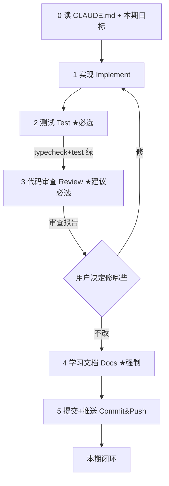

# CLAUDE.md — easyCLI 项目总章程

> 本文件是项目的**总准则**。每次开启新对话、接续开发时，都应先读它并严格遵守，尤其是「每完成一小节必须写学习文档」这条强制准则。

## 0. 项目目标

个人学习项目：从零到一**纯手写**一个仿 Claude Code 的命令行 Agent CLI，用以吃透以下底层模式：

- ReAct 架构、Tool Calling、MCP 协议、多模型适配
- Prompt 工程、RAG、安全审计、Agent 流程

**核心约束**：纯从零手写，**不 fork 任何参考项目**。参考物仅作架构对照（优先级：**实现蓝本 > 架构/范围对照 > 交互范本**）：
- **claude-code-from-scratch**（[GitHub](https://github.com/Windy3f3f3f3f/claude-code-from-scratch)）——**首要实现蓝本**：约 4300 行、13 章 clean-room 教程，从零造受 Claude Code 启发的 Coding Agent，与本项目「纯手写吃透原理」诉求几乎同构，比 PaiCLI 更贴合作为实现蓝本。
- itwanger 的 **PaiCLI（Java, 21期）** 与 **paicli-ts（TypeScript）**——分期与功能清单对照。
- **Qoder CLI**（轻量/ACP/SDK 交互范本）。
- 配套 **how-claude-code-works**（[GitHub](https://github.com/Windy3f3f3f3f/how-claude-code-works)）—— Claude Code 真实架构（50 万行）16 篇拆解，作为「生产级护城河」参照（见 §8）。

> 这些参考物**都不是本项目作者所写**，只能看、不能复制粘贴当实现。claude-code-from-scratch 可照着学思路，但代码仍须自己手写（不 fork）。

---

## 1. 🔴 强制准则：每完成一小节必须写学习文档

**每完成一期（一小节）开发，必须同步产出一份学习文档**，放在 `docs/phaseN.md`（N 为期的序号，如 `docs/phase1.md`）。未写学习文档，该期不算真正完成。

学习文档的目的有两类，必须同时覆盖：
1. **辅助学习**：讲清本期涉及的知识、设计原理、为什么要这样设计。
2. **面试素材**：写清「本期完成了什么 / 设计方案及原理 / 为什么这样设计 / 与其他方案比有什么优势」。

文档中应**使用画图（Mermaid）辅助理解**；也可自由增加有助于学习与理解的内容（如踩坑、自测题、延伸阅读）。

### 学习文档固定模板（后续各期严格沿用）

```
# 第 N 期学习文档：<本期标题>

## 0. 本期在全局路线图中的位置
## 1. 本节完成了什么（交付物）        ← 含文件清单表
## 2. 核心概念速览（先看这个）         ← 术语、前置知识
## 3. 设计方案与原理                  ← 配 Mermaid 图
## 4. 为什么这样设计（设计权衡）       ← 决策 vs 反方案的表
## 5. 与其它方案对比（优势）           ← 方案对比表
## 6. 面试话术（30 秒版 + 详版）       ← 被追问时怎么接
## 7. 常见面试题（附答题要点）         ← 3-5 道可能考的题 + 参考答案
## 8. 关键代码索引                     ← 文件:函数 映射
## 9. 踩坑与细节（来自真实实现）
## 10. 自测题（检验是否真懂）
## 11. 延伸与下一步
```

> 注意：**§6 面试话术** 与 **§7 常见面试题** 是强制要求的两节，缺一不可——前者练「怎么讲」，后者列「考什么」。

参考样例：`docs/phase1.md`（第 1 期已按此模板产出，可作为风格基准）。

> 提示：本期货代码审查结论可附于文档「§9 踩坑与细节」或单独成段，便于复习（见 §7 交付流程）。

---

## 2. 技术栈与工程约定

- **语言/运行时**：TypeScript / Node（>= 18，沙箱 22）。**纯从零手写**。
- **包管理**：pnpm。
- **构建**：tsup（esbuild），产物到 `dist/`。
- **测试**：vitest，单测放 `tests/unit/`，每模块配回归测试。
- **类型检查**：`tsc --noEmit`。
- **依赖克制**：仅引入必要依赖——`commander`（CLI）、`chalk`（着色）、`zod`（schema 校验）；MCP 客户端、SSE 解析等**一律手写，不引官方 SDK**，以吃透原理。
- **忽略项**：`node_modules`、`dist`、`.env` 已在 `.gitignore`，**密钥（API Key）绝不入库**。

常用命令：
```bash
pnpm dev            # 交互 REPL（tsx 直接跑 TS）
pnpm build          # tsup 打包
pnpm test           # vitest run
pnpm typecheck      # tsc --noEmit
```

---

## 3. 已敲定的 6 大设计决策（不要再重新争论）

| # | 分支 | 结论 |
|---|---|---|
| 1 | 实现语言/技术栈 | TS/Node，纯从零手写；PaiCLI/paicli-ts 仅作参考 |
| 2 | 模型适配 | 先接 OpenAI 兼容协议；接口设计为 Provider 无关的 `ChatModel` + 首批 `OpenAICompatibleAdapter` |
| 3 | 模块分期 | 采用修订后 11 期路线（见 §4），全做到底；实现蓝本优先参照 claude-code-from-scratch |
| 4 | MCP 范围 | 客户端优先、stdio 优先；Server 模式留到第 9 期 |
| 5 | 交互/UX | 轻量 `readline`+`chalk` 手写流式 REPL；Claude Code 式三级权限（allow/deny/ask）持久化到 `~/.config/<cli>/settings.json` |
| 6 | 安全审计 | 核心三道防线（路径围栏+命令黑名单+HITL），前两者为不可关闭硬限制；脱敏/Token 预算延后 |

> 以下为「设计评审补充」新敲定的决策（原 6 大决策不变、不再争论）；它们把评审中发现的路线图缺口落成硬约束，详见 §8 与修订后的路线图。

| # | 分支 | 结论 |
|---|---|---|
| 7 | 上下文压缩 | **独立于长期记忆**，作为贯穿性关注点；Phase 1 定义 `ContentBlock` 时即需为「可被裁剪/折叠/摘要」预留 |
| 8 | 工具并发模型 | `ToolDef` 从 Day 1 带 `isReadOnly`/`isDestructive` 标记；执行器**只读并行、写串行** |
| 9 | 可观测/扩展 | 预留**轻量事件总线/钩子**（`onToolCall`/`onError`/`onCompact`），审计与可观测性统一挂载，避免后期推翻结构 |
| 10 | 错误恢复 | 规划故障恢复策略：上下文超限自动压缩、max-tokens 续写、API 错误指数退避、可选 fallback model |
| 11 | Multi-Agent 隔离 | 子 Agent 各自独立 **worktree/沙箱**，避免并发改写同一文件冲突 |
| 12 | Skill 加载 | 三层加载 + **渐进式披露**（按需加载保护 prompt cache 命中率） |

---

## 4. 11 期路线图（每期 = 一个小模块，独立提交+独立测试）

| 期 | 模块 | 状态 |
|---|---|---|
| 1 | 脚手架 + REPL + 流式对话 + ChatModel/OpenAI 适配器 | ✅ 完成 |
| 2 | ReAct 循环 + Tool Calling + **最小内置工具**（read_file/bash，循环才非空转） | 待做 |
| 3 | 内置工具扩展 + 安全围栏（`isReadOnly/isDestructive` 标记；**读并行/写串行**；三级权限+围栏+黑名单+HITL+审计挂事件总线） | 待做 |
| 4 | **上下文压缩**（裁剪/去重/折叠/摘要）+ 长期记忆（SQLite） | ✅ 已完成 |
| 5 | MCP 客户端（stdio，JSON-RPC 连接状态机） | 待做 |
| 6 | RAG | 待做 |
| 7 | Skill 系统（三层加载 + **渐进式披露**保护 cache） | 待做 |
| 8 | Multi-Agent（Planner/Worker/Reviewer + **文件隔离 worktree** + 事件总线落地） | 待做 |
| 9 | MCP Server + 多模型补全（补齐 Anthropic/Ollama 适配器 + **fallback model 降级**） | 待做 |
| 10 | **Plan 模式 + 异步并行**（与 ReAct 共享同一引擎） | 待做 |
| 11 | Browser（CDP） | 待做 |

> **贯穿性关注点**（不单独占期，但每期实现时遵守，对应决策 7–10）：① 上下文压缩；② 工具并发模型（只读并行/写串行）；③ 事件总线/钩子（审计与可观测性挂载点）；④ 错误恢复（上下文超限自动压缩、max-tokens 续写、API 错误指数退避、fallback model）。这些在 Phase 1 定义类型、Phase 3 写工具时就要留接口。

---

## 5. 全局架构约定（各期实现时遵守）

- **`ChatModel` 归一化接口**（`src/core/chatmodel/types.ts`）：`complete(opts)` 返回 `{ content, toolCalls }`，屏蔽厂商差异。新增模型 = 新增适配器，上层零改动。**多模型适配的核心在 Phase 1 已就位**，Phase 9 仅补 Anthropic/Ollama 适配器。
- **工具统一契约** `ToolDef`：内置工具与 MCP 工具统一进同一 `ToolRegistry`；`ToolDef` 自带 `isReadOnly`/`isDestructive` 标记（决策8），执行器据此**只读并行、写串行**；后续期把 `execute` 补进 `ToolDef`。
- **MCP 客户端**：`child_process.spawn` + JSON-RPC 2.0（`initialize`→`tools/list`→`tools/call`），stdio 先于 HTTP；维护连接状态机。
- **配置**：`CLI 参数 > 环境变量 > 默认值`，空字符串视为未设置（`firstNonEmpty`）。
- **权限/安全**：三级模型 + 路径围栏/命令黑名单硬 gate；写操作/bash 默认 `ask`；审计日志挂事件总线。
- **事件总线/钩子（预留）**：工具执行、错误、压缩等关键节点发事件（`onToolCall`/`onError`/`onCompact`），审计与可观测性统一挂载（决策9），避免后期推翻结构。
- **上下文压缩（贯穿）**：压缩策略（裁剪/去重/折叠/摘要）约束 `ChatMessage`/`ContentBlock` 结构，Phase 1 定义类型时即需为「可被折叠/摘要」预留（决策7）。
- **Multi-Agent 文件隔离**：子 Agent 各自独立 worktree/沙箱，避免并发改写同一文件冲突（决策11）。

目录骨架：
```
src/cli/        入口、REPL、渲染器、slash 命令
src/core/chatmodel/   ChatModel 接口 + 适配器（期1/9）
src/core/agent/       ReAct 循环（期2，决策核心，不依赖 REPL）
src/core/events/      事件总线/钩子（决策9，期3落地）
src/core/tools/       工具系统（期3，含 isReadOnly/isDestructive 标记）
src/core/mcp/         McpClient（期5）/McpServer（期9）
src/core/memory/      上下文压缩 + SQLite 长期记忆（期4）
src/core/rag/         向量检索（期6）
src/core/skill/       三层加载 + 渐进式披露（期7）
src/core/multiagent/  Orchestrator（期8，worktree 隔离）
src/core/security/    围栏/黑名单/权限/脱敏/审计（期3/6/9）
src/config/           配置加载与合并
tests/unit/           各模块 vitest 回归
docs/                 各期学习文档（强制产出）
```

---

## 6. 提交与推送约定

- 每期独立提交，commit message 用 `feat: 第 N 期 <标题>` 风格。
- 推送 GitHub（`wpy2580536181-stack/easyCLI`，默认分支 `main`）。
- 推送用 git 临时凭据，**绝不把 token 明文写入 `.git/config` 或仓库**；推送后清除临时凭据。
- `node_modules`/`dist`/`.env` 不入库。
- `CLAUDE.md`（项目总章程）已纳入版本管理，随仓库同步；`.env` 等密钥文件永不入库。

---

## 7. 每期交付流程（Definition of Done）

每一期（一小节）开发必须走完以下闭环，**任一道 gate 未过不算完成**：



| 步骤 | 执行方 | 必选 | 出口标准（gate） |
|---|---|---|---|
| 0 对齐章程 | 人 + Agent | 必 | 本期目标与「设计决策（§3）」「全局架构约定（§5）」一致 |
| 1 实现 | Agent | 必 | 功能写完，遵循「手写不引 SDK / 依赖克制」等约束 |
| 2 测试 | Agent | **必** | `pnpm typecheck` + `pnpm test` 全绿；能真机验证的跑一次 |
| 3 代码审查 | Agent 审 diff | **建议必（有逻辑实现的期必做）** | 产出审查报告：正确性/边界、是否偏离约定、是否过度设计、测试盲区 |
| 4 学习文档 | Agent | **必（强制准则）** | `docs/phaseN.md` 套模板，含 §6 面试话术 + §7 常见面试题 |
| 5 提交推送 | 人确认 / Agent | 必 | `feat: 第 N 期 <标题>`，push `main` |

关键约定：
- **测试与审查是串联两道 gate，不是二选一**：测试保正确性，审查保设计合理与「真理解原理」（面试核心）。
- **审查由 Agent 执行**：每期实现后 Agent 直接 `git diff` 做结构化审查并给报告，用户挑要改的；这本身也是观察「Agent 如何审代码」的学习机会。
- **审查可跳过的情况**：仅纯配置/脚手架微调（无逻辑实现）可只跑测试；凡含算法/协议/交互逻辑的期（ReAct、MCP、RAG、Multi-Agent…）必须审。
- **顺序不可乱**：先测试 → 再审查 → 后写文档。文档讲「为什么」，只有代码定稿且审过才写得住。
- **真机验证**：对话、工具执行等可运行功能，除单测外须手动跑一次（单测用 mock，真机用真实 Key）。
- **审查报告**可附于对应学习文档的「§9 踩坑与细节」一节或单独成段，便于复习。

---

## 8. 生产级护城河：值得抄的作业（设计评审补充）

> 来源：对 Claude Code 真实架构（50 万行，见 how-claude-code-works）与 PaiCLI 的横向评审。以下**不是每期必做**，而是「未来升级 / 面试加分」的方向清单——在对应期实现时应主动借鉴，优先级由低到高。

### 8.1 上下文与成本
- **Prompt Cache 命中率**：Skill 渐进式披露（按需加载，不一次性塞满 System Prompt）、`CLAUDE.md` 缓存、压缩后保留最近若干文件——直接降成本、降延迟。→ 落地期：Skill（期7）、压缩（期4）。
- **4 级渐进压缩**：裁剪（截旧工具输出）→ 去重 → 折叠（不删原文，可展开）→ 摘要（子 Agent 总结）。每级都可能释放足够空间，不必走到最后一级。→ 落地期：期4。

### 8.2 性能与体验
- **工具预执行**：模型还在流式输出时就解析并执行 `tool_calls`，把约 1s 的工具延迟藏进模型思考窗口。当前 `complete()` 等全流结束才返回，未来可在流式阶段并行预执行只读工具。→ 升级期：期3/期10。
- **200ms 防抖确认**：HITL 确认框加防抖，防键盘连击误确认。→ 落地期：期3 安全。

### 8.3 安全（硬核升级方向）
- **命令 AST 分析**：用 tree-sitter 解析 Shell 真实意图（Claude Code 含 23 项检查：命令注入、环境变量泄露、特殊字符攻击等），而非正则黑名单。本项目 Phase 3 用黑名单（够用但弱），多模型/复杂命令场景应升级为 AST 分析。→ 升级期：期3/期9。
- **纵深防御层数**：在现有「围栏+黑名单+HITL」之上，未来可加 Sandbox、Hook 校验（允许自动给 `rm` 加 `--dry-run`）、审计日志脱敏。→ 升级期：期3/期9。

### 8.4 错误恢复（「用起来稳」的关键）
Claude Code 有约 7 种「继续」策略，大部分错误用户无感：
- 上下文超限 → 自动压缩后重试
- max output tokens → 自动续写（最多 3 次）
- API 错误 → 指数退避
- 可选 fallback model 切换
- token 预算不足 → 自动升级预算再试
→ 落地期：期2（循环骨架）/ 期9（fallback model）。

### 8.5 对照蓝本
- **claude-code-from-scratch**（[GitHub](https://github.com/Windy3f3f3f3f/claude-code-from-scratch)）：约 4300 行、13 章 clean-room 教程，从零造受 Claude Code 启发的 Coding Agent。**作为本项目实现的首要对照蓝本**——照着它能少走弯路，但代码仍须自己手写（不 fork）。
- **how-claude-code-works**（[GitHub](https://github.com/Windy3f3f3f3f/how-claude-code-works)）：Claude Code 真实架构 16 篇拆解，作为「生产级护城河」参照。

---

> 本章程随项目演进更新；任何影响全局的架构/分期/约定变更，都应同步修订此处，保证新会话拿到的是最新总准则。
