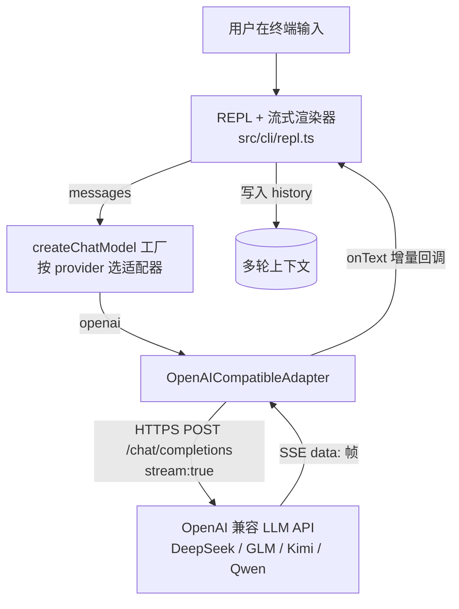
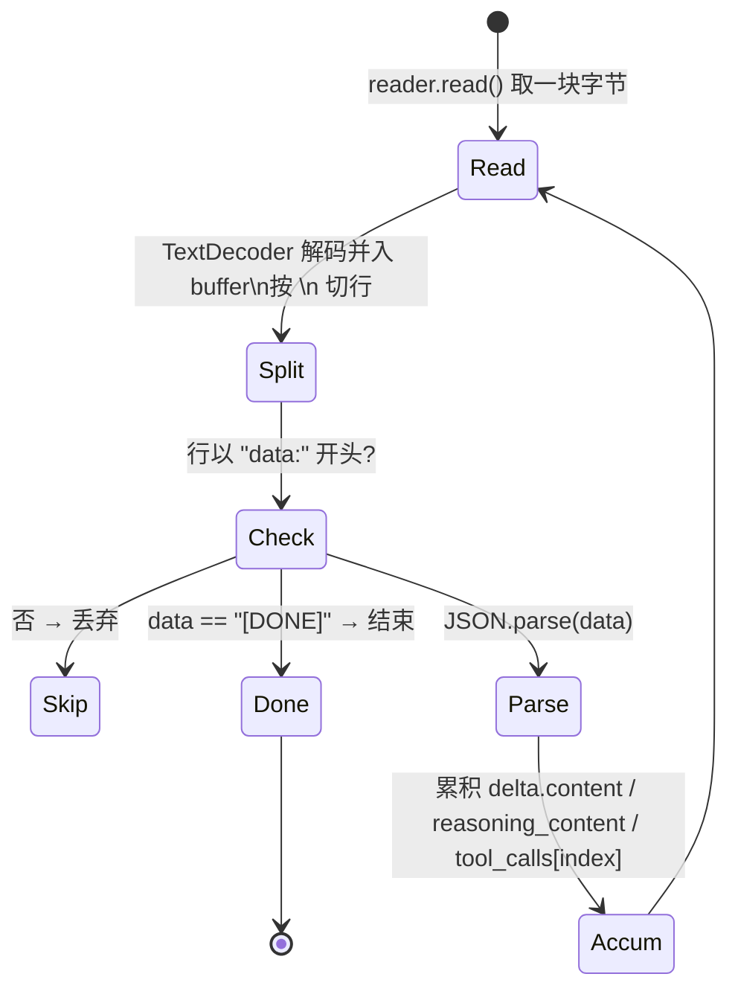
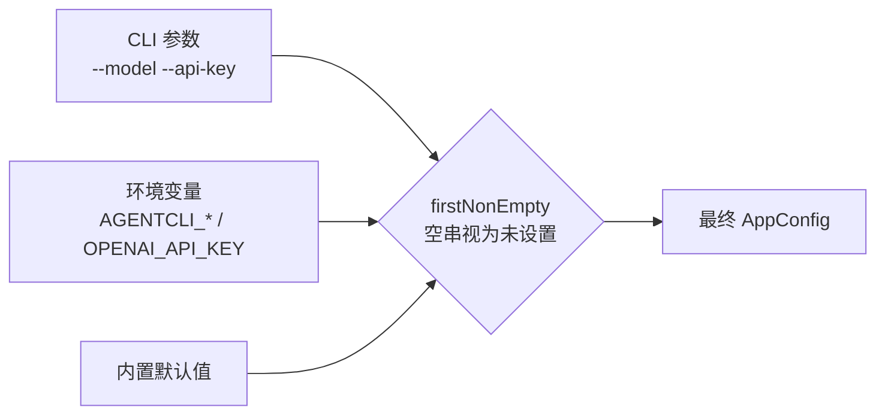
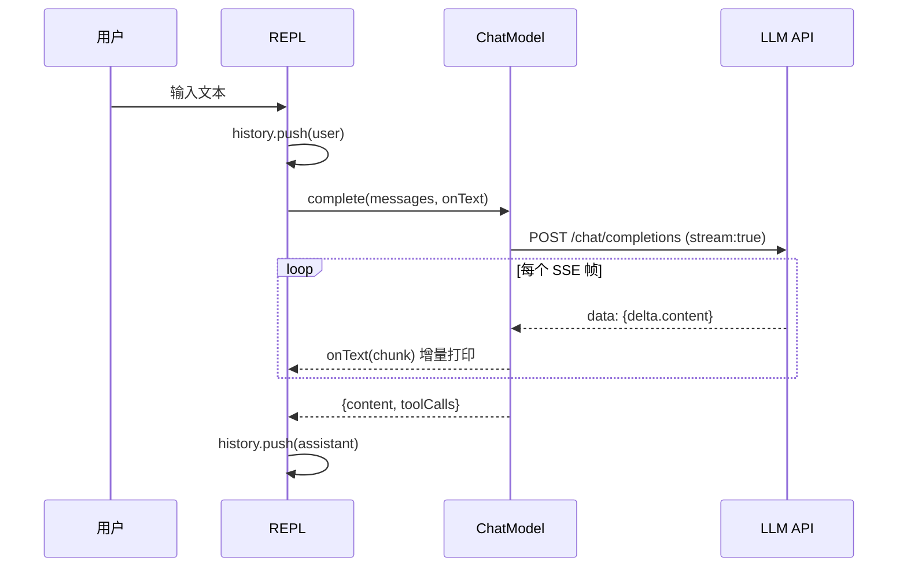

# 第 1 期学习文档：脚手架 + REPL 流式对话 MVP

> 目标读者：想吃透 Agent 底层原理、并能在面试中讲清楚「为什么这么写」的人。
> 阅读建议：先读 §2 概念速览，再看 §3 设计原理（含图），最后用 §9 自测题、§7 面试题检验。

---

## 0. 本期在全局路线图中的位置

本项目用 10 期从零手搓一个仿 Claude Code 的 CLI，每期一个小模块。**第 1 期是地基**——它不实现任何 Agent 智能，只把「能和一个 LLM 流式对话」跑通，并定义一套**贯穿后续 9 期的归一化契约**（类型与接口）。后面的 ReAct、工具、MCP 全部长在这套契约上。

| 期 | 模块 | 状态 |
|---|---|---|
| **1** | **脚手架 + REPL + 流式对话 + ChatModel/OpenAI 适配器** | ✅ 已完成 |
| 2 | ReAct 循环 + Tool Calling | 待做 |
| 3 | 内置工具 + 安全围栏 | 待做 |
| 4 | Memory（SQLite + 压缩） | 待做 |
| 5 | MCP 客户端（stdio） | 待做 |
| 6 | RAG | 待做 |
| 7 | Skill 系统 | 待做 |
| 8 | Multi-Agent | 待做 |
| 9 | MCP Server + 多模型补全 | 待做 |
| 10 | Browser + 异步并行 + Plan 模式 | 待做 |

---

## 1. 本节完成了什么（交付物）

一个**能跑通的 MVP**：在终端输入问题，CLI 调用 OpenAI 兼容模型（DeepSeek/GLM/Kimi/Qwen 等），边接收边流式打印回答，支持多轮对话与基础斜杠命令。

| 模块 | 文件 | 说明 |
|---|---|---|
| 工程脚手架 | `package.json` / `tsconfig.json` / `tsup.config.ts` / `vitest.config.ts` | pnpm + tsup(esbuild) + vitest，依赖克制 |
| 归一化类型契约 | `src/core/chatmodel/types.ts` | `ChatModel` 接口、`ChatMessage`/`ToolCall`/`ToolDef` |
| OpenAI 兼容适配器 | `src/core/chatmodel/openai-compatible.ts` | 手写 SSE 流式解析、tool_calls 分片拼接 |
| 模型工厂 | `src/core/chatmodel/index.ts` | `createChatModel(config)` 按 provider 分发 |
| 配置加载 | `src/config/index.ts` | CLI 参数 > 环境变量 > 默认值 |
| 流式渲染器 | `src/cli/renderer.ts` | 边收边打印 |
| REPL | `src/cli/repl.ts` | 多轮对话 + `/help /clear /model /prompt /exit` |
| 入口 | `src/cli/main.ts` | commander，支持交互模式与 `-p` 单次查询 |
| 测试 | `tests/unit/*` | 8 个单测（SSE 流式/工具调用/推理内容/配置合并），全绿 |

**命令用法**：
```bash
export AGENTCLI_API_KEY=你的Key
export AGENTCLI_BASE_URL=https://api.deepseek.com/v1
export AGENTCLI_MODEL=deepseek-chat
pnpm dev                      # 进入交互 REPL
pnpm dev -p "用一句话解释 ReAct"   # 单次查询
```

---

## 2. 核心概念速览（先看这个）

- **Provider 无关接口（策略/适配器模式）**：把「调模型」抽象成一个统一接口 `ChatModel`，不同厂商（OpenAI/Claude/Ollama）各自实现适配器。上层（REPL、未来的 Agent 循环）只依赖接口，不依赖具体厂商。这是「多模型适配」学习目标的第一块。
- **流式（Streaming / SSE）**：LLM 不是一次性返回整段文本，而是用 **SSE（Server-Sent Events）** 以 `data: {...}\n` 帧持续推送增量。客户端边收边渲染，体验更顺、首字延迟更低。
- **function calling / tool_calls**：模型可以在回复里「要求调用某个工具并给出参数」。本期只解析、不执行（执行在 §2 期），但接口已预留。
- **归一化（Normalization）**：不同厂商返回格式不同（OpenAI 的 `tool_calls`、Claude 的 `tool_use`、Ollama 的 `tool_calls`）。适配器负责把各家格式**统一成同一套 `CompleteResult`**，上层无感知。

---

## 3. 设计方案与原理

### 3.1 整体架构



关键点：**REPL 不直接 `fetch` LLM**，而是通过 `ChatModel` 接口。这样换模型 = 换适配器，REPL 一行不改。

### 3.2 ChatModel 归一化接口（策略/适配器模式）

```ts
export interface ChatModel {
  readonly id: string;                              // 例如 "openai:deepseek-chat"
  complete(opts: CompleteOptions): Promise<CompleteResult>;
}
// CompleteOptions: { messages, tools?, signal?, onText?, temperature?, maxTokens? }
// CompleteResult: { content: string, toolCalls: ToolCall[], raw? }
```

- 模型工厂把「配置」翻译成「具体适配器」：
  ```ts
  switch (config.provider) {
    case 'openai': return new OpenAICompatibleAdapter({ baseURL, apiKey, model });
    default: throw new Error('未实现的 provider（Claude/Ollama 在第 9 期补齐）');
  }
  ```
- 这是典型的**策略模式 + 简单工厂**：运行时按配置决定用哪个策略（`ChatModel` 实现），调用方只认接口。

### 3.3 OpenAI 兼容适配器：手写 SSE 流式解析

适配器向 `/chat/completions` 发 `stream:true` 的请求，拿到 `ReadableStream` 后逐帧解析：



三个易错点（对应真实代码）：
1. **SSE 帧用 `\n` 分隔**，但一块网络字节可能含半个帧，必须用 `buffer` 累积、按 `\n` 切行，避免帧被截断。
2. **`tool_calls` 是分片下发的**：模型可能把 `{name, arguments}` 拆成多帧，按 `index` 累积 `id/name/arguments` 字符串，全部到齐后再 `JSON.parse(arguments)`。
3. **DeepSeek 有 `reasoning_content`（思考过程）**，要当普通文本增量一样上抛，否则思考内容会丢。

### 3.4 配置分层



要点：`firstNonEmpty` 把「空字符串」也当作「未设置」，从而正确回退（否则 env 被显式置空时会卡在 `''`，这是一个真实踩坑，见 §9）。

### 3.5 一次对话的数据流



---

## 4. 为什么这样设计（设计权衡）

| 设计决策 | 为什么 | 不这样做会怎样 |
|---|---|---|
| **Provider 无关接口 + 适配器** | 把「厂商差异」收敛到一层，未来加 Claude/Ollama 不动上层 | 若到处 `if (provider==='openai')`，第 9 期会爆炸式 if-else |
| **手写 SSE 解析，不引官方 SDK** | 本项目目标是学原理；SSE 解析是流式能力的核心，亲手写才真懂 | 用 SDK 一行搞定，但「流式怎么实现的」仍是黑盒 |
| **轻量 `readline` + `chalk`，不套 TUI 框架** | 流式渲染、光标控制本就是学习点；少依赖=可控 | ink/blessed 把渲染封装掉，反而学不到 |
| **配置三层合并 + 空串回退** | 同时支持「命令行临时试」「环境变量持久用」「开箱默认值」 | 只靠 env 不够灵活，只靠默认值不能切换模型 |
| **先定义类型契约，再写实现** | 后续 9 期都复用这套类型，避免每期改字段返工 | 边写边改类型，会牵一发动全身 |

---

## 5. 与其它方案对比（优势）

| 方案 | 学习价值 | 可控性 | 依赖体积 | 多模型/MCP 适配成本 |
|---|---|---|---|---|
| **A. 自写 ChatModel + 手写 SSE（本期采用）** | ⭐⭐⭐ 最高，原理全透明 | 高，每字节可控 | 极小（仅 chalk/commander/zod） | 低，接口已归一化 |
| B. 直接用 `openai` 官方 SDK 的 `stream()` | ⭐⭐ 中，省了 SSE 但失了原理 | 中，受 SDK 约束 | 小 | 中，换厂商要换 SDK |
| C. 用 LangChain / 高阶 Agent 框架 | ⭐ 低，调到会用为止 | 低，黑盒 | 大 | 低，但「为什么」说不清 |
| D. 用 Vercel AI SDK 等聚合层 | ⭐⭐ 中 | 中 | 中 | 低，但封装过厚 |

**结论**：本项目目标是「加强理解」，所以选 A。面试时这正是加分项——你能说清 B/C/D 帮你省了什么、又让你丢了什么。

---

## 6. 面试话术（30 秒版 + 详版）

**30 秒版**：
> 我第 1 期先把 CLI 跑通能和 LLM 流式对话。核心是把「调模型」抽象成一个 Provider 无关的 `ChatModel` 接口，OpenAI 兼容厂商统一用一个适配器实现。适配器手写 SSE 解析，把分片下发的 `tool_calls` 按 index 累积拼接、把 DeepSeek 的 `reasoning_content` 当增量上抛。配置做了 CLI > 环境变量 > 默认 三层合并。这样后面接 Claude、接 MCP 都不用改上层。

**详版（被追问时）**：
> - 为什么不用 SDK？因为我要理解流式本身——SSE 是 `\n` 分隔的 `data:` 帧，网络块可能截断半个帧，所以必须 buffer 累积按行切；`tool_calls` 是分片下发的，按 `index` 累积再 `JSON.parse`。
> - 为什么接口归一化？策略模式，运行时按配置选适配器，调用方只认 `ChatModel`，换模型零改动。
> - 配置为什么特意处理空串？`??` 空串不会回退，会导致 env 置空时卡在 `''`，所以用 `firstNonEmpty` 把空串当未设置。

---

## 7. 常见面试题（附答题要点）

**Q1：你们 CLI 是怎么处理大模型流式输出的？SSE 怎么解析？**
- 答：用 `fetch` 流式读取 `ReadableStream`；SSE 以 `\n` 分隔 `data:` 帧；用 `buffer` 累积字节、按行切分，避免网络块截断半个帧；逐帧 `JSON.parse` 取 `choices[0].delta.content`，通过 `onText` 回调增量上抛渲染。

**Q2：为什么要设计 Provider 无关的 `ChatModel` 接口，而不是直接调某个 SDK？**
- 答：策略/适配器模式，把厂商差异收敛到一层；调用方只依赖接口，换模型（OpenAI→Claude→Ollama）只需新增一个适配器，上层零改动；同时把「流式/SSE」等原理暴露出来，学习价值最高。

**Q3：function calling 的 `tool_calls` 在流式下有什么坑？**
- 答：是分片下发的——`id`/`name`/`arguments` 可能跨多帧到达，需按 `index` 把 `arguments` 字符串累积完整后再 `JSON.parse`；中途解析会报错。本期只解析不执行，执行在第 2 期。

**Q4：配置加载为什么不用 `env ?? default` 直接回退？**
- 答：`??` 只在 `null/undefined` 时回退，空字符串 `''` 不会触发，导致 env 被显式置空时卡在 `''`；正确做法是 `firstNonEmpty`，把空串也当「未设置」处理。

**Q5：如果让你接 Claude 或本地 Ollama，改动大吗？**
- 答：不大。只需新增一个实现 `ChatModel` 的适配器（Claude 适配 `tool_use`、Ollama 适配本地端点），`createChatModel` 工厂加一个 `case`；REPL 与未来的 Agent 循环完全不用动，因为只依赖 `ChatModel` 接口。

---

## 8. 关键代码索引

| 想看什么 | 去哪 |
|---|---|
| 接口与类型契约 | `src/core/chatmodel/types.ts` |
| SSE 流式解析主逻辑 | `src/core/chatmodel/openai-compatible.ts` → `parseStream` |
| 消息格式转换 | `openai-compatible.ts` → `toOpenAIMessages` / `toOpenAITool` |
| 适配器选择 | `src/core/chatmodel/index.ts` → `createChatModel` |
| 配置合并 | `src/config/index.ts` → `loadConfig` / `firstNonEmpty` |
| REPL 主循环 | `src/cli/repl.ts` → `startRepl` / `runTurn` / `handleSlash` |
| 流式打印 | `src/cli/renderer.ts` → `StreamRenderer.push` |

---

## 9. 踩坑与细节（来自真实实现）

1. **`??` 遇空串不回退**：`env ?? default` 在 `env === ''` 时返回 `''`（空串非 nullish）。配置合并必须用「空串视为未设置」的 `firstNonEmpty`，否则默认值/兜底全部失效。这条直接导致第一版单测挂掉。
2. **SSE 帧可能被网络块截断**：必须用 `buffer` 累积后按 `\n` 切行，不能假设一次 `read()` 就是一个完整帧。
3. **`tool_calls` 分片**：OpenAI 流式下 `arguments` 是字符串且跨多帧到达，需按 `index` 拼成完整 JSON 再 `parse`，否则 `JSON.parse` 中途报错。
4. **DeepSeek `reasoning_content`**：思考过程字段名不是 `content`，漏处理会丢思考链。
5. **`esbuild` 的 build script 被 pnpm 默认拦截**：本例不影响 tsup 构建（二进制走 optionalDependencies），但提醒你 pnpm v10 默认不跑安装脚本，必要时 `pnpm approve-builds`。

---

## 10. 自测题（检验是否真懂）

1. 为什么 `ChatModel` 要设计成接口而不是一个固定的 `callOpenAI()` 函数？如果第 9 期要接 Claude，需要改 REPL 吗？
2. SSE 的帧是怎么分隔的？如果一次 `read()` 拿到半个帧，应该怎么处理？
3. `tool_calls` 流式下为什么不能每帧直接 `JSON.parse(arguments)`？
4. 配置合并里 `process.env.AGENTCLI_API_KEY ?? process.env.OPENAI_API_KEY ?? ''` 有什么隐患？正确写法是什么？
5. 本期 `complete()` 返回了 `toolCalls` 但没执行，为什么接口要现在就预留它？

---

## 11. 延伸与下一步

- **延伸阅读**：OpenAI 官方「Streaming」与「Function calling」文档；MCP 协议草案（第 5 期用）；SSE 规范（HTTP 的 `text/event-stream`）。
- **第 2 期预告 —— ReAct 循环 + Tool Calling**：用 `while` 循环把「调模型 → 解析 `tool_calls` → 执行工具 → 结果回传」串起来，Agent 就能自主决定何时调工具、何时给出最终答案。本期预留的 `toolCalls` 字段正是为它准备的。

> 文档模板约定（后续各期沿用）：定位 → 交付物 → 概念 → 设计原理(图) → 设计权衡 → 方案对比 → 面试话术 → **常见面试题** → 代码索引 → 踩坑 → 自测题 → 延伸。
