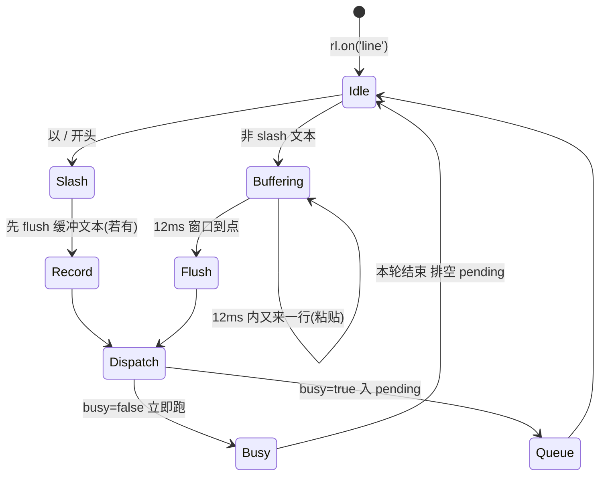
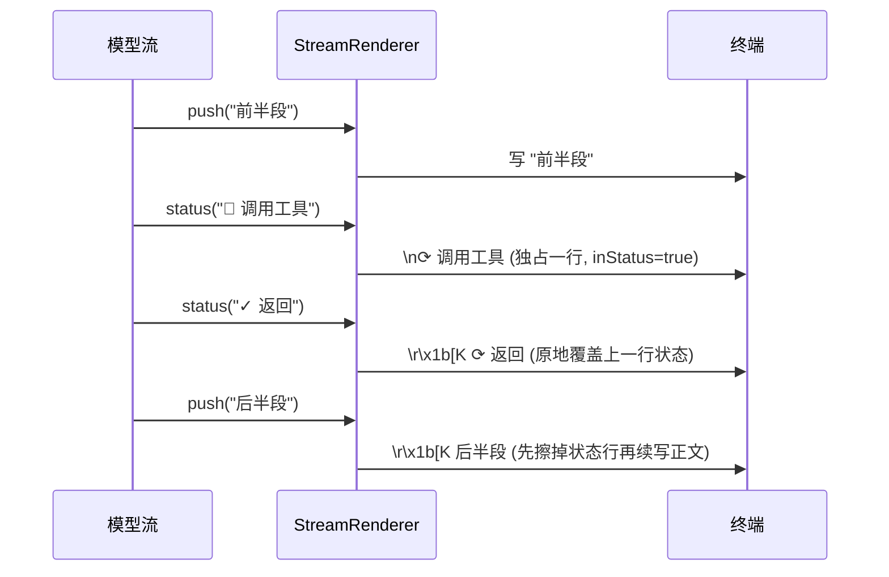

# 第 10 期学习文档：REPL 体验打磨

## 0. 本期在全局路线图中的位置

| 期 | 模块 | 状态 |
|---|---|---|
| 1 | 脚手架 + REPL + 流式对话 + ChatModel/OpenAI 适配器 | ✅ 完成 |
| 2 | ReAct 循环 + Tool Calling + 最小内置工具 | ✅ 完成 |
| 3 | 内置工具扩展 + 安全围栏 | ✅ 完成 |
| 4 | 上下文压缩 + 长期记忆（SQLite） | ✅ 完成 |
| 5 | MCP 客户端（stdio + JSON-RPC） | ✅ 完成 |
| 6 | RAG（检索增强生成，纯手写） | ✅ 完成 |
| 7 | Skill 系统（三层加载 + 渐进式披露） | ✅ 完成 |
| 8 | 模型配置持久化 | ✅ 完成 |
| 9 | 会话持久化（Session） | ✅ 完成 |
| **10** | **REPL 体验打磨（历史 / 多行粘贴 / 补全 / 流式渲染）** | **✅ 本期** |
| 11 | 多模型适配补全（Anthropic/Ollama + fallback + 可插拔 embedding） | 待做 |
| 12 | MCP Server | 待做 |
| 13 | Token / 成本统计与可观测性 | 待做 |
| 14 | Plan 模式 + 异步并行 | 待做 |
| 15 | 记忆与检索自动注入 | 待做 |
| 16 | Multi-Agent | 待做 |
| 17 | Browser（CDP） | 待做 |

本期不做新「能力」，而是把前 9 期攒下的 REPL 打磨成「能天天用」的样子：命令历史**跨会话**保留、直接粘贴多行代码作为一条消息、Tab 补全命令、流式输出不再被状态行切碎。四个点都围绕同一个目标——**让交互顺手**。

---

## 1. 本节完成了什么（交付物）

| 文件 | 角色 | 关键内容 |
|---|---|---|
| `src/cli/history.ts` | **核心（新增）** | `HistoryStore`：历史文件 `~/.config/agent-cli/history`（与 config/session/audit 同目录约定）；`add()` 落盘 + 连续重复去重 + 限长 2000；`forReadline()` 反转为「新→旧」供 seed |
| `src/cli/completer.ts` | **核心（新增）** | `SLASH_COMMANDS`（与 `handleSlash` 的 case 对齐）；纯函数 `completeLine(line, commands, history)`——`/` 开头补命令名、否则按历史补句子 |
| `src/cli/renderer.ts` | **改造** | `StreamRenderer` 状态行用 `\r\x1b[K` **原地刷新/擦除**，正文连续不被切碎；支持注入 `OutputSink` 便于单测 |
| `src/cli/repl.ts` | **改造** | 注入 `HistoryStore`（seed 进 `readline` + `completer`）；重写 `rl.on('line')`：slash 原子、非 slash 走 12ms 多行缓冲、busy 时排队；多行缓冲里若出现 slash 先 flush 文本再处理 |
| `tests/unit/history.test.ts` | 测试（新增） | 8 个用例：落盘顺序、跨实例读回、连续去重、空串忽略、保留内部空行、限长、路径常量、损坏文件不崩 |
| `tests/unit/completer.test.ts` | 测试（新增） | 9 个用例：slash 前缀/精确/无匹配/多候选；历史补全/自身排除/无匹配/默认空 |
| `tests/unit/renderer.test.ts` | 测试（新增） | 6 个用例：正文拼接、着色、状态行原地擦除、连续状态覆盖、末尾状态清除、纯正文换行 |
| `docs/phase10.md` | 文档 | 本文件 |

**交付验证**：
- `pnpm typecheck` 通过；`pnpm test` **139 个用例全绿**（本期新增 23 个）。
- **真机验证①（零 API 消耗）**：管道喂 `/model /perm /help /exit`，REPL 逐条原子执行、`/exit` 干净退出，历史文件落地且顺序为 `/model /perm /help /exit`。
- **真机验证②（真实 API）**：喂两行提示 + `/exit`，模型流式返回正常（`助手 › …`），历史文件记录的是**合并后的两行提示**（含换行）+ `/exit`——证明多行粘贴合并为一条消息且正确落盘。

---

## 2. 核心概念速览（先看这个）

- **跨会话历史文件**：readline 自带的历史只在内存、不落盘。我们手写一个 append-only 文本文件，把每条命令持久化，下次启动读回 seed 进 readline，使 **↑/↓ 跨进程可用**。
- **多行粘贴缓冲（Paste Buffering）**：终端把粘贴内容按行拆成多个 `line` 事件。若不做处理，一段 10 行代码会被当成 10 条独立输入。用「短窗口 debounce」把窗口内连续到达的**非 slash** 行合并成一条消息。
- **slash 原子性**：`/` 开头的命令必须逐条立即执行（不合并、可管道化、可逐条排队），所以走与文本不同的快速通道。
- **Tab 补全（Completer）**：readline 的 `completer` 选项，给定当前行返回候选数组；我们补 slash 命令名与历史句子。
- **状态行原地刷新**：用 `\r`（回行首）+ `\x1b[K`（清到行尾）在「同一行」覆盖/擦除临时状态（思考中、工具调用），让正文保持连续。
- **`\r\x1b[K` 擦除序列**：`\r` 把光标移到当前行首，`\x1b[K` 清除从光标到行尾的内容——合起来就是「抹掉刚打印的这行状态」而不动前面已打印的正文。

---

## 3. 设计方案与原理

### 3.1 跨会话历史：load → seed → record → persist

设计要点：文件是「旧→新」追加序；seed 进 readline 时需反转为「新→旧」（`rl.history[0]` 为最新）。落盘前做**连续重复去重**，超限（2000）时整体重写文件（只在超过上限后触发，单次会话极少敲到 2000 条，故近乎 append-only）。

### 3.2 输入处理：slash 原子 vs 多行缓冲 vs 生成中排队

关键点：
- **slash 原子**：立即 `recordHistory` + `dispatch`，不进缓冲——保证管道里一条条 slash 都能逐条执行，也保证可管道化。
- **多行缓冲**：窗口（12ms）内连续的非 slash 行合并为一条消息；窗口到点 `flushLines` 送出。
- **缓冲里出现 slash 的边界**：例如「多行提示 + /exit」快速到达，若直接清定时器会**丢弃前面的多行输入**。修正为：先 `flushLines()` 把缓冲文本作为一条消息送出，再处理 slash（slash 随后排队）。
- **生成中排队**：沿用 Phase 9 的 `busy/pending`，模型跑的时候到达的输入不丢，本轮结束顺序排空。

### 3.3 流式渲染器：状态行原地刷新

旧版 `status()` 每来一条状态就 `\n⟳ …\n`，把正文切成碎片。新版：状态独占一行且用 `\r\x1b[K` 原地覆盖；正文 `push` 时若正处于状态行，先擦掉状态再续写，正文因此**不被状态打断**。

---

## 4. 为什么这样设计（设计权衡）

| 决策点 | 方案 | 反方案 | 为什么选它 |
|---|---|---|---|
| 历史持久化 | 手写 append-only 文件 + `HistoryStore` | 依赖 readline 自带持久化 | readline **不落盘**；手写完全掌控去重/限长/路径约定，且与 config/session 同目录风格统一 |
| 历史注入 readline | `createInterface({history, historySize})` 选项 seed + 本地 `histLines` 镜像 | 直接读写 `rl.history` | 新版 `@types/node` 的 `Interface` **已移除可读写的 `history` 属性**，只能经选项初始化、由内部维护；补全要读历史，故本地 mirror 一份 |
| 多行粘贴识别 | 12ms debounce 合并非 slash 行 | 逐行即独立输入 / 或 bracketed paste | debounce 零依赖、健壮性高；代价是单行输入有 ~12ms 延迟（可忽略）。bracketed paste 零延迟但需终端配合、实现复杂，留作升级 |
| slash 与文本分流 | slash 原子、文本缓冲 | 全部缓冲 / 全部原子 | slash 必须可管道化、可逐条执行；文本才需要合并粘贴——分流最贴合两类输入的语义 |
| 状态行渲染 | `\r\x1b[K` 原地擦除 | 每条状态独立 `\n` 行 | 正文连续、不碎片化，视觉上「状态像浮层」；代价是非 TTY 输出会残留 `\r\x1b[K` 转义（一次性 `runOnce` 管道场景可接受） |

---

## 5. 与其它方案对比（优势）

| 维度 | Phase 9 及之前 | Phase 10 之后 |
|---|---|---|
| 命令历史 | 关掉终端即丢，无法 ↑ 找回 | **跨会话持久**，重启后仍可 ↑/↓ 翻历史 |
| 多行粘贴 | 一段代码被拆成 N 条输入（N 轮对话） | 合并为**一条消息**，符合「粘贴代码=一次性提问」直觉 |
| Tab 补全 | 无，靠死记命令 | `/` 补命令名、普通文本补历史句子 |
| 流式输出 | 状态行 `\n⟳…\n` 把正文切碎 | 状态行原地刷新，正文连续顺滑 |
| 依赖 | 仅 `chalk`/`commander`/`zod` | 维持不变（历史/补全/渲染均用 Node 内置 + 手写） |

---

## 6. 面试话术（30 秒版 + 详版）

**30 秒版**：
> 第 10 期我给 REPL 做了四件体验打磨：一是手写了一个命令历史文件，启动时读回 seed 进 readline、每条命令落盘去重限长，实现跨会话 ↑/↓；二是用 12ms 的 debounce 把粘贴的多行文本合并成一条消息，而 slash 命令走原子通道保证可管道化；三是给 readline 注入了 Tab 补全器，补命令名和历史句子；四是重写了流式渲染器，用 `\r\x1b[K` 让状态行原地刷新，正文不再被切碎。期间踩到 `@types/node` 把 `writeFileSync` 声明成全局导致 tsc 不报错、运行时却 undefined 的坑，以及「多行提示紧跟 /exit 被丢弃」的边界 bug。

**详版（被追问时怎么接）**：
- **为什么不直接用 readline 的历史？** readline 的历史只在内存、不落盘；而且新版 `@types/node` 的 `Interface` 已经没有可读写的 `history` 属性，只能经 `createInterface({history, historySize})` 初始化、由内部维护。所以我自己写一个 `HistoryStore` 负责落盘，并镜像一份 `histLines` 数组给补全器用。
- **多行粘贴怎么识别？** 终端把粘贴内容按 `\n` 拆成多个 `line` 事件。我用短窗口（12ms）debounce：窗口内连续到达的非 slash 行视为同一次粘贴、合并为一条消息；窗口到点才送出。slash 命令不进缓冲，保证原子。代价是单行输入有约 12ms 延迟，几乎无感；更优雅的「bracketed paste」需要终端发 `\x1b[200~` 包围粘贴，实现更复杂，我把它列为后续升级。
- **流式怎么做到不碎片化？** 旧版每条状态都 `\n⟳…\n`，正文被切成几段。新版让状态独占一行并用 `\r\x1b[K`（回行首+清到行尾）原地覆盖；当正文继续 `push` 时，若当前处于状态行就先擦掉状态再续写，所以正文始终连续。

---

## 7. 常见面试题（附答题要点）

1. **为什么 readline 的历史不能跨会话？怎么让它跨会话？**
   要点：readline 历史仅进程内内存、不落盘；需自己维护一个文件，启动时读回 seed（`history` 选项）、每条命令 `appendFileSync` 落盘，并做去重与限长。

2. **Node 22 / 新版 `@types/node` 里 `rl.history` 还能直接读写吗？**
   要点：不能。`Interface` 已移除可读写属性，历史经 `createInterface({history, historySize})` 初始化、由内部维护；想读历史需自己 mirror 一份，或用 `'history'` 事件（变更时回调全量数组）。

3. **终端多行粘贴为什么要特殊处理？有哪几种实现思路？**
   要点：粘贴被拆成多个 `line` 事件，逐行处理会破坏「一次粘贴=一条消息」语义；思路有（a）debounce 合并非 slash 行（本项目采用，零依赖）；（b）bracketed paste 模式（`\x1b[?2004h` + `\x1b[200~…\x1b[201~`，零延迟但需终端配合、要拦截原始输入避免 readline 误拆）；（c）编辑器式行编辑（overkill）。

4. **如何让流式输出里夹杂的「工具调用/思考中」状态不把正文切碎？**
   要点：状态走「临时浮层」——独占一行并用 `\r\x1b[K` 原地覆盖/擦除；正文恢复时先抹掉状态行再续写。这样状态像覆盖层，正文连续。

5. **debounce 合并粘贴有什么 trade-off？**
   要点：实现简单、零依赖、稳健；代价是单行输入有极小延迟（本项目 12ms），且窗口内若混入 slash 行需要特殊边界处理（先 flush 文本再处理 slash）。

6. **补全器（completer）的契约是什么？**
   要点：返回 `[候选数组, 被补全子串]`，候选是「完整候选值」（含已敲部分）；readline 算公共前缀并替换光标处。本项目对 `/` 开头补命令名、否则补历史句子。

---

## 8. 关键代码索引

| 文件:函数 | 作用 |
|---|---|
| `src/cli/history.ts:HistoryStore.add` | 去重 + 落盘 + 超限整体重写 |
| `src/cli/history.ts:HistoryStore.forReadline` | 反转为「新→旧」供 seed |
| `src/cli/history.ts:HISTORY_PATH` | `~/.config/agent-cli/history` |
| `src/cli/completer.ts:completeLine` | slash/历史补全纯函数 |
| `src/cli/renderer.ts:StreamRenderer.status` | 状态行原地刷新（含 `\r\x1b[K`） |
| `src/cli/renderer.ts:StreamRenderer.push` | 续写正文前先擦状态行 |
| `src/cli/repl.ts:dispatch` | 输入执行入口（busy 排队 / 立即跑） |
| `src/cli/repl.ts:flushLines` | 多行缓冲到点 → 合并送出 |
| `src/cli/repl.ts:recordHistory` | 记历史 + 镜像到 `histLines` |
| `src/cli/repl.ts:rl.on('line')` | slash 原子 / 文本缓冲 / 生成中排队 的总调度 |

---

## 9. 踩坑与细节（来自真实实现）

1. **`writeFileSync` 没导入，tsc 却通过、运行时 `is not defined`**：
   `@types/node` 把一批 `fs` 函数（含 `writeFileSync`）声明成了**全局**，所以 tsc 认为它存在、不报错；但 ESM 运行时不自动注入，调用即 `ReferenceError`。**教训**：依赖「全局类型」会掩盖真正的导入缺失，关键 IO 函数务必显式 `import`，不要迷信 tsc 绿。本项目超限重写分支最初漏了 `writeFileSync` 导入，单测一开始报 `fileLines[0]` 仍是 `c0`（文件没被重写），加临时 `console.error` 才定位到 `writeFileSync is not defined`。

2. **`rl.history` 在新版 `@types` 不可读写**：硬改方向——改用 `createInterface({history, historySize})` 初始化，内部维护；补全所需的「历史句子」用本地 `histLines` 镜像。不要试图 `rl.history = ...` 赋值（类型直接报错）。

3. **「多行提示 + /exit」被丢弃**：管道里两行提示后紧跟 `/exit`，旧逻辑在 slash 分支直接 `clearTimeout` 清掉未触发的多行缓冲定时器，导致前面两行输入丢失（历史只留下 `/exit`，模型根本没被问到）。修正：slash 到达时若缓冲非空，先 `flushLines()` 把文本作为一条消息送出，再处理 slash。已用真实 API 管道复现并验证修复。

4. **debounce 的 12ms 是经验值**：太小则粘贴可能被拆（行间隔超过窗口），太大则单行输入明显卡顿。12ms 对机械键盘连击和粘贴都安全；若接 bracketed paste 可彻底去掉这个延迟。

5. **readline 会把粘贴的每一行都记进它自己的内部历史**：所以当前会话内 ↑ 翻到的是被拆开的单行，而我们落盘的是合并后的整段——跨会话（下次启动 reseed）↑ 看到的是合并消息。这是已知小不一致，bracketed paste 可根治。

---

## 10. 自测题（检验是否真懂）

1. 不手写历史文件、只用 readline 自带能力，命令历史能跨进程保留吗？为什么？
2. 把 `PASTE_DEBOUNCE_MS` 调到 0 或 1000 分别会有什么现象？（提示：粘贴合并 / 单行延迟）
3. 为什么 `completeLine` 对普通文本要从 `history` 里按前缀匹配、且排除「等于当前行」的条目？
4. `\r` 和 `\x1b[K` 各自做什么？为什么合起来能「抹掉刚打印的状态行」而不动前面的正文？
5. 若用户粘贴一段含空行的代码，空行在缓冲里怎么处理？为什么不能直接忽略？
6. `HistoryStore` 超限时为什么用 `writeFileSync` 整体重写、而不是继续 `appendFileSync`？

---

## 11. 延伸与下一步

- **Bracketed Paste（零延迟多行）**：启用 `\x1b[?2004h`，监听原始输入里的 `\x1b[200~…\x1b[201~`，把整段粘贴当一条消息；彻底去掉 debounce 延迟，并根治「↑ 翻到拆开单行」的不一致。
- **历史去重升级**：当前只去「连续重复」；可加跨会话模糊去重（如完全相同的长提示只留一份）。
- **状态行可视化**：在状态行渲染 spinner / 进度条（如「检索中 3/12」），进一步提升「Agent 在干嘛」的可观测性——呼应路线图第 13 期（Token/成本与可观测性）。
- **非 TTY 输出清理**：`runOnce`（一次性 `-p` 模式）管道输出目前会带 `\r\x1b[K` 转义；可按 `!process.stdout.isTTY` 切换到纯文本渲染，避免污染重定向文件。

> 审查结论（gate 3）：改动正确、贴合「手写不引 SDK」约定；边界（slash 先 flush 缓冲、生成中排队、超限重写）处理到位；交互编排难以纯单测，已通过真实 API 管道验证。无过度设计，无偏离 §3/§5 约定的地方。
