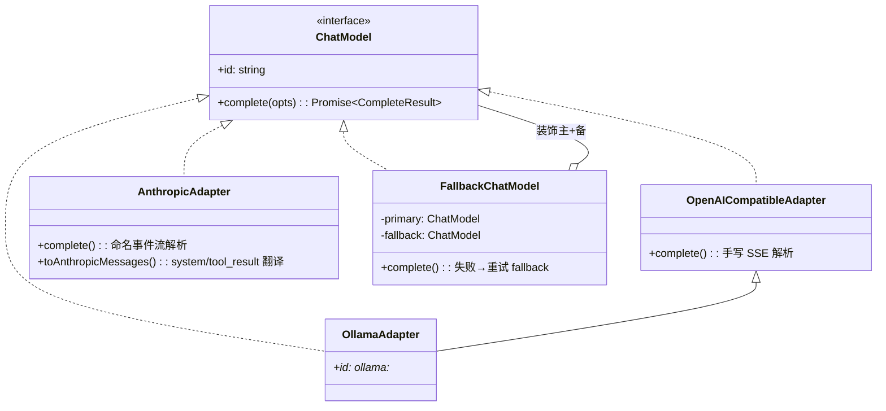

# 第 11 期学习文档：多模型适配补全（Anthropic/Ollama 适配器 + fallback 降级 + 可插拔 Embedder）

## 0. 本期在全局路线图中的位置

第 11 期属于「多模型适配补全」收尾。Phase 1 已定义好 Provider 无关的 `ChatModel` 接口与首批 `OpenAICompatibleAdapter`，
但只接了 OpenAI 兼容协议；本期的目标是把协议矩阵补齐，并落地两条贯穿性关注点（决策 10「错误恢复」与 Phase 6 的嵌入抽象）：

- **Anthropic 适配器**：补齐 Claude 协议（system 顶层字段 / tool_result 并入 user / 命名事件流）。
- **Ollama 适配器**：本地模型，复用 OpenAI 兼容端点（不重写 SSE）。
- **fallback model 降级**：主模型失败时自动切备用，装饰器模式，对 ReAct 循环透明。
- **Embedder 可插拔**：把 Phase 6 的同步 `embed()` 抽象为 `Embedder` 接口，提供「手写 TF-IDF」与「API 嵌入」双实现，
  `RagStore` 只依赖接口，换嵌入器零改动核心。

> 关联决策：决策 2（模型适配：Provider 无关接口 + 适配器）、决策 10（错误恢复：含可选 fallback model）。

## 1. 本节完成了什么（交付物）

| 文件 | 状态 | 作用 |
|---|---|---|
| `src/core/chatmodel/anthropic.ts` | 新增 | `AnthropicAdapter implements ChatModel`：Anthropic Messages API 协议翻译 + 命名事件流解析 |
| `src/core/chatmodel/ollama.ts` | 新增 | `OllamaAdapter`：继承 `OpenAICompatibleAdapter`，仅覆盖默认 baseURL 与 `id` |
| `src/core/chatmodel/fallback.ts` | 新增 | `FallbackChatModel implements ChatModel`：主/备装饰器，失败自动降级 |
| `src/core/chatmodel/index.ts` | 改写 | `createChatModel` 工厂支持 `openai/anthropic/ollama` + 可选 fallback 包裹 |
| `src/core/rag/embedder.ts` | 新增 | `Embedder` 接口 + `HandwrittenEmbedder` + `ApiEmbedder` + `createEmbedder` 工厂 |
| `src/core/rag/embed.ts` | 改 | 新增 `Embedding = Float32Array` 类型别名（语义化） |
| `src/core/rag/store.ts` | 改 | `RagStore` 接受 `Embedder`，`reindex/search/addSource` 改为 `async` |
| `src/core/rag/tools.ts` | 改 | `rag_search` 的 `execute` 内 `await store.search(...)` |
| `src/config/index.ts` | 改 | 解析 `fallback` / `embedder` 配置（CLI > env > file > 默认） |
| `src/config/store.ts` | 改 | `UserConfig` 增加 `fallback` / `embedder` 字段与 zod 校验 |
| `src/cli/main.ts` | 改 | 接线 `createEmbedder` 注入 `RagStore`；新增 `--embedder` / `--fallback` CLI 选项 |
| `src/cli/repl.ts` | 改 | `/rag` 子命令三处 `await` 异步 RAG 调用 |
| `tests/unit/{anthropic,ollama,fallback,embedder}.test.ts` | 新增 | 四个新增模块的回归测试 |
| `tests/unit/{rag,config}.test.ts` | 改 | 适配异步 RAG / 新增 embedder 字段 |

**验证状态（Definition of Done Gate 2）**：`pnpm typecheck` 通过；`pnpm test` 全绿（155 用例）；
真机验证：① fallback 真实切换（主模型 404 → 备用 `agnes-2.0-flash` 成功返回，见 §9）；
② 全链路 RAG 单次问答，异步 `reindex` + `rag_search` 经执行器跑通。

## 2. 核心概念速览（先看这个）

- **Provider 无关接口 `ChatModel`**：`complete(opts) → { content, toolCalls }`，屏蔽厂商差异；
  新增模型 = 新增适配器，上层（ReAct 循环）零改动。这是 Phase 1 就定下的「归一化契约」。
- **适配器（Adapter）**：把一种厂商线缆协议「翻译」成 `ChatModel` 接口。三种协议差异见下表。
- **装饰器模式（Decorator）**：`FallbackChatModel` 实现与被包装对象相同的接口，内部持有主/备两个 `ChatModel`，
  在不改变调用方代码的前提下附加「失败重试」行为。
- **可插拔接口（Pluggable Interface）**：`Embedder` 只暴露 `embed(text, idf)`，具体实现可替换；
  仓库（RagStore）只认接口，不认实现——与 `ChatModel` 的哲学完全同构。
- **命名 SSE 事件（named events）**：Anthropic 的流式不是 OpenAI 那种「裸 `data:` 帧」，而是
  `event: content_block_delta\ndata: {...}\n\n`，每个事件带 `type` 字段；解析器按 `type` 分支。
- **AbortError**：用户 Ctrl+C 时 `fetch` 抛的 `AbortError`（或 `signal.aborted`），属于「主动中断」而非「模型失败」。

## 3. 设计方案与原理

### 3.1 三个适配器如何统一到 `ChatModel`



- OpenAI / Ollama 走同一套「裸 `data:` SSE + `tool_calls` 分片累积」解析（`OpenAICompatibleAdapter`）。
- Anthropic 线缆差异大：需做 `system` 抽离、`tool_result` 并入 `user`、解析命名事件流，故独立实现。
- `FallbackChatModel` 是「接口之上的接口」，把两个 `ChatModel` 包成一层，对调用方透明。

### 3.2 请求体翻译（Anthropic 三处关键差异）

```mermaid
flowchart LR
  A[ChatMessage[]] --> B{role?}
  B -->|system| C[拼接进顶层 system 字段]
  B -->|user| D[role=user, content]
  B -->|assistant| E[role=assistant, content= text/tool_use 块]
  B -->|tool| F[并入最近 user 消息的 tool_result 块]
  C --> G[Anthropic 请求体]
  D --> G
  E --> G
  F --> G
```

- **system 不是消息**：Anthropic 把系统提示放在请求体顶层 `system`，所以转换器把 `role:'system'` 的 content 抽出来单独拼。
- **tool 结果无独立 role**：OpenAI 用 `role:'tool'`，Anthropic 把工具结果作为 `user` 消息里的
  `{type:'tool_result', tool_use_id, content}` 块；连续的 `tool` 消息会被合并进同一条 `user` 消息（保证 user/assistant 交替）。
- **tool 声明字段名不同**：Anthropic 用 `input_schema`（不是 OpenAI 的 `parameters`）。

### 3.3 fallback 降级时序

```mermaid
sequenceDiagram
  participant Loop as ReAct 循环
  participant F as FallbackChatModel
  participant P as 主模型
  participant B as 备用模型
  Loop->>F: complete(opts)
  F->>P: complete(opts)
  alt 主模型抛错（非中断）
    P-->>F: throw
    F->>B: complete(opts)  （onSwitch 回调）
    B-->>F: {content, toolCalls}
    F-->>Loop: 返回备用结果
  else 主模型成功
    P-->>F: {content, toolCalls}
    F-->>Loop: 直接返回
  else 用户中断(AbortError)
    P-->>F: throw AbortError
    F-->>Loop: 原样抛出（不降级！）
  end
```

### 3.4 Embedder 可插拔

```mermaid
flowchart TD
  R[RagStore] -->|依赖| E[Embedder 接口]
  E <|.. HW[HandwrittenEmbedder\n复用 embed/tokenize\n同步包 Promise]
  E <|.. API[ApiEmbedder\n/embeddings 协议\n需联网]
  F[createEmbedder(cfg)] -->|tfidf| HW
  F -->|api| API
  R -->|构造时注入| F
```

- `RagStore` 构造函数第二个参数接收 `Embedder`（默认 `HandwrittenEmbedder`）。
- `reindex` 先把全部块算好向量（`Promise.all` 并行嵌入），再落库；`search` 用同一 `embedder` 嵌入 query。
- 手写实现里 `idf` 参与加权；API 实现忽略 `idf`（模型自有语义）。

## 4. 为什么这样设计（设计权衡）

| 决策点 | 我们的选择 | 反方案 | 为什么 |
|---|---|---|---|
| Ollama 怎么接 | 复用 `OpenAICompatibleAdapter`（本地 `/v1` 兼容端点） | 从零写 Ollama 原生 `/api/chat` 解析器 | Ollama 自带 OpenAI 兼容端点，重写是重复劳动；复用既少 bug 又讲清「线缆兼容就组合」 |
| Anthropic 怎么接 | 独立适配器 + 命名事件流解析 | 在 OpenAI 适配器里加 if 分支 | 协议差异大（system/tool_result/事件流），塞进一个类会变成「意大利面」；独立类职责单一 |
| fallback 实现方式 | 装饰器 `FallbackChatModel` | 在 `loop.ts` 里写 try/catch 重试 | 装饰器对 ReAct 循环零侵入；将来还能叠加重试/超时/缓存等装饰 |
| 是否降级 AbortError | **不降级**，原样抛出 | 也降级 | 用户 Ctrl+C 中断后若再调备用，已流式吐出的前半段会和备用输出拼接成乱码，且浪费一次请求 |
| Embedder 接口同步还是异步 | 统一为 `async embed` | 维持同步接口 | API 嵌入必然异步；统一异步让 `RagStore` 不用为两种实现写两套分支 |
| 默认 embedder | 手写 TF-IDF（离线零依赖） | 默认 API 嵌入 | 学习项目要能离线跑；API 是「可选升级」，不强制联网 |

## 5. 与其它方案对比（优势）

| 维度 | 本项目（接口 + 适配器 + 装饰器） | 直接 if/else 分支调用各 SDK | 引官方 SDK（无适配层） |
|---|---|---|---|
| 上层耦合 | ReAct 循环只认 `ChatModel` | 循环里散落厂商判断 | 依赖 SDK 类型，难替换 |
| 新增模型成本 | 写一个适配器类 | 改循环 + 多处分支 | 受 SDK 支持范围限制 |
| 依赖克制（硬约束） | ✅ 全手写 SSE/JSON | — | ❌ 引入各厂商 SDK |
| fallback 可组合性 | 装饰器可叠加 | 逻辑耦合在循环 | 需各 SDK 各自支持 |
| 离线可跑 | ✅ 默认 TF-IDF | 取决于实现 | 取决于 SDK |

> 核心优势一句话：**「加模型 = 加适配器，加行为 = 加装饰器，加嵌入器 = 换实现」，核心代码一行不动。**

## 6. 面试话术（30 秒版 + 详版）

**30 秒版**：
> 我做了一个仿 Claude Code 的 CLI Agent。第 11 期把多模型适配补全了：用统一的 `ChatModel` 接口屏蔽厂商差异，
> 写了 Anthropic 和 Ollama 两个适配器（Ollama 直接复用 OpenAI 兼容端点），用装饰器模式实现 fallback——
> 主模型失败自动切备用，且特判了用户中断不降级。还把 RAG 的嵌入抽象成可插拔 `Embedder` 接口，
> 提供手写 TF-IDF 和 API 嵌入两种实现，仓库只依赖接口。

**详版（被追问时展开）**：
- **为什么接口归一化？** 上层 ReAct 循环只调 `complete(opts)`，不关心底层是哪家。新增厂商只需新增适配器类，
  符合开闭原则；这也是 Claude Code 这类系统的标准做法。
- **Anthropic 最难的是什么？** 三处协议翻译：system 抽成顶层字段、tool 结果并入 user 的 tool_result 块、
  以及命名事件流（content_block_delta 的 input_json_delta 分片累积参数，按块 index 拼）。
- **fallback 为什么用装饰器？** 装饰器实现与被装饰对象相同接口，调用方无感；而且装饰器能叠加
  （重试、超时、缓存都是装饰），比在循环里写 if 可维护得多。
- **为什么 AbortError 不降级？** 用户主动中断时，主模型可能已经通过 `onText` 流式吐出前半段文本；
  此时再调备用会把这些文本和备用输出拼在一起造成重复/错乱，还浪费一次请求——所以中断必须原样上抛。
- **Embedder 抽象解决了什么？** Phase 6 的 `embed()` 是手写同步实现，直接耦合在 `RagStore` 里。
  抽象成接口后，换 API 嵌入（OpenAI/local bge）只需换实现，索引/检索核心代码零改动。

## 7. 常见面试题（附答题要点）

1. **「多个 LLM provider 你怎么统一接入的？」**
   答：定义 Provider 无关的 `ChatModel` 接口（`complete(opts)→{content,toolCalls}`），每个厂商一个适配器负责
   协议翻译（消息格式 + 流式解析）。上层只认接口。新增厂商 = 新增适配器，开闭原则。

2. **「流式响应里工具调用是分片下发的，你怎么拼接？」**
   答：按 `index`（OpenAI）或 `content_block` 的 index（Anthropic）把分片累积到同一个槽位，
   流结束后再 `JSON.parse` 出完整 `arguments`。要点：分片顺序可能乱，index 是归并键。

3. **「模型调用失败了你怎么兜底？」**
   答：用装饰器 `FallbackChatModel` 包主/备两个 `ChatModel`，主抛错（非中断）时调备用。
   特判 `AbortError`/用户中断不降级。注意流式场景下降级会重复吐字，是个已知权衡（可改为「先缓冲不吐，失败整体重放」）。

4. **「Anthropic 和 OpenAI 的消息格式主要差在哪？」**
   答：① system 是顶层字段而非消息；② 工具结果没有独立 role，是 user 消息里的 tool_result 块；
   ③ tool 声明用 `input_schema` 而非 `parameters`；④ 流式是命名事件（event/data），不是裸 data 帧。

5. **「RAG 嵌入为什么要抽象成接口？手写和 API 嵌入怎么选？」**
   答：手写 TF-IDF 零依赖、确定、可离线，适合学习与无网环境；API 嵌入语义质量高但要联网计费。
   抽象成 `Embedder` 接口后，仓库只依赖接口，切换实现核心零改动。手写需要 IDF 加权，API 忽略 IDF。

6. **「Promise.all 并行嵌入有什么坑？」**
   答：API 嵌入时 N 块 = N 个并发请求，可能触发限流；生产应做批量（一次 input 传多段）或限并发。
   另外若中途某块嵌入失败，`Promise.all` 会整体 reject，需 try/catch 单条容错。

## 8. 关键代码索引

| 能力 | 文件:符号 |
|---|---|
| Anthropic 适配器 | `src/core/chatmodel/anthropic.ts` : `AnthropicAdapter.complete` / `parseStream` / `toAnthropicMessages` |
| Ollama 适配器 | `src/core/chatmodel/ollama.ts` : `OllamaAdapter`（继承 `OpenAICompatibleAdapter`） |
| fallback 装饰器 | `src/core/chatmodel/fallback.ts` : `FallbackChatModel.complete` |
| 模型工厂 | `src/core/chatmodel/index.ts` : `createChatModel` / `buildModel` |
| Embedder 接口 | `src/core/rag/embedder.ts` : `Embedder` / `HandwrittenEmbedder` / `ApiEmbedder` / `createEmbedder` |
| 仓库接入 | `src/core/rag/store.ts` : `RagStore` 构造（注入 embedder）、`reindex`/`search`/`addSource` 异步化 |
| 配置解析 | `src/config/index.ts` : `loadConfig` 的 `fallback`/`embedder` 解析；`src/config/store.ts` : `UserConfig` |
| 调用点 | `src/cli/main.ts`（注入 embedder + CLI 选项）、`src/cli/repl.ts`（await RAG）、`src/core/rag/tools.ts`（await search） |

## 9. 踩坑与细节（来自真实实现）

1. **测试 helper 漏了 `type` 字段，差点误判适配器有 bug。**
   真机 Anthropic 的每个 SSE 事件的 `data` JSON **顶层就带 `type`**（与 `event:` 同名），如
   `{"type":"content_block_delta","index":0,"delta":{...}}`。我最初的测试 mock 只在 `event:` 行写了类型、
   `data` 里没放 `type`，导致 `parseStream` 的 `switch(json.type)` 全部走 default，content 恒为空。
   **教训**：mock 要照真实线缆格式造，否则测的是自己的假想而不是真实协议。
   真实验证（见下）也确认了 `type` 在 data 顶层。

2. **真机验证 fallback 时第一次遇到 404，以为是代码 bug，其实是服务抖动。**
   第一次跑 `verify-fallback`：主模型（不存在的 model）404 → 触发降级 → 备用 `agnes-2.0-flash` 也 404。
   怀疑 fallback 实现，但日志显示「`[verify] 触发降级 openai:xxx -> openai:agnes-2.0-flash`」已执行，
   说明降级逻辑本身对，是备用端点瞬时 404。重试即成功返回。
   **教训**：用 `stream:false` 先 probe 真实端点可达性，再下结论；网络 4xx/5xx 要区分「代码错」与「服务抖」。

3. **Float32 精度让 `toEqual([3/5,0,4/5,0])` 失败。**
   `ApiEmbedder` 把 `[3,0,4,0]` 存进 `Float32Array`，`3/5` 在 float32 下变成 `0.6000000238418579`，
   与 float64 的 `0.6` 不全等。断言改用 `toBeCloseTo(0.6, 5)`。
   **教训**：凡是经过 `Float32Array` 的数值，比较要用容差而非精确相等。

4. **RagStore 异步化后，所有调用点必须 `await`。**
   `reindex/search/addSource` 从同步变异步，漏掉 `await` 的地方（main.ts 的 `reindex`、repl.ts 的 `/rag` 子命令、
   `rag/tools.ts` 的 `execute`、以及 `rag.test.ts` 全部用例）都会变成「拿到 Promise 当结果用」。
   `tsc` 能抓到 main.ts/repl.ts 的类型错，但单测里 `expect(store.search(...))` 是运行时才暴露。
   **教训**：把同步方法改异步，第一反应是「全局搜这个方法名，逐个加 await」。

5. **Embedder 维度切换的隐坑（已知 caveat，未做硬拦截）。**
   向量存进 SQLite BLOB，`status().dim` 取自当前 embedder。若用户中途把 embedder 从手写(1024) 换成 API(1536)
   却不 `/rag reindex`，检索时会用 1536 维向量去和库里 1024 维向量算余弦（按 min 长度），结果无意义。
   **当前处理**：main.ts 启动时若库为空才自动 reindex；换 embedder 需手动 `/rag reindex`。
   生产可加「维度/算法版本戳」写入元数据表，不匹配则强制重建。

6. **`@types/node` 全局声明陷阱（历史坑，本期未复发但重申）。**
   `tsc` 因 `@types/node` 把 `fs` 函数声明为全局，漏写 import 也能过编译、运行才 `ReferenceError`。
   本期新文件均显式 `import { readFileSync } from 'node:fs'`，保持干净。

## 10. 自测题（检验是否真懂）

1. 给一个 `ChatMessage[]`：`[system, user, assistant(tool_call), tool, assistant(tool_call), tool]`，
   经过 `toAnthropicMessages` 后，最终 `messages` 数组长什么样？（提示：system 抽离、两个 tool 各并入对应 user）
2. 若主模型在流式输出到第 5 个字时抛网络错误，fallback 会怎么表现？用户看到什么？如何改进？
3. 手写 `embed` 和 `ApiEmbedder.embed` 的 `idf` 参数意义有何不同？为什么 API 可以忽略它？
4. `Promise.all(chunks.map(c => embedder.embed(c.text, idf)))` 中，若某块 embed 抛错会怎样？怎么让单块失败不影响整体？
5. 为什么 `OllamaAdapter` 选择继承而非组合 `OpenAICompatibleAdapter`？继承带来了什么约束（如 `override`）？

## 11. 延伸与下一步

- **批量嵌入**：API 嵌入应改为一次 `input: [text1, text2, ...]` 批量调用，显著降低请求数与延迟（见 §7 Q6）。
- **fallback 缓存 + 超时装饰器**：在 `FallbackChatModel` 之上再叠 `TimeoutChatModel` / `CacheChatModel`，
  验证「装饰器可叠加」这一卖点。
- **维度/算法版本戳**：`RagStore` 元数据表记录 embedder id+dim，加载时校验，不匹配强制 reindex（填 §9 坑 5）。
- **Anthropic 工具输入校验 / 扩展thinking**：可加 `anthropic-beta` 头支持 extended thinking，thinking 内容走 `onText` 透出。
- **多 provider 配置 UI**：当前 `--fallback/--embedder` 用 JSON 字符串，可加交互式 `/config` 子命令引导填写。
- **下一期（12）**：MCP Server 端（与 Phase 5 客户端对端），暴露 tools/resources，可选 Streamable HTTP。
