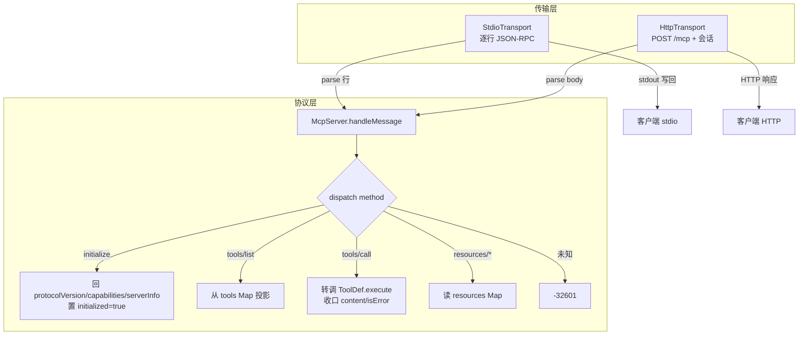
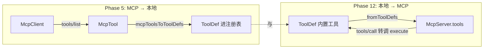
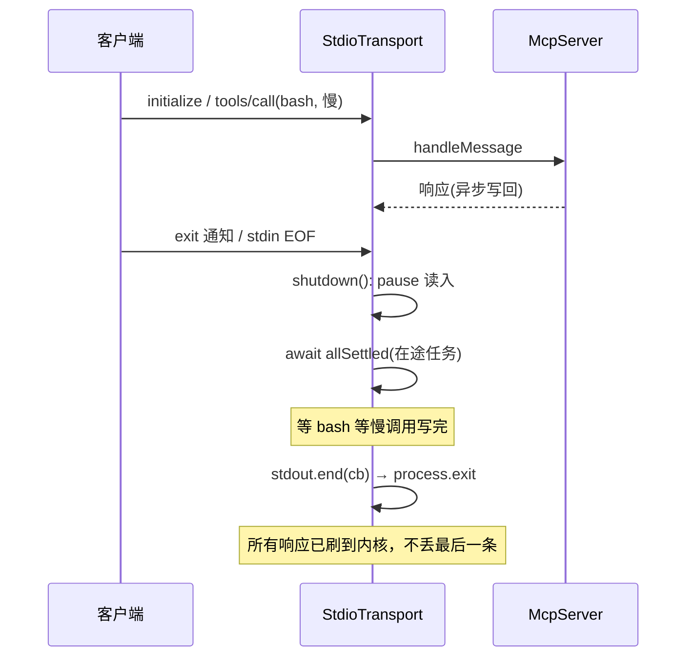
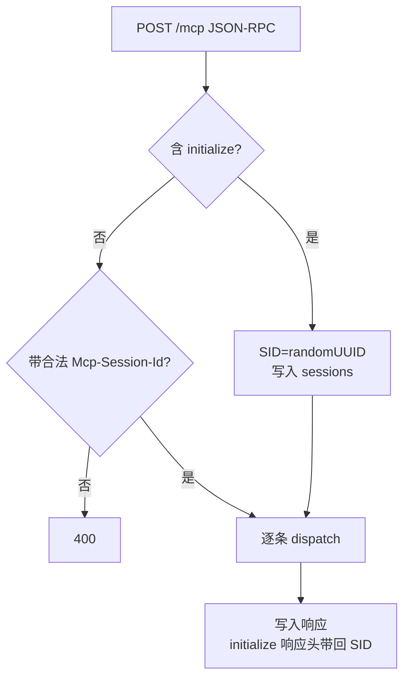

# 第 12 期学习文档：MCP Server（与 Phase 5 客户端对端；暴露 tools/resources，可选 Streamable HTTP 传输）

## 0. 本期在全局路线图中的位置

Phase 5 做了 **MCP 客户端**（stdio + JSON-RPC 状态机，去连第三方 Server）。本期补齐对端——**手写一个 MCP Server**，
把本项目的「内置工具」原样暴露成 MCP 工具，让任意标准 MCP 客户端（包括我们自己的 Phase 5 `McpClient`）都能消费；
同时实现 `resources` 只读通道与 **Streamable HTTP** 传输。一句话：**客户端/服务端协议对等，是同一份 JSON-RPC 规范的两端**。

> 本期仍是「全手写、不引官方 SDK」的硬约束延续——重点是把 Phase 5 只「消费」的线规，自己「生产」一遍，
> 真正吃透 `initialize` 握手、`tools/call` 收口、传输层解耦这些 MCP 核心机制。

## 1. 本节完成了什么（交付物）

- `src/core/mcp/server.ts`：`McpServer` 传输无关的核心，实现 `initialize`/`ping`/`tools/list`/`tools/call`/`resources/list`/`resources/read`/`shutdown` 分发；`McpError` + 标准 JSON-RPC 错误码；`fromToolDefs` 桥接（ToolDef → MCP 工具，与 Phase 5 的 `mcpToolsToToolDefs` 方向相反）。
- `src/core/mcp/stdio.ts`：stdio 传输，逐行 JSON-RPC；优雅停机（等所有在途响应刷出再退出）。
- `src/core/mcp/http.ts`：Streamable HTTP 传输（手写 `node:http`，会话用 `Mcp-Session-Id` 头管理）。
- `src/core/mcp/demo-server.ts`：演示服务端，把 `getBuiltinTools()` 暴露为 MCP 工具，并挂一个 `agent://clock` 资源。
- `src/cli/main.ts`：`--mcp-serve` / `--mcp-transport <stdio|http>` / `--mcp-port` 三个 CLI 开关，进入服务端模式（不进 Agent/REPL，也不需要模型配置）。
- `tests/unit/mcp-server.test.ts`（16 用例，纯协议单测）+ `tests/unit/mcp-server-integration.test.ts`（2 用例：① 用 Phase 5 `McpClient` 真实连我们的 CLI Server 走通；② 直接起 HTTP 传输用 fetch 走通）。
- **验证三连**：单测 173 全绿；`McpClient ↔ CLI Server` 对端集成通过；真机手驱 stdio / HTTP 均收到完整响应。

## 2. 核心概念速览（先看这个）

- **传输无关（Transport-agnostic）**：协议层只认「一条 JSON-RPC 请求 → 一条响应」，至于字节走 stdin 还是 HTTP，交给传输层。`McpServer.handleMessage(msg)` 是唯一入口。
- **JSON-RPC 2.0 配对**：每条请求带 `id`，响应原样带回 `id`；**通知（notification）无 `id`**（如 `notifications/initialized`、`exit`），服务端不回包。
- **握手顺序**：客户端先 `initialize`（协商 `protocolVersion`），再发 `notifications/initialized` 通知，之后才 `tools/list`/`tools/call`。服务端在 `initialize` 里回 `capabilities`（`tools`/`resources`）与 `serverInfo`。
- **`tools/call` 收口**：无论工具成功失败，返回固定形态 `{ content: [{type:'text', text}], isError }`。`isError:true` 表示「工具执行了但业务报错」，与 JSON-RPC 协议级错误（如 `-32601` 未知方法）是两回事。
- **resources**：与 tools 解耦的只读通道（`resources/list` 列、`resources/read` 读 `uri`），适合暴露配置、文档、状态等「不改动世界」的内容。
- **Streamable HTTP**：2024-11-05 新增传输，单入口 `POST /mcp`；用 `Mcp-Session-Id` 头把多个 HTTP 请求归并到一条逻辑连接（替代旧的 SSE+POST 双端点）。

## 3. 设计方案与原理

### 3.1 Server 与传输层职责划分

- `McpServer` 不碰 `process.stdin/stdout`、不碰 `http.Server`——它只做「协议」。这让同一套逻辑能驱动两种传输，也便于单测（直接喂 `handleMessage`）。
- 传输层负责「字节 ↔ JSON-RPC 对象」以及连接生命周期（stdin 关闭 / HTTP 会话销毁）。

### 3.2 工具桥接（与 Phase 5 对称）

- 客户端：`mcpToolsToToolDefs` 把远端 `McpTool` 翻译成本地 `ToolDef`（execute 内部转调 `tools/call`）。
- 服务端：`fromToolDefs` 把本地 `ToolDef` 注册进 `McpServer`（execute 直接复用，无需重写逻辑）。
- **同一份工具定义，既能作为客户端消费，也能作为服务端暴露**——这正是「协议对等」最直观的体现。

### 3.3 stdio 优雅停机时序（踩坑后版本）

### 3.4 Streamable HTTP 会话

## 4. 为什么这样设计（设计权衡）

| 决策点 | 我们的选择 | 反方案 | 为什么 |
|---|---|---|---|
| Server 是否依赖传输 | 传输无关，`handleMessage` 唯一入口 | Server 直接读 stdin / 接 http | 协议逻辑可单测、可双传输复用；也是 MCP SDK 的标准分层 |
| 不引官方 SDK | 全手写 JSON-RPC 分发 | `import { Server } from @modelcontextprotocol/sdk` | 项目硬约束「从零手搓」；手写才能看清配对/协商/收口细节 |
| `tools/call` 如何调工具 | 直接 `tool.execute(args, ctx)` | 再起子进程跑工具 | 与 Agent 侧执行同一份逻辑，零重复；权限/审计天然一致 |
| 错误模型 | `McpError(code)` 收口 + `isError` 业务标记 | 全用抛异常 | 区分「协议错(-326xx)」与「工具业务失败(isError)」，对端才好分别处理 |
| stdio 退出 | 等所有在途响应刷出再 `process.exit` | 收到 exit 直接 `process.exit` | 见 §9：直接退出会截断最后一条响应（实测俩坑） |
| HTTP 实现范围 | 手写 `node:http`，只做 `POST /mcp` + 会话 | 引 express / 完整 SSE | 保持零运行时依赖；SSE 流式留作进阶练习（文档已声明） |
| 传输选择 | 单进程可切 stdio/http | 只做一种 | stdio 给本地子进程，http 给远程/多客户端，覆盖主流用法 |

## 5. 与其它方案对比（优势）

| 维度 | 本项目（传输无关手写 Server） | 引官方 SDK | 从零但揉在一起 |
|---|---|---|---|
| 依赖克制（硬约束） | ✅ 零额外依赖 | ❌ 引入 SDK | ✅ |
| 协议细节可见性 | ✅ 全在自己代码里 | 隐藏在 SDK 内 | ✅ 但易乱 |
| 双传输复用 | ✅ 同一 `McpServer` | ✅ SDK 支持 | ❌ 常耦合 stdin |
| 可单测性 | ✅ 直接喂 `handleMessage` | 中（需 mock 传输） | ❌ 难 |
| 与既有工具复用 | ✅ `fromToolDefs` 直接桥 | 需各自 adapter | 视实现 |

> 核心优势一句话：**「协议层一份逻辑，stdio / HTTP 两种传输；内置工具原地暴露成 MCP 工具，零重写。」**

## 6. 面试话术（30 秒版 + 详版）

**30 秒版**：
> 我做了一个仿 Claude Code 的 CLI Agent。第 12 期补齐了 MCP 的**服务端**——和 Phase 5 的客户端对端。
> 核心是**传输无关**的 `McpServer`：只做 JSON-RPC 协议分发（initialize 握手、tools/list、tools/call、resources），
> 真正的字节收发交给 stdio 和 Streamable HTTP 两个传输层。我把内置工具通过 `fromToolDefs` 原样暴露成 MCP 工具，
> 和客户端侧的 `mcpToolsToToolDefs` 正好是对称桥接。最踩坑的是 stdio 退出：**直接 `process.exit` 会截断最后一条响应**，
> 我改成「先 `await` 所有在途请求、再 `stdout.end(cb)` 触发退出」，才不丢包。

**详版（被追问时展开）**：
- **为什么传输无关？** 协议层（握手/分发/错误码）与字节传输（行分隔 vs HTTP）正交。把 `handleMessage(msg)` 做成唯一入口，
  stdio 和 HTTP 只是不同的「喂消息 / 收响应」适配器。好处是协议逻辑可以脱离 IO 单测（直接构造 JSON 调用），且双传输零重复。
- **tools/call 怎么和你们 Agent 的工具打通？** 两边共用 `ToolDef` 类型。客户端把远端 `McpTool` 翻成 `ToolDef`（execute 内部转调 `tools/call`）；
  服务端反过来把本地 `ToolDef` 注册进 `McpServer`，`tools/call` 直接 `execute(args)`。同一份工具定义，既能消费也能暴露。
- **错误分两层你怎么处理的？** JSON-RPC 协议级错误（未知方法 `-32601`、缺参 `-32602`、未初始化 `-32600`）用 `McpError(code)` 收口进 `error` 字段；
  而「工具跑起来了但业务失败」用 `isError:true` + `content` 文本返回——对端据此区分「链路坏了」还是「工具说不行」。
- **stdio 那个退出坑具体说下？** 两连击：① 收到 `exit` 立刻 `process.exit(0)` 会截断正在写的最后一条响应（甚至 `ERR_STREAM_WRITE_AFTER_END`）；
  ② 把「stdin 关闭 EOF」接硬杀，会和 `exit` 通知/父进程断开同时间到达，抢在慢工具（如 bash）之前杀进程丢响应。
  修法是 EOF 和 exit 都走优雅停机：`pause` 读入 → `await` 所有在途任务 → `stdout.end(cb)` 刷出后退出。
- **HTTP 传输你做了多少？** 手写 `node:http`，单入口 `POST /mcp`，`initialize` 时生成 `Mcp-Session-Id` 回在响应头、后续请求必须带，否则 400；
  响应以 `application/json` 直接返回（退化形态）。完整的 SSE 流式推送留作进阶（文档已声明范围）。

## 7. 常见面试题（附答题要点）

1. **「MCP 的 initialize 握手在干什么？」**
   答：协商协议版本（`protocolVersion`，本项目锁定 `2024-11-05`）、服务端回 `capabilities`（`tools`/`resources` 声明支持哪些能力）与 `serverInfo`。
   客户端随后发 `notifications/initialized`（无 id 通知）正式进入 ready，之后才列/调工具。**未初始化就调业务方法应回 `-32600`。**

2. **「JSON-RPC 里请求和通知有什么区别？服务端怎么处理通知？」**
   答：请求带 `id`，需回带同 `id` 的响应；通知无 `id`，服务端不回包。`exit`、`notifications/initialized` 都是通知。
   服务端 dispatcher 第一件事就是「无 id → 返回 null（不回包）」，否则客户端会把它当挂起请求一直等。

3. **「tools/call 返回 `{isError:true}` 和 JSON-RPC 的 `error` 字段，你什么时候用哪个？」**
   答：`error` 是协议层出错（方法不存在、参数缺失、服务端炸了），对端按协议错误处理；`isError:true` 是「工具成功执行但业务失败」
   （如文件不存在、命令非零退出），内容仍在 `content` 里。二者意图不同：前者链路故障，后者工具结论。

4. **「stdio 传输下，你怎么保证进程退出时不丢最后一条响应？」**
   答：不能收到 `exit` 就 `process.exit(0)`——Node 不会等 stdout 缓冲刷完。正确做法：停止读入 → `await` 所有在途 `handleMessage`（含其写回）→
   `stdout.end(cb)` 在刷出回调里再 `process.exit(0)`。并把 stdin EOF 也接优雅停机而非硬杀，避免和慢工具竞争。

5. **「Streamable HTTP 怎么把多次 HTTP 请求对应到一条逻辑连接？」**
   答：`initialize` 时服务端生成 `Mcp-Session-Id` 放在响应头；客户端后续请求都带这个头；服务端用 `Set` 维护活跃会话，
   非 initialize 请求不带合法 SID 直接回 400。会话可对应「一对多」HTTP 请求到「一个 Server 状态」。

6. **「你为什么不直接 import 官方 MCP SDK 的 Server？」**
   答：本项目定位「从零手搓学习」，硬约束不引 SDK。手写能看清 JSON-RPC 配对、`initialize` 协商、`tools/call` 收口、传输解耦这些本质；
   且零额外依赖，stdio/HTTP 都能用原生模块（readline / node:http）实现。生产里当然优先用 SDK 省心。

## 8. 关键代码索引

| 能力 | 文件:符号 |
|---|---|
| 协议核心 | `src/core/mcp/server.ts` : `McpServer.handleMessage` / `dispatch` / `onInitialize` / `onToolsCall` / `onResourcesRead` |
| 错误模型 | `src/core/mcp/server.ts` : `McpError` / `JsonRpcError`（标准码） |
| 工具桥接 | `src/core/mcp/server.ts` : `fromToolDefs`（与 Phase 5 `mcpToolsToToolDefs` 对称） |
| stdio 传输 | `src/core/mcp/stdio.ts` : `StdioTransport.start` / `onLine` / `shutdown`（优雅停机） |
| HTTP 传输 | `src/core/mcp/http.ts` : `HttpTransport.listen` / `onRequest`（会话 + `Mcp-Session-Id`） |
| 演示服务端 | `src/core/mcp/demo-server.ts` : `startMcpServer`（注册内置工具 + `agent://clock` 资源） |
| CLI 接线 | `src/cli/main.ts` : `--mcp-serve` / `--mcp-transport` / `--mcp-port` 分支（早于模型配置） |

## 9. 踩坑与细节（来自真实实现）

1. **`process.exit(0)` 直接截断最后一条响应（第一坑）。**
   最初 `exit` 通知处理里直接 `process.exit(0)`。手驱测试时发现：慢工具（如 `bash`）的响应还没写，进程就没了，
   客户端只收到前几条。甚至曾因「先 `stdout.end()` 又写」抛 `ERR_STREAM_WRITE_AFTER_END`。
   **修法**：`shutdown()` 里 `await Promise.allSettled([...inFlight])` 等所有在途任务（含其 `write`）完成，再 `stdout.end(cb)` 在刷出回调里退出。

2. **把 stdin EOF 接了硬杀，和慢工具竞争丢包（第二坑，更隐蔽）。**
   最初 `rl.on('close', () => process.exit(0))`。当客户端断开（或 `printf` 写完关闭管道），EOF 与 `exit` 通知/父进程退出**同期到达**，
   硬杀抢在 `bash` 等慢调用之前，响应被吞。真机表现：init 收到、bash 的 id 缺失。
   **修法**：`rl.on('close')` 也改接 `void this.shutdown()`（优雅停机），与 `exit` 通知走同一安全路径；`shutdown` 幂等（`if(this.closed) return`）。

3. **`inFlight` 必须在「写回」之后才算完成。**
   一开始 `onLine` 里 `await handleMessage` 后就从 `inFlight` 删除，导致「请求处理完但响应还没 write」就被认为完成，
   优雅停机可能在 write 前结束 stdout。
   **修法**：把「`handleMessage` + `write`」包成一个 async 任务整体加入 `inFlight`，`await` 完整个任务再删除——保证退出前响应已落笔。

4. **手写 `node:http` 解析单条 vs 批量消息。**
   MCP 允许请求体是单条对象或数组。最初只按单条处理，批量会整体当一条解析失败。
   **修法**：`Array.isArray(body)` 判定，`isBatch` 时逐条 `handleMessage`、把非空响应组成数组回包；`initialize` 判定对数组用 `some`。

5. **HTTP 会话校验位置与 400。**
   非 `initialize` 请求若不带合法 `Mcp-Session-Id`，直接回 `400`（而不是当成新会话）。这是规范要求的，否则会话会被凭空新建、状态错乱。
   已用测试覆盖（`tools/list` 不带 SID → `HTTP 400`）。

6. **`agent://clock` 资源演示了 resources 与 tools 解耦。**
   `resources/read` 返回 `{ contents:[{uri,mimeType,text}]}`，与 `tools/call` 的 `{content:[...]}` 字段名不同（`contents` vs `content`），
   容易在对接客户端时写错。统一在 `server.ts` 里固定形状，单测与 HTTP 真机均验证。

## 10. 自测题（检验是否真懂）

1. 客户端连上后**没发 `initialize`** 就直接 `tools/list`，你的 Server 应返回什么错误码？为什么？
2. 某 `tools/call` 的 `execute` 抛了异常（不是业务 `ok:false`），你的 Server 响应长什么样？`isError` 是 true 还是 false？客户端看到的和「未知方法 `-32601`」有何本质区别？
3. 画出 stdio 优雅停机时序：客户端在**同一条输入里**连发 `initialize` + `tools/call(bash,慢)` + `exit`，Server 内部 `inFlight` 如何变化？为什么最后 bash 的响应不会丢？
4. HTTP 传输下，客户端先 `initialize`（拿到 SID），再发 `tools/list` 但**忘了带 `Mcp-Session-Id` 头**，会怎样？若带了伪造的 SID 呢？
5. 为什么 `fromToolDefs` 要 `filter(t => typeof t.execute === 'function')`？如果不滤，注册一个没有 `execute` 的 ToolDef 后在 `tools/call` 会发生什么（结合 `onToolsCall` 看）？
6. Streamable HTTP 完整规范还要求支持 SSE（`text/event-stream`）做服务端主动推送，我们的实现为什么先退化成 `application/json`？如果要补 SSE，传输层要改哪几处？

## 11. 延伸与下一步

- **补全 SSE 流式**：`HttpTransport` 在支持 `Accept: text/event-stream` 时改走 SSE 响应，支持 `GET /mcp` 建监听流、`DELETE /mcp` 关会话（§4 决策已声明范围）。
- **鉴权与多租户**：HTTP 传输加 Bearer/API Key 校验，按 SID 隔离资源；stdio 可加 `--mcp-token` 简单握手。
- **资源订阅（resources/subscribe）**：当前 `resources/read` 是拉模式，规范还有变更通知推送，可作为进阶练习。
- **把 Server 能力接到配置**：让 `--mcp-serve` 能从 `config.json` 读取「要暴露哪些工具 / 资源」，而非写死全部内置工具。
- **对端互测脚本化**：把本期「`McpClient` ↔ 我们自己的 Server」集成测试固化进 CI，作为「协议对等」的回归保障。
