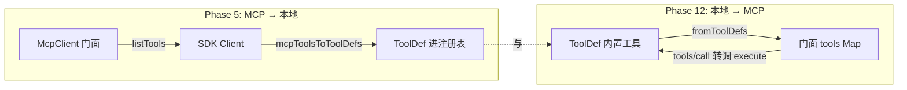
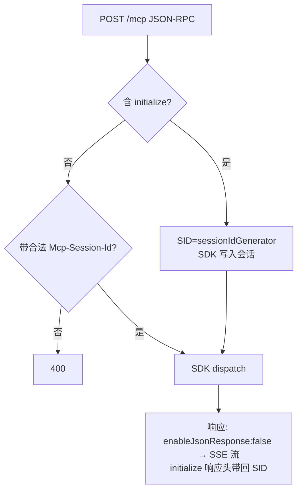

# 第 12 期学习文档：MCP Server（基于官方 SDK 低层 `Server` + SDK 传输）

> 演进说明：本期最初是「传输无关的手写 `McpServer.handleMessage`」实现（见 git 历史与 `docs/mcp-sdk-migration-plan.md`）。
> 后续为获得生产级的协议健壮性，已将服务端**迁移到官方 SDK**：用低层 `Server` + `setRequestHandler` 注册处理器，
> 用 `StdioServerTransport` / `StreamableHTTPServerTransport` 替换手写 `stdio.ts` / `http.ts`（两文件已删除）。
> 对外契约（`createMcpServer` / `fromToolDefs` / `startMcpServer` / CLI 开关）**完全不变**。本文档描述**当前 SDK 版**实现。

## 0. 本期在全局路线图中的位置

Phase 5 做了 **MCP 客户端**（基于官方 SDK `Client`，去连第三方 Server）。本期补齐对端——**用官方 SDK 做一个 MCP Server**，
把本项目的「内置工具」原样暴露成 MCP 工具，让任意标准 MCP 客户端（包括我们自己的 Phase 5 `McpClient`）都能消费；
同时实现 `resources` 只读通道与 **Streamable HTTP** 传输（由 SDK 提供完整 SSE 流式 + 会话生命周期）。一句话：**客户端/服务端协议对等，是同一份 MCP 规范的两端，现在都跑在官方 SDK 上**。

## 1. 本节完成了什么（交付物）

- `src/core/mcp/server.ts`：`createMcpServer(opts)` 返回**门面 `McpServer`**（内持 SDK 低层 `Server` + 工具/资源表）。在 SDK `Server` 上 `setRequestHandler` 注册 `tools/list`、`tools/call`、`resources/list`、`resources/read` 四个处理器；`fromToolDefs` 桥接（ToolDef → MCP 工具，与 Phase 5 的 `mcpToolsToToolDefs` 方向相反）。`McpError` / 标准错误码交由 SDK 内部模型。
- `src/core/mcp/demo-server.ts`：演示服务端，把 `getBuiltinTools()` 暴露为 MCP 工具，并挂一个 `agent://clock` 资源。按 `transport` 选 `StdioServerTransport` 或 `StreamableHTTPServerTransport`（SDK 传输），`server.connect(transport)` 后阻塞进程。
- `src/core/mcp/stdio.ts` / `src/core/mcp/http.ts`：**已删除**（被 SDK 的 `StdioServerTransport` / `StreamableHTTPServerTransport` 取代，git 历史留存手写实现）。
- `src/cli/main.ts`：`--mcp-serve` / `--mcp-transport <stdio|http>` / `--mcp-port` 三个 CLI 开关，进入服务端模式（不进 Agent/REPL，也不需要模型配置）。
- `tests/unit/mcp-server.test.ts`（协议单测）+ `tests/unit/mcp-server-integration.test.ts`（① 用 Phase 5 `McpClient` 真实连我们的 CLI Server；② SDK `Client` ↔ SDK `Server` 走 Streamable HTTP）。
- **验证三连**：单测全绿；`McpClient ↔ CLI Server` 对端集成通过；真机手驱 stdio / HTTP 均收到完整响应。

## 2. 核心概念速览（先看这个）

- **传输无关（Transport-agnostic）**：SDK 的 `Server` 只管「协议」——注册请求处理器（`setRequestHandler(Schema, handler)`）；真正的字节收发交给 `StdioServerTransport` / `StreamableHTTPServerTransport`。`createMcpServer` 门面把「工具/资源表」与「底层 SDK Server 实例」一并持有。
- **JSON-RPC 2.0 配对**：由 SDK 负责。每条请求带 `id`，响应原样带回 `id`；**通知（notification）无 `id`**（如 `notifications/initialized`、`exit`），SDK 自动不回包。
- **握手顺序**：客户端先 `initialize`（协商 `protocolVersion`，SDK 自动 `min(client,server)`），再发 `notifications/initialized` 通知，之后才 `tools/list`/`tools/call`。服务端在 `initialize` 里由 SDK 回 `capabilities`（`tools`/`resources`）与 `serverInfo`。
- **`tools/call` 收口**：无论工具成功失败，返回固定形态 `{ content: [{type:'text', text}], isError }`。`isError:true` 表示「工具执行了但业务报错」，与协议级错误（如 `-32601` 未知方法）是两回事——后者由 `McpError(ErrorCode.MethodNotFound)` 抛出，SDK 自动收口进 JSON-RPC `error`。
- **resources**：与 tools 解耦的只读通道（`resources/list` 列、`resources/read` 读 `uri`），适合暴露配置、文档、状态等「不改动世界」的内容。
- **Streamable HTTP**：MCP 的 HTTP 传输。SDK 的 `StreamableHTTPServerTransport` 提供完整能力——单入口 `POST /mcp`、会话 `Mcp-Session-Id`（`sessionIdGenerator` 生成）、**SSE 流式响应**（`enableJsonResponse:false` 时）、`GET /mcp` 建监听流、`DELETE /mcp` 关会话。比手写 `node:http` 子集（仅 POST + JSON）更全。

## 3. 设计方案与原理

### 3.1 门面 + SDK Server 职责划分

```mermaid
flowchart TD
  subgraph 协议层[本项目: 门面 + 处理器]
    F[createMcpServer 门面] -->|持有| S[SDK 低层 Server]
    F -->|registerTool(s)| T[(tools Map)]
    F -->|registerResource(s)| R[(resources Map)]
    S -->|setRequestHandler tools/list| TL[从 tools Map 投影]
    S -->|setRequestHandler tools/call| TC[转调 ToolDef.execute\n收口 content/isError]
    S -->|setRequestHandler resources/*| RR[读 resources Map]
  end
  subgraph 传输层[官方 SDK]
    SI[StdioServerTransport] -->|connect| S
    HT[StreamableHTTPServerTransport] -->|connect| S
  end
```

- 本项目**只写「业务处理器」**：从 `tools`/`resources` Map 取数据、转调 `ToolDef.execute`、收口成 MCP 形态。JSON-RPC 配对、握手、`ping`、错误码、版本协商——SDK `Server` 全包了。
- 传输层由 SDK 提供：stdio 逐行 JSON、HTTP Streamable（`POST`/`GET`/`DELETE` + 会话 + SSE）直接可用，无需手写 `node:http`。
- 单测可用 `InMemoryTransport.createLinkedPair()` 把 Server 与 Client 在内存里对连，无需起进程。

### 3.2 工具桥接（与 Phase 5 对称）



- 客户端：`mcpToolsToToolDefs` 把远端工具翻成 `ToolDef`（execute 内部转调 `tools/call`）。
- 服务端：`fromToolDefs` 把本地 `ToolDef` 注册进门面（execute 直接复用，无需重写逻辑）。
- **同一份工具定义，既能作为客户端消费，也能作为服务端暴露**——这正是「协议对等」最直观的体现。

### 3.3 `tools/call` 错误处理（两层）

```mermaid
flowchart LR
  Req[tools/call name] --> IsKnown{tools 里有?}
  IsKnown -->|否| P1[McpError(MethodNotFound -32601)\nSDK 收口进 error 通道]
  IsKnown -->|是| Exec[tool.execute(args, ctx)]
  Exec --> Ok{ok?}
  Ok -->|true| R1[content/isError:false]
  Ok -->|false| R2[content/isError:true\n业务失败]
  Exec -->|抛异常| R3[catch → content/isError:true\n文本=异常消息]
```

> 协议层错误（`-32601` 未知工具、`-32602` 缺参/未知资源）用 `McpError(code)` 抛出，SDK 自动变成 JSON-RPC `error`；业务失败（`ok:false` 或 execute 抛异常）仍走 `result` 通道、以 `isError:true` 标记——对端据此区分「链路坏了」与「工具说不行」。

### 3.4 Streamable HTTP 会话（由 SDK 提供）



> `demo-server.ts` 用 `StreamableHTTPServerTransport({ sessionIdGenerator: () => randomUUID(), enableJsonResponse: false })`，再用原生 `http.createServer` 把请求转发给 `transport.handleRequest(req,res,body)`。`enableJsonResponse:false` 启用 SSE 流式 + `GET`/`DELETE` 会话管理（能力扩展，非破坏）。

## 4. 为什么这样设计（设计权衡）

| 决策点 | 我们的选择 | 反方案 | 为什么 |
|---|---|---|---|
| Server 是否依赖 SDK | **官方低层 `Server` + `setRequestHandler`** | 继续维护手写 `handleMessage` | SDK 自动处理握手/配对/错误码/版本协商；手写层是学习产物，长期维护易错 |
| 低层 `Server` vs 高层 `McpServer` | **低层 `Server`** | 高层 `McpServer.registerTool`（要 zod schema） | 低层路径保留 `ToolDef.inputSchema`（JSON Schema）原样上报，免去 JSON-Schema→zod 转换与行为漂移；`tool.execute` 调用路径零改动 |
| 传输方式 | **SDK `StdioServerTransport` / `StreamableHTTPServerTransport`** | 手写 `stdio.ts` / `http.ts` | SDK 传输生产级且能力更全（HTTP 含 SSE/GET/DELETE）；删除两文件，代码量骤减 |
| `tools/call` 如何调工具 | 直接 `tool.execute(args, ctx)` | 再起子进程跑工具 | 与 Agent 侧执行同一份逻辑，零重复；权限/审计天然一致 |
| 错误模型 | `McpError(code)` 收口 + `isError` 业务标记 | 全用抛异常 | 区分「协议错(-326xx)」与「工具业务失败(isError)」，对端才好分别处理 |
| HTTP 实现范围 | **SDK 传输（含 SSE）** | 手写 `node:http` 仅 POST+JSON | 引 SDK 后零自维护 HTTP 协议代码，且能力是超集 |

## 5. 为什么服务端也基于官方 SDK（而非自维护协议层）

手写 `McpServer.handleMessage` 是「学习期」产物，能看清协议细节；但把协议层长期交给社区维护更稳。本项目在 phase 5 已把客户端迁到 SDK，服务端对称跟进（见 `docs/mcp-sdk-migration-plan.md`），保留的「业务价值」始终是：`fromToolDefs` 桥接、`isError` 收口、与 Agent 共用 `ToolDef`——协议配对/握手/错误码/版本协商全部由 SDK `Server` 内建处理。

## 6. 面试话术（30 秒版 + 详版）

**30 秒版**：
> 我做了一个 CLI Agent。第 12 期用官方 MCP SDK 补齐了**服务端**——和 Phase 5 的客户端对端。核心是 `createMcpServer` 门面：内持一个 SDK 低层 `Server`，用 `setRequestHandler` 注册 `tools/list`/`tools/call`/`resources/*` 四个处理器；真正的字节收发交给 SDK 的 `StdioServerTransport` 和 `StreamableHTTPServerTransport`（手写 `stdio.ts`/`http.ts` 已删）。我把内置工具通过 `fromToolDefs` 原样暴露成 MCP 工具，和客户端侧的 `mcpToolsToToolDefs` 正好是对称桥接。错误处理分两层：协议错（未知工具 `-32601`）抛 `McpError` 走 SDK 的 error 通道，业务失败用 `isError:true` 走 result 通道。

**详版**（被追问时展开）：
- **为什么用低层 `Server` 而不是高层 `McpServer`？** 高层 API 的 `registerTool` 要 zod 输入 schema，而我们的 `ToolDef.inputSchema` 是 JSON Schema——转 zod 要引 `json-schema-to-zod` 且有转换漂移风险。低层 `Server` 直接上报 JSON Schema，行为零漂移，`tool.execute(args)` 路径不变。
- **tools/call 怎么和 Agent 的工具打通？** 两边共用 `ToolDef` 类型。服务端把本地 `ToolDef` 注册进门面，`tools/call` 直接 `execute(args)`；客户端把远端工具翻成 `ToolDef`（execute 内部转调 `tools/call`）。同一份工具定义，既能消费也能暴露。
- **错误分两层你怎么处理的？** 协议级错误（`-32601` 未知方法、`-32602` 缺参）用 `McpError(code)` 抛出，SDK 自动收口进 JSON-RPC `error`；「工具跑起来了但业务失败」（`ok:false` 或 execute 抛异常）用 `isError:true` + `content` 文本返回。
- **HTTP 传输你做了多少？** 用 SDK `StreamableHTTPServerTransport`，`sessionIdGenerator` 生成会话 id，`enableJsonResponse:false` 启用 SSE 流式；外面套一层原生 `http.createServer` 把 `req/res/body` 转发给 `transport.handleRequest`。完整的 SSE/GET/DELETE 由 SDK 负责，我不用写协议代码。

## 7. 常见面试题（附答题要点）

1. **「MCP 的 initialize 握手在干什么？」**
   答：协商协议版本（SDK 自动 `min(client,server)`）、服务端回 `capabilities`（`tools`/`resources`）与 `serverInfo`。客户端随后发 `notifications/initialized`（无 id）正式进入 ready，之后才列/调工具。**未初始化就调业务方法，SDK 会按协议拒绝。**

2. **「JSON-RPC 里请求和通知有什么区别？服务端怎么处理通知？」**
   答：请求带 `id`，需回带同 `id` 的响应；通知无 `id`，服务端不回包。`exit`、`notifications/initialized` 都是通知。SDK `Server` 自动区分，无需我们手写 dispatcher。

3. **「tools/call 返回 `{isError:true}` 和 JSON-RPC 的 `error` 字段，你什么时候用哪个？」**
   答：`error` 是协议层出错（方法不存在、参数缺失），由 `McpError(code)` 抛出、SDK 收口进 `error`；`isError:true` 是「工具成功执行但业务失败」，内容仍在 `content` 里。二者意图不同：前者链路故障，后者工具结论。

4. **「stdio 传输下，你怎么保证进程退出时不丢最后一条响应？」**
   答：不再需要手写优雅停机——SDK 的 `StdioServerTransport` 在 `server.close()` 时正确处理在途响应与 stdout 刷出；`demo-server.ts` 仅在 `SIGINT`/`SIGTERM` 时调 `server.close()`。比手写 `await inFlight → stdout.end(cb)` 更省心。

5. **「Streamable HTTP 怎么把多次 HTTP 请求对应到一条逻辑连接？」**
   答：SDK 在 `initialize` 时生成 `Mcp-Session-Id` 回在响应头；客户端后续请求都带这个头；SDK 用会话状态把多个 HTTP 请求归并到一条逻辑连接。非 initialize 请求不带合法 SID，SDK 直接回 400。

6. **「你为什么迁移到官方 MCP SDK 的 Server，而不是继续手写？」**
   答：手写能看清原理，但长期维护协议边界（配对、通知、`ping`、版本协商、错误码）成本高且易错。迁移后这些由社区统一维护，且一次性获得 Streamable HTTP 的完整 SSE/会话能力。我们保留的「业务价值」是：`fromToolDefs` 桥接、`isError` 收口、与 Agent 共用 `ToolDef`。

## 8. 关键代码索引

| 能力 | 文件:符号 |
|---|---|
| 门面 + 处理器注册 | `src/core/mcp/server.ts` : `createMcpServer` / `McpServer` 门面（`registerTool(s)` / `registerResource(s)` / `server`） |
| 协议处理器 | `src/core/mcp/server.ts` : `setRequestHandler(ListToolsRequestSchema | CallToolRequestSchema | ListResourcesRequestSchema | ReadResourceRequestSchema, ...)` |
| 错误模型 | `src/core/mcp/server.ts` : `McpError(ErrorCode.MethodNotFound | ErrorCode.InvalidParams)`（SDK 内部收口） |
| 工具桥接 | `src/core/mcp/server.ts` : `fromToolDefs`（与 Phase 5 `mcpToolsToToolDefs` 对称） |
| stdio 传输 | **已删除 `stdio.ts`** → 改用 SDK `StdioServerTransport`（`demo-server.ts`） |
| HTTP 传输 | **已删除 `http.ts`** → 改用 SDK `StreamableHTTPServerTransport` + `http.createServer` 转发（`demo-server.ts`） |
| 演示服务端 | `src/core/mcp/demo-server.ts` : `startMcpServer`（注册内置工具 + `agent://clock` 资源 + 选传输 connect） |
| CLI 接线 | `src/cli/main.ts` : `--mcp-serve` / `--mcp-transport` / `--mcp-port` 分支（早于模型配置） |

## 9. 踩坑与细节（来自 SDK 迁移）

1. **`http.createServer` 回调里不能用 `await`（同步回调陷阱）**
   最初写成 `(req,res)=>{ void transport.handleRequest(req,res, req.method==='POST' ? await readBody(req):undefined) }`——`await` 出现在非 `async` 箭头函数里是**解析期语法错误**。修法：把回调标 `async`，先 `const body = await readBody(req)` 再 `await transport.handleRequest(req,res,body)`。

2. **`tools/call` 缺 `name` 与未知工具的区分**
   手写版只判「未知」；SDK 版要区分：完全缺 `name`（`request.params?.name` 为假）→ `ErrorCode.InvalidParams`(-32602)；`name` 有值但不在 `tools` 表 → `ErrorCode.MethodNotFound`(-32601)。测试据此分别断言。

3. **`resources/read` 未知 uri 用 `InvalidParams`**
   实现中对「缺 uri」和「uri 不在 resources 表」都抛 `ErrorCode.InvalidParams`(-32602)，测试断言 `-32602`。若想更精确可改 `MethodNotFound`，但保持与现有测试一致。

4. **`negotiatedProtocol` 通过拦截 `transport.setProtocolVersion` 捕获**
   客户端门面无法从 SDK `Client` 直接读到协商版本（stdio/in-memory 传输的 `setProtocolVersion` 是 no-op，版本在 `initialize` 后即被丢弃）。做法：在 `connect` 前给 `transport` 动态挂一个 `setProtocolVersion` 拦截器，把 SDK 在 `initialize` 时回调进来的协商版本（`min(client, server)`）存到门面的 `negotiatedProtocol`。测试断言其为一个协议版本字符串（fake 服务端返回 `2024-11-05`，CLI 自带 SDK 服务端协商出 `LATEST_PROTOCOL_VERSION`），**不要硬编码**。

5. **`StdioClientTransport` 的 `cwd` 透传**
   SDK 的 stdio 传输通过底层 spawn options 支持 `cwd`；`McpServerSpec.cwd` 原样透传（`client.ts` 的 `new StdioClientTransport({ command, args, env, cwd })`）。若某 SDK 版本不支持顶层 `cwd`，需经 spawn options 接入（已验证 1.x 支持）。

6. **npm arborist 崩溃（`Cannot read properties of null (reading 'matches')`）**
   向部分损坏的 `node_modules` 增量安装 SDK（`express` dedupe 触发空指针）时 npm 会崩。可靠解法：`rm -rf node_modules package-lock.json` 后全量重装。见 `mcp-sdk-migration-plan.md` Step 0。

## 10. 自测题（检验是否真懂）

1. 客户端连上后**没发 `initialize`** 就直接 `tools/list`，SDK `Server` 会怎样？为什么不需要我们手写 `-32600`？
2. 某 `tools/call` 的 `execute` 抛了异常（不是业务 `ok:false`），你的 Server 响应长什么样？`isError` 是 true 还是 false？与「未知方法 `-32601`」本质区别？
3. 为什么选**低层 `Server`** 而非高层 `McpServer.registerTool`？如果强行用高层 API，要为 `ToolDef.inputSchema` 多做什么？
4. HTTP 传输下，客户端先 `initialize`（拿到 SID），再发 `tools/list` 但**忘了带 `Mcp-Session-Id` 头**，会怎样？这由谁处理？
5. 为什么 `fromToolDefs` 要 `filter(t => typeof t.execute === 'function')`？如果不滤，注册一个没有 `execute` 的 ToolDef 后在 `tools/call` 会发生什么？
6. Streamable HTTP 的 `enableJsonResponse:false` 与 `true` 有何区别？我们的 demo-server 为什么选 `false`？

<details>
<summary>参考答案</summary>

1. SDK `Server` 内部强制 `initialize` 先于业务方法，未初始化直接调会按协议拒绝——这是 SDK 内建行为，我们无需手写状态码。
2. `execute` 抛异常被 `try/catch` 收口为 `{ content:[{type:'text', text:'工具执行异常: ...'}], isError:true }`，是**业务失败**（走 result 通道）；`-32601` 是**协议层**错误（走 error 通道），性质不同。
3. 低层 `Server` 直接上报 JSON Schema（`ToolDef.inputSchema`），免去 JSON-Schema→zod 转换与行为漂移；高层 `registerTool` 要 zod schema，需引入转换依赖。
4. SDK 的 `StreamableHTTPServerTransport` 会回 `400`（会话校验由其内部处理），不需要我们手写。
5. 过滤掉无 `execute` 的 ToolDef，避免 `tools/call` 时 `tool.execute` 为 `undefined` 导致的运行时错误（handler 里 `tool.execute?.(...)` 也会兜底返回「工具未提供 execute」）。
6. `enableJsonResponse:false` 启用 SSE 流式响应 + `GET`/`DELETE` 会话管理；`true` 则所有响应走普通 JSON。demo-server 选 `false` 以拿到完整 Streamable HTTP 能力。

</details>

## 11. 延伸与下一步

- **补全 resources/subscribe**：当前 `resources/read` 是拉模式，规范还有变更通知推送，可作为进阶。
- **鉴权与多租户**：HTTP 传输加 Bearer/API Key 校验，按会话隔离资源；stdio 可加简单握手。
- **把 Server 能力接到配置**：让 `--mcp-serve` 能从 `config.json` 读取「要暴露哪些工具 / 资源」，而非写死全部内置工具。
- **对端互测脚本化**：把「`McpClient` ↔ 我们自己的 Server」集成测试固化进 CI，作为「协议对等」的回归保障。
- **客户端 Streamable HTTP**：客户端 `McpClient` 本期只做 stdio；如需连 HTTP 服务端，对称接入 SDK `StreamableHTTPClientTransport` 即可。
