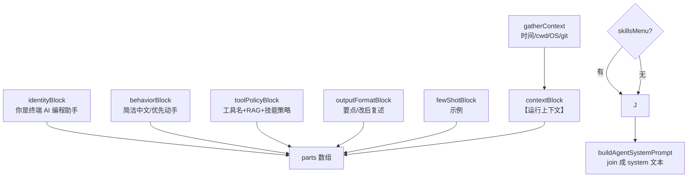
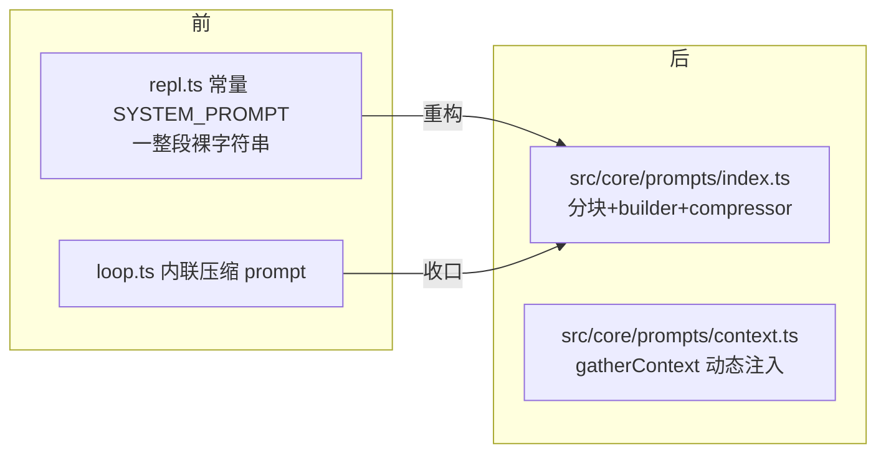

# 第 13 期学习文档：System Prompt 工程化（从硬编码字符串到可组合模块）

## 0. 本期在全局路线图中的位置

Prompt 工程是项目目标里点名的 8 大底层模式之一（ReAct / Tool Calling / MCP / 多模型适配 / **Prompt 工程** / RAG / 安全审计 / Agent 流程）。
前 7 个都已有专属期次，唯独 Prompt 工程一直散落在 `repl.ts` 的硬编码常量里。本期把它**正式工程化**：
把系统提示拆成可组合的块、注入动态运行上下文、补输出格式与 few-shot，并把压缩子 prompt 统一收口。

> 这不是"加功能"，而是"补课"——把早期能跑的最小 prompt 升级成可维护、可注入、可评测的形态，
> 为后续 Plan 模式（14→15）、Multi-Agent（16→17）、记忆自动注入（15→16）打正地基（它们都建立在"会写 prompt"之上）。

## 1. 本节完成了什么（交付物）

- `src/core/prompts/index.ts`：系统提示的**分块组合**核心——`identity` / `behavior` / `tool-policy` / `output-format` / `few-shot` 五个职责单一的块 + `buildAgentSystemPrompt()` 组装器 + `compressorSystemPrompt()`（压缩子 prompt 收口）。
- `src/core/prompts/context.ts`：`gatherContext()` 动态采集运行上下文（当前时间 / cwd / OS / git 分支），非 git 目录或 git 不可用时静默降级为 `undefined`。
- `src/cli/repl.ts`：删除硬编码 `SYSTEM_PROMPT` 常量，`runOnce` 与 `startRepl` 两处改用 `buildAgentSystemPrompt()`，技能清单（渐进式披露）照常按需追加。
- `src/core/agent/loop.ts`：`defaultSummarizer` 改用 `compressorSystemPrompt()`，移除内联硬编码字符串。
- `tests/unit/prompts.test.ts`（7 用例）：分块组合、动态上下文注入、skillsMenu 追加/省略、非 git 目录不抛、压缩 prompt 语义。
- **验证**：`tsx` 真机渲染确认五块齐全、运行上下文（时间/cwd/`linux x64`/git 分支 `main`）注入正确；单测 **180/180** 全绿。

## 2. 核心概念速览（先看这个）

- **分块组合（Block Composition）**：系统提示不是一整段字符串，而是多个小块的数组，按顺序 `join`。每块只管一件事，可单独测试/替换/启停。
- **动态上下文注入（Dynamic Context Injection）**：每次组 prompt 都采集"此刻在哪"——时间、工作目录、OS、git 分支——让模型不再凭空假设环境。这是 Claude Code 类工具的真实做法。
- **系统提示 vs 工具 schema（关键区分）**：本项目的工具**不写进系统提示**，而是走 API 的 `tools` 参数（function calling，见 `loop.ts` 的 `tools: opts.tools.list()`）。系统提示里只**提示工具名**作为引导，真正的工具契约在 `tools` 字段。两者职责不同，别混。
- **渐进式披露（沿用 Phase 7）**：技能正文仍只在 `use_skill` 被调用时才加载；常驻系统提示的只有「技能 name+description 清单」（`SkillLoader.menuText()`），由调用方按需追加。
- **prompt 作为数据/代码**：原本 prompt 是代码里的裸字符串（易漏改、难测）；工程化后块是纯函数、组装是可测的纯逻辑，prompt 变成"可组合的数据"。

## 3. 设计方案与原理

### 3.1 分块组合与装配



- 五个常驻块是纯函数，放 `BLOCKS` 数组里 `map(b => b())` 展开，顺序即最终顺序，确定性可测。
- `contextBlock` 由 `gatherContext` 的结果渲染，是唯一的"动态"部分。

### 3.2 动态上下文采集（含容错）

```mermaid
flowchart LR
  G[buildAgentSystemPrompt] --> H[gatherContext cwd,now]
  H --> OS[platform()+arch → OS]
  H --> T[now.toLocaleString zh-CN → 时间]
  H --> GIT[execSync git rev-parse --abbrev-ref HEAD]
  GIT -->|成功| BR[gitBranch=分支名]
  GIT -->|失败/非git/超时| BR2[gitBranch=undefined 不抛]
  OS --> CTX[DynamicContext]
  T --> CTX
  BR --> CTX
  BR2 --> CTX
```

- `execSync` 用 `stdio:['ignore','pipe','ignore']` + `timeout:2000`，失败（非 git 仓库/无 git）被 `try/catch` 吞掉 → `undefined`，**绝不阻断主流程**。

### 3.3 与改造前的对比



## 4. 为什么这样设计（设计权衡）

| 决策点 | 我们的选择 | 反方案 | 为什么 |
|---|---|---|---|
| 提示放哪 | 独立 `src/core/prompts/` 模块 | 继续堆在 repl.ts | 与 REPL 解耦，Agent 循环/测试都能复用，且单一职责 |
| 是否分块 | 五块纯函数 + 数组组合 | 仍是一整段模板字符串 | 块可单独测、可启停、可替换；加维度不改旧块 |
| 动态上下文 | 每次组 prompt 实时 `gatherContext` | 写死或完全不放 | 模型需要知道时间/环境；实时采集最省心 |
| git 分支失败 | `try/catch` → `undefined` | 抛错中断 / 强制要求 git | 非 git 目录（如 `/tmp`）必须可用，不能因拿不到分支而崩 |
| 工具是否进 prompt | 工具名仅作提示，schema 走 `tools` 参数 | 把所有工具 schema 文本塞进 prompt | 避免 prompt 膨胀、命中函数调用机制、保持单一事实源 |
| 压缩 prompt 放哪 | 收口进 prompts 模块 | 留在 loop.ts | "所有写给模型的系统提示"集中管理，一处可维护 |

## 5. 与其它方案对比（优势）

| 维度 | 本期工程化方案 | 改造前的硬编码 | 引现成 prompt 框架 |
|---|---|---|---|
| 可维护性 | ✅ 块独立、可组合 | ❌ 一改动全身 | 视框架 |
| 可测试性 | ✅ 纯函数 + 注入 `now` 确定性测 | ❌ 字符串难单测 | 中 |
| 动态上下文 | ✅ 实时注入 | ❌ 无 | 视框架 |
| 与 Agent 解耦 | ✅ 模块独立 | ❌ 绑死 REPL | 视框架 |
| 依赖克制 | ✅ 零额外依赖 | ✅ | ❌ 引框架 |

> 核心优势一句话：**「系统提示从『代码里的字符串』变成『可组合、可注入、可测的数据』，且所有写给模型的 prompt 集中一处。」**

## 6. 面试话术（30 秒版 + 详版）

**30 秒版**：
> 我做了一个仿 Claude Code 的 CLI Agent。第 13 期把系统提示做了工程化：原本是 `repl.ts` 里的一整段硬编码字符串，
> 我抽成 `src/core/prompts/` 模块，按 identity/behavior/tool-policy/output-format/few-shot 五个职责单一的块组合；
> 并加了**动态上下文注入**（当前时间、cwd、OS、git 分支），让模型知道"此刻在哪"；还补了输出格式约定与 few-shot，
> 把压缩用的子 prompt 也统一收口进同一模块。工具本身不进 prompt，走 function calling 的 `tools` 参数。

**详版（被追问时展开）**：
- **为什么要分块？** 一整段字符串改一处容易破坏其它语义，且无法单测。拆成纯函数块后，每块可单独测、可启停、可替换（比如以后要切"严谨模式"只需换 behavior 块）。组合是确定性的数组 `join`，顺序可控。
- **动态上下文注入有什么用？** 模型默认不知道"现在几点、在哪个目录、什么系统、哪个分支"。注入后它能在回答里正确引用相对路径、判断时区、结合分支上下文给建议。这是 Claude Code 类工具的真实做法。
- **git 分支失败怎么办？** `gatherContext` 用 `execSync` 取分支，但 `/tmp` 等非 git 目录会失败——必须 `try/catch` 降级为 `undefined`，绝不能因为拿不到分支就让整个 Agent 崩。
- **工具为什么不写进 prompt？** 工具契约（参数 schema）通过 API 的 `tools` 字段传给模型（function calling），这是单一事实源；prompt 里只提示工具**名字**作为引导。把完整 schema 塞进 prompt 会膨胀上下文、且和 `tools` 字段重复，容易不一致。
- **和 Phase 7 的技能披露怎么衔接？** 技能正文仍只在 `use_skill` 调用时加载（渐进式披露）；常驻系统提示只追加「name+description 清单」，由调用方按需拼上，保持 prompt cache 友好。

## 7. 常见面试题（附答题要点）

1. **「你的系统提示是怎么组织的？」**
   答：拆成可组合块（身份/行为/工具策略/输出格式/few-shot），纯函数组合成最终文本；动态上下文（时间/cwd/OS/git）实时注入；工具清单走 function calling 不进 prompt。所有写给模型的系统提示集中在一个模块。

2. **「为什么要把 prompt 抽成模块而不是写在 main 里？」**
   答：解耦（Agent/测试都能用）、可测（块是纯函数，可注入固定 `now` 做确定性测试）、可维护（改语义不动结构）、可演进（加块不影响旧块）。prompt 从"代码字符串"变成"可组合数据"。

3. **「工具描述你放系统提示还是走 function calling？为什么？」**
   答：走 function calling 的 `tools` 参数，prompt 只提示工具名。原因：① 单一事实源，避免 prompt 与 `tools` 重复不一致；② 不膨胀上下文；③ 模型原生支持从 `tools` 字段解析参数 schema。

4. **「动态注入运行上下文，失败（比如不是 git 仓库）怎么处理？」**
   答：`gatherContext` 里 git 调用包 `try/catch`，失败/超时/非 git 都降级为 `undefined`，绝不抛错中断主流程。时间/OS 来自 `Date`/`node:os`，基本不会失败。

5. **「system prompt 在 ReAct 循环里是每轮重建还是只建一次？有什么讲究？」**
   答：本项目在会话开始建一次、作为 `history[0]` 常驻（REPL 与单次 `-p` 都如此）。**已知权衡**：这样"当前时间"是会话开始时刻，不会逐轮刷新（刷新要每轮重建 system 并可能破坏 history 结构/缓存）。若要求逐轮精确时间，可在每轮重算——但会增加成本与复杂度，当前按"会话级"足够。

6. **「few-shot 示例你放在哪、放什么？」**
   答：放在 `fewShotBlock`，给一个"用户要改异步 → 你按 glob/read/edit/复述"的最小闭环示例，示范"先动手再复述"的工具使用节奏，比空泛说教更有效。示例只展示流程不堆细节，保持 prompt 精简。

## 8. 关键代码索引

| 能力 | 文件:符号 |
|---|---|
| 分块 + 组装器 | `src/core/prompts/index.ts` : `buildAgentSystemPrompt` / `identityBlock`…`fewShotBlock` / `BLOCKS` |
| 压缩子 prompt 收口 | `src/core/prompts/index.ts` : `compressorSystemPrompt` |
| 动态上下文 | `src/core/prompts/context.ts` : `gatherContext` / `DynamicContext`（git 容错） |
| REPL 接线 | `src/cli/repl.ts` : 删除 `SYSTEM_PROMPT`，`runOnce`/`startRepl` 改用 `buildAgentSystemPrompt` |
| 压缩接线 | `src/core/agent/loop.ts` : `defaultSummarizer` 改用 `compressorSystemPrompt` |
| 单测 | `tests/unit/prompts.test.ts`（7 例） |

## 9. 踩坑与细节（来自真实实现）

1. **测试断言踩了"子串撞车"。**
   `toolPolicyBlock` 里本来就有"若下方列出「可用技能」…"这句话，而追加技能的 header 是"可用技能："。
   我初版断言 `not.toContain('可用技能')` 永远失败——因为工具策略块里就有"可用技能"四字。
   **修法**：断言改用带全角冒号的 `"可用技能："` 区分"追加的 header"与"策略里的提及"。
   **教训**：断言要选"唯一标记"，别用会撞车的子串。

2. **`gatherContext` 在非 git 目录必须降级，否则单测/真实使用会崩。**
   初版没把 `execSync` 包进 `try/catch`，在 `/nonexistent_dir` 上直接抛 `ENOENT`。
   **修法**：`try/catch` + `timeout:2000` + `stdio:['ignore','pipe','ignore']`，失败 → `gitBranch=undefined`。
   **教训**：任何"锦上添花"的环境采集都必须是 best-effort，绝不能成为主流程的硬依赖。

3. **导出的边界：子模块不自动透传。**
   测试从 `src/core/prompts` 导入 `gatherContext`，但它只定义在 `context.ts` 没在 `index.ts` 再导出，导致 `TS2459` + 运行期 `not a function`。
   **修法**：在 `index.ts` 加 `export { gatherContext } from './context';`（顺带导出 `DynamicContext` 类型）。
   **教训**：barrel 文件要显式 re-export 所有外部需要的符号，别假设"内部 import 了就等于外部能拿到"。

4. **`noUncheckedIndexedAccess` 下函数数组安全。**
   `BLOCKS` 是 `Array<() => string>`，`map(b => b())` 不触发索引访问报错；但若写成 `for (const b of BLOCKS) b()` 同样安全。本期未踩，但提醒：组合逻辑尽量用 `map`/`for-of` 而非下标访问。

5. **已知权衡：system prompt 会话级构建，时间不逐轮刷新（§7 Q5）。**
   当前 `history[0]` 是会话开始那次构建的 system，time 字段冻结在开局。这是有意的简化；若未来要逐轮精确时间，需每轮重建 system——但会牵涉 history 结构与缓存策略，留作进阶。

## 10. 自测题（检验是否真懂）

1. 若要在"严谨模式"下把 `behaviorBlock` 换成"先给方案让用户确认再动手"，最小改动是改哪一处？要不要动其它块？为什么块化让这变得容易？
2. `buildAgentSystemPrompt({ cwd:'/x' })` 在 `/x` 不是 git 仓库时，返回的字符串里会出现"当前 git 分支"这一行吗？为什么？
3. 为什么 `fewShotBlock` 示例里只写"glob→read→edit→复述"的流程、不堆具体代码？如果塞一大段真实代码进 few-shot，会有什么代价？
4. 工具 schema 走 `tools` 参数而非系统提示——如果某个模型不支持 function calling，这套设计要怎么兜底？（提示：可在 prompt 里用 XML/JSON 描述工具，并改解析层）
5. `gatherContext` 每次调用都 `execSync('git ...')`。若会话非常长、或你改成"每轮重建 system"，会有什么性能/正确性影响？怎么缓解（提示：缓存 + 仅在 cwd 变化时刷新）？
6. `contextBlock` 把时间格式化成 `toLocaleString('zh-CN',{hour12:false})`。若部署到非中文 locale 的容器，显示会怎样？要不要改成显式指定 locale/timeZone？为什么？

## 11. 延伸与下一步

- **缓存 gatherContext**：git 分支/cwd 在一次会话内基本不变，可在会话级缓存（仅 cwd 变化时刷新），避免在长的 ReAct 循环里每轮 `execSync`。
- **多档人格/模式**：块化后很容易加 `mode: 'concise' | 'thorough'`，按模式切换 behavior/output-format 块组合。
- **prompt 版本戳 + 评测**：给 `buildAgentSystemPrompt` 加版本号，配合一个最小 eval（固定问题 → 断言行为），让 prompt 改动有回归保障。
- **逐轮上下文刷新**：若要做到"时间逐轮精确"，可在 Agent 循环里每轮重算 system（需协调 history 结构与 prompt cache）。
- **模板外部化**：把块文本抽到 `prompts/*.md` 或 JSON，实现"prompt 即配置"，非工程师也能调（呼应"prompt 作为数据"）。
