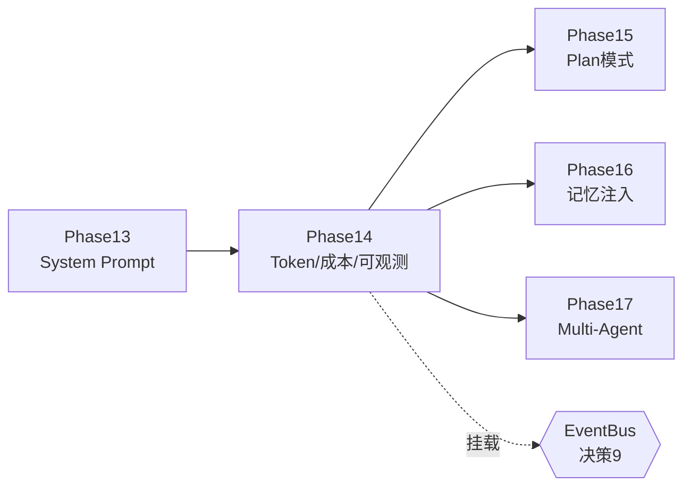
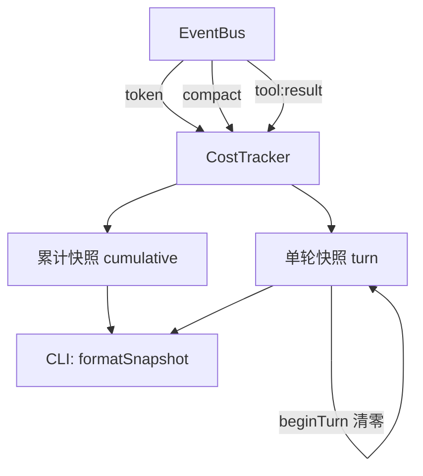
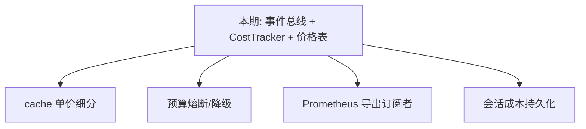

# 第 14 期学习文档：Token / 成本统计与可观测性

## 0. 本期在全局路线图中的位置

Phase 14 承接 Phase 13（System Prompt 工程化），把「跑得通」再往前推一步——**让用户和开发者能看清一次会话到底花了多少 token、多少钱、上下文被压缩/检索了多少次**。

它在路线图里对应「决策 9：可观测/扩展」的正式落地：之前事件总线（`EventBus`）只挂了审计日志（`AuditLogger`），本期把**成本/用量追踪器**也挂上去，与审计共用同一套订阅机制，不推翻任何既有结构。

往前看，它也是后续几期的底座：
- Phase 15 Plan 模式、Phase 17 Multi-Agent 都需要「能看到每步成本」来做预算控制；
- Phase 16 记忆/检索自动注入后，检索次数、压缩节省量这些指标正是本期在汇总的东西。



## 1. 本节完成了什么（交付物）

| 文件 | 类型 | 作用 |
|---|---|---|
| `src/core/chatmodel/types.ts` | 修改 | `CompleteResult` 新增可选 `usage: TokenUsage`（真实 token 用量） |
| `src/core/events/bus.ts` | 修改 | `AgentEventType` 新增 `'token'` 事件 |
| `src/core/chatmodel/openai-compatible.ts` | 修改 | 请求加 `stream_options.include_usage`，解析流式 `usage` |
| `src/core/chatmodel/anthropic.ts` | 修改 | 从 `message_start`/`message_delta` 解析 `input/output_tokens` |
| `src/core/observability/tokenizer.ts` | **新增** | CJK 感知的 token 估算器 |
| `src/core/observability/pricing.ts` | **新增** | 模型价格表 + 成本计算 + 格式化 |
| `src/core/observability/tracker.ts` | **新增** | `CostTracker`：订阅事件总线累加用量/成本/压缩/检索 |
| `src/core/observability/index.ts` | **新增** | 模块桶导出 |
| `src/core/agent/loop.ts` | 修改 | 每次 `complete()` 后 emit `token` 事件 |
| `src/cli/main.ts` | 修改 | 创建并挂载 `CostTracker` 到总线 |
| `src/cli/repl.ts` | 修改 | 每轮展示成本；新增 `/cost` 命令；`runOnce` 展示 |
| `tests/unit/observability.test.ts` | **新增** | 19 个单测覆盖 tokenizer/pricing/tracker |

> 真机验证：用假 `fetch` 模拟 OpenAI 流式含 `usage` 分片 → 适配器解析正确；用假模型跑完整 `runAgent` → `token` 事件被 `CostTracker` 正确累加（calls=2、460+42 token、成本>0、非估算）。全量测试 199 个全绿，typecheck 干净，build 通过。

## 2. 核心概念速览（先看这个）

- **Token**：大模型计费与上下文长度的基本单位。英文约 4 字符/token，中文等宽字符（CJK）约 1 字符/token。
- **Prompt tokens vs Completion tokens**：输入（含 system + 历史）算 prompt，模型生成算 completion；**两者单价通常不同**，completion 更贵。
- **真实用量 vs 估算**：OpenAI / Anthropic 的流式响应都能回报真实 token 数；若没拿到（如本地 Ollama、或兼容服务未开启），则用本地启发式估算。
- **事件总线（决策 9）**：Agent 循环只负责 `emit`，审计/成本等订阅者各自 `on` 收事件，彻底解耦。
- **Prompt Cache（延伸）**：Claude 的 `input_tokens` 里含 cache 命中部分，按更低单价计费；本期用统一单价，是个可被后续优化的点。

## 3. 设计方案与原理

### 3.1 数据从哪来：适配器回填 `usage`

OpenAI 流式默认**不回报** token 数，必须显式开 `stream_options: { include_usage: true }`，真实用量出现在 `[DONE]` 前的最后一个分片（`choices` 可能为空，仅带 `usage`）。Anthropic 则在 `message_start.usage.input_tokens` 给输入、`message_delta.usage.output_tokens` 给输出。两者都在适配器里解析进 `CompleteResult.usage`，对上层透明。

```mermaid
sequenceDiagram
  participant Loop as Agent 循环
  participant Adapter as 适配器
  participant API as 模型 API
  participant Bus as EventBus
  participant Tracker as CostTracker
  Loop->>Adapter: model.complete(messages)
  Adapter->>API: POST (stream_options.include_usage)
  API-->>Adapter: SSE ... usage 分片
  Adapter-->>Loop: CompleteResult { content, toolCalls, usage? }
  Loop->>Loop: computeUsage(真实优先/否则估算)
  Loop->>Bus: emit('token', {model, promptTokens, ...})
  Bus->>Tracker: onToken → 累加累计+单轮
```

### 3.2 可观测层：订阅而非轮询

`CostTracker` 完全被动——`attach(bus)` 后监听三类事件：

- `token`：累加 prompt/completion/total token 与成本；
- `compact`：累加压缩次数与节省 token（before−after）；
- `tool:result`：若工具名是 `rag_search`，记为一次检索。

它维护**两份快照**：`cumulative`（整段会话）与 `turn`（单轮，每次 `beginTurn()` 清零）。REPL 每轮 `beginTurn → runAgent → endTurn` 取本轮，再叠加看累计。



### 3.3 估算器：中英混合不亏

`estimateTokens` 按 Unicode 区间区分宽字符（CJK/假名/全角/谚文 ≈ 1 token/字符）与窄字符（≈ 4 字符/token）。相比「统一 4 字符/token」，对中文成本估算更准（否则会低估约 4 倍）。

## 4. 为什么这样设计（设计权衡）

| 决策点 | 选择 | 反方案 | 理由 |
|---|---|---|---|
| 用量来源 | 适配器解析真实 `usage`，失败则估算 | 永远只用估算 | 真实值误差为 0，估算只是兜底；API 白给的精度不用是浪费 |
| 成本汇总方式 | 订阅 `EventBus` | 在循环里直接调用 tracker | 与审计同构、解耦、可热插拔；不改动 `runAgent` 签名 |
| 双快照 | 累计 + 单轮 | 只维护一个 | REPL 既要「本轮花多少」也要「总共花多少」 |
| 估算器 | CJK 感知启发式 | 引 tiktoken/BPE 分词器 | 依赖克制（CLAUDE.md 硬约束），估算误差对展示足够 |
| 价格表 | 数据表 + 子串匹配 + 默认价 | 调外部价目 API | 纯离线、零依赖、够用；未知模型不崩（回退默认） |
| 检索计数 | 从 `tool:result` 推导 | 新增 `retrieval` 事件 | 复用既有事件，零新事件类型噪声（仅 `token` 是新增） |

## 5. 与其它方案对比（优势）

| 维度 | 本期方案 | Claude Code / 生产级 | 说明 |
|---|---|---|---|
| 用量精度 | 真实优先 + 估算兜底 | 真实为主 + cache 细分价 | 本期不区分 cache 单价，是已知简化点 |
| 观测架构 | 事件总线订阅 | Hook / 中间件链 | 同样解耦，本期更轻量 |
| 依赖 | 零第三方分词/计价依赖 | 可能引 tokenizer 库 | 符合「纯手写、依赖克制」总约束 |
| 扩展性 | 新增订阅者即可 | 同 | 未来加 Prometheus 导出只需再 `bus.on` |

## 6. 面试话术（30 秒版 + 详版）

**30 秒版：**
> 我在 easyCLI 里落地了 Token 成本统计与可观测性。核心是把用量统计做成事件总线的订阅者：适配器从流式响应解析真实 token 用量填进 `CompleteResult.usage`，Agent 循环每次调完模型就 emit 一个 `token` 事件；`CostTracker` 订阅总线，累加累计和单轮两份快照，并按价格表算成本。真实用量拿不到时退回 CJK 感知的本地估算。UI 每轮打印成本，还有 `/cost` 看明细。整套和审计日志共用一套事件机制，零侵入、可热插拔。

**详版（被追问时）：**
> 为什么用事件而不是在循环里直接算？因为项目早期就定了「事件总线/钩子」作为可观测挂载点（决策 9），审计日志已经是这么挂的，成本统计复用同一范式，不推翻结构。
> 真实用量怎么拿？OpenAI 要开 `stream_options.include_usage`，用量在 `[DONE]` 前最后一个分片；Anthropic 在 `message_start` 给 input、`message_delta` 给 output。两者都在适配器内解析，对 `runAgent` 透明。
> 估算为什么 CJK 感知？因为中文 ~1 字符/token、英文 ~4 字符/token，统一 4/字符会把中文低估约 4 倍，成本展示会严重失真。
> 检索/压缩怎么统计？压缩直接有 `compact` 事件；检索复用 `tool:result` 事件、按工具名 `rag_search` 推导，不新增事件类型。

## 7. 常见面试题（附答题要点）

1. **为什么不在 `runAgent` 里直接调 tracker，而走事件总线？**
   答：解耦 + 一致。审计早已挂总线，成本复用同一机制；循环只 emit，未来加 Prometheus/日志导出只需再订阅，不改循环签名。

2. **真实 token 数和估算差很多时怎么办？以谁为准？**
   答：真实优先。适配器解析到 `usage` 就用真实的（`estimated:false`）；只有拿不到（本地模型/Ollama、或兼容服务未开启）才估算（`estimated:true`），快照会标记「含估算」提示用户。

3. **中文场景下「字符数/4」估算有什么问题？你怎么修正？**
   答：会低估中文约 4 倍。修正为 Unicode 区间判断：宽字符（CJK/假名/全角/谚文）按 1 token/字符，窄字符按 4，得到更合理的成本。

4. **OpenAI 流式为什么默认拿不到 token 数？怎么开启？**
   答：流式协议默认只发 delta，用量要显式 `stream_options:{include_usage:true}` 才在末片回报。注意该分片 `choices` 可能为空，解析时要先抓 `usage` 再判 `delta`。

5. **单轮和累计两份快照有什么用？怎么保证不串？**
   答：REPL 既要本轮成本也要总账。每次 `beginTurn()` 把单轮快照清零，累计不动；`runAgent` 期间所有 `token` 事件同时写两份，轮末 `endTurn()` 取单轮、叠加看累计，互不干扰。

6. **价格表匹配未知模型会崩吗？**
   答：不会。模型 id 取 `:` 后的名字做**不区分大小写的子串匹配**，命中即用对应价，未命中回退 `DEFAULT_PRICE`，本地模型（ollama）直接 0 价。

## 8. 关键代码索引

| 功能 | 位置 |
|---|---|
| 真实用量类型 | `src/core/chatmodel/types.ts` → `TokenUsage` / `CompleteResult.usage` |
| 事件类型扩展 | `src/core/events/bus.ts` → `AgentEventType` 加 `'token'` |
| OpenAI 用量解析 | `src/core/chatmodel/openai-compatible.ts` → `stream_options` + `lastUsage` |
| Anthropic 用量解析 | `src/core/chatmodel/anthropic.ts` → `message_start`/`message_delta` |
| Token 估算 | `src/core/observability/tokenizer.ts` → `estimateTokens` / `estimateMessagesTokens` |
| 价格与成本 | `src/core/observability/pricing.ts` → `lookupPrice` / `costFor` / `formatUSD` |
| 追踪器 | `src/core/observability/tracker.ts` → `CostTracker` / `formatSnapshot` |
| 循环埋点 | `src/core/agent/loop.ts` → `computeUsage` + `emit('token')` |
| CLI 展示 | `src/cli/repl.ts` → `runTurn` 每轮打印 + `/cost` 命令；`src/cli/main.ts` 挂载 |

## 9. 踩坑与细节（来自真实实现）

1. **OpenAI 用量分片 `choices` 为空**：最初在 `if (!delta) continue;` 之后才处理 `usage`，导致末片（只有 `usage` 没有 `delta`）被直接跳过、永远拿不到用量。**修复**：在判 `delta` 之前先 `if (json?.usage) lastUsage = json.usage;`。

2. **Anthropic input/output 在两个事件**：`input_tokens` 在 `message_start.usage`，`output_tokens` 在 `message_delta.usage`，必须分别捕获再合并，不能只在一个事件里取。

3. **`estimateMessagesTokens` 的每消息开销**：若不给每条消息加 ~3 token 结构开销，短消息会显著低估（tiktoken 实际有 role 等开销）。这里加了每消息 +3 的启发式，量级更接近真实。

4. **`usage` 字段「有则加、无则不写」**：`CompleteResult` 返回时只在 `usage` 存在才展开该键，保证无用量时对象形状与旧版完全一致，不破坏任何 `toEqual` 断言。

5. **`formatSnapshot` 里 `cumulative` 是可选参数**：直接 `cumulative.compactions` 会触发 `possibly undefined`，必须用可选链 `cumulative?.compressions`，否则 typecheck 不过（`noUncheckedIndexedAccess` 严格模式）。

6. **字段名拼写一致性**：接口用 `compressions`（压缩次数），但 `onCompact`/`formatSnapshot`/REPL 一度写成 `compactions`，typecheck 直接报错——统一回 `compressions` 才过。命名一定要和接口对齐。

7. **假 registry 缺 `.get()`**：端到端 smoke 测时只实现了 `list()` 没实现 `get()`，执行器 `opts.registry.get(...)` 直接抛错；用真实 `createToolRegistry` 才跑通。

## 10. 自测题（检验是否真懂）

1. 把一条含 100 个汉字 + 100 个英文字母的消息估算成 token，结果大约是多少？（答案：100 + ceil(100/4)=25 → 125，外加消息开销）
2. 某次调用返回 `usage` 缺失，但你知道 prompt=500、completion=100，快照 `estimated` 是 true 还是 false？为什么？（答案：true，因为走了本地估算）
3. 想在成本超过 $1 时自动告警，最小改动是哪里加逻辑？（答案：再 `bus.on('token', ...)` 一个订阅者，或在 `CostTracker.add` 里判断，无需改循环）
4. 为什么 `rag_search` 不单独发 `retrieval` 事件也能统计？（答案：`tool:result` 事件已带 `call.name`，订阅者按名字过滤即可）

## 11. 延伸与下一步

- **cache 单价细分**：Anthropic `input_tokens` 含 cache 命中/创建，可按更低单价拆分计费，更精确。
- **预算熔断**：订阅 `token` 事件累加成本，超阈值自动降级模型或缩短上下文（呼应决策 10 错误恢复）。
- **可观测导出**：再挂一个订阅者把快照推到 Prometheus / 日志，零侵入。
- **持久化会话成本**：把累计快照随 `SessionStore` 落盘，跨会话恢复后成本连续（配合 Phase 9）。


