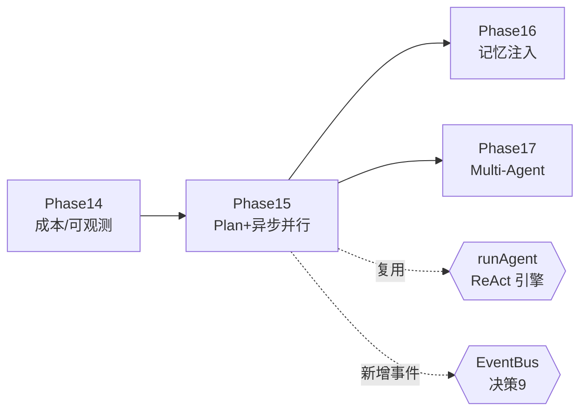
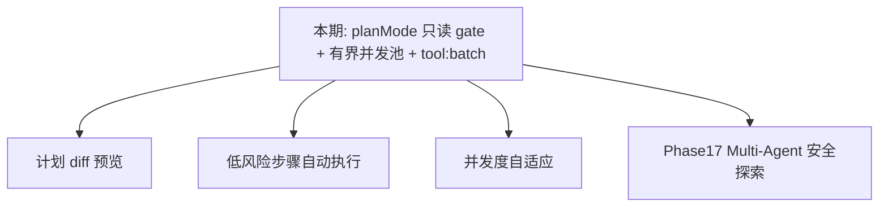

# 第 15 期学习文档：Plan 模式 + 异步并行

## 0. 本期在全局路线图中的位置

Phase 15 把 easyCLI 从「想到就做」升级为「先规划、再执行」——这是 Claude Code 类工具的核心交互范式之一。它**完全复用 Phase 1 以来的 ReAct 引擎**（`runAgent`），不另起一套规划引擎，只是给它加了一个 `planMode` 开关与一套「规划专用系统提示」。

本期两条主线：
- **Plan 模式**：进入规划态后，执行器**硬拦截一切写/破坏性工具**（只读探测），模型只产出结构化计划；用户 `/approve` 后才切回正常模式真正执行。
- **异步并行**：把 Phase 3 就声明却一直为空的 `maxReadOnlyConcurrency` 字段真正落地成**有界并发池**，并新增 `tool:batch` 事件 / `onBatch` 钩子，让「并行探测」这件事**可被观测**（呼应 Phase 14）。



## 1. 本节完成了什么（交付物）

| 文件 | 类型 | 作用 |
|---|---|---|
| `src/core/prompts/index.ts` | 修改 | 新增 `AgentMode` 类型、`planModeBlock()` 规划指令块、`buildPlanSystemPrompt()`；`buildAgentSystemPrompt` 支持 `mode:'plan'` |
| `src/core/tools/executor.ts` | 修改 | 落地 `mapWithConcurrency` 有界并发池（真正用上 `maxReadOnlyConcurrency`）；`planMode` 写操作硬拦截；每批 emit `tool:batch` 事件 + 触发 `onBatch` 钩子；新增 `ToolBatchInfo` 类型 |
| `src/core/agent/loop.ts` | 修改 | `AgentOptions` 新增 `planMode`；`AgentHooks`/`AgentOptions` 新增 `onBatch`；透传 `planMode` 与 `onBatch` 给执行器 |
| `src/core/events/bus.ts` | 修改 | `AgentEventType` 新增 `'tool:batch'` |
| `src/cli/repl.ts` | 修改 | `mode`/`awaitingApproval`/`planCheckpoint` 状态；`/plan` `/approve` `/discard` 命令；`setMode` 切换系统提示；`runPlan` 规划轮；`processInput` 支持「待批准时普通输入=修订」；`runOnce` 支持 `--plan` |
| `src/cli/main.ts` | 修改 | 新增 `--plan` 命令行标志，传入 `runOnce` |
| `tests/unit/plan.test.ts` | **新增** | 8 个单测覆盖规划提示、planMode 写拦截、并发池上限/串行/全并行、`runAgent` 规划结束 |

> 真机验证路径：全量测试 **207 个全绿**（新增 8 个），typecheck 干净，build 通过。并发池测试用 5 个各 sleep 25ms 的只读工具验证 `cap=2 → 峰值并发=2`，`cap=1 → 峰值=1`，`cap=10 → 峰值=3`，且 `tool:batch` 事件与 `onBatch` 钩子均按预期触发；`runAgent` 规划模式测试验证「模型试图写文件被拦、随后产出计划结束、写工具 execute 从未调用」。

## 2. 核心概念速览（先看这个）

- **Plan 模式（规划模式）**：一种「只探索、不落地」的运行态。模型能调用只读工具去理解代码库，但任何写/破坏性操作都被执行器在**工具调度层**拦死——不依赖模型自觉。
- **ReAct 共享引擎**：规划与执行都是同一个 `runAgent` 循环，区别仅在于（a）系统提示不同，（b）执行器是否开启 `planMode` 只读拦截。没有两套代码路径。
- **有界并发池（Bounded Concurrency Pool）**：同时最多跑 N 个任务的工作池。只读工具天然独立、可并行；用池子限制并发上限，既提速又避免一次性打爆外部 API/文件系统。
- **`tool:batch` 事件**：每批工具调用执行完毕后，执行器把「只读数 / 写数 / 峰值并发」作为一条事件发到总线，供 UI 展示与可观测层消费（与 Phase 14 同源范式）。

## 3. 设计方案与原理

### 3.1 Plan 模式：同一引擎 + 两个开关

规划与执行共用 `runAgent`，靠两个「开关」区分行为：

1. **系统提示开关**：`buildPlanSystemPrompt(ctx)` 在常规提示后追加 `planModeBlock()`（约束「只调只读工具 + 产出结构化计划」）。REPL 用 `setMode('plan'|'normal')` 直接替换 `history[0].content` 来切换，不重建对话。
2. **执行器开关**：`ExecutorOptions.planMode=true` 时，执行器在权限决策之后**再追加一道硬 gate**——任何非只读工具一律判为「权限拒绝」，理由写死「计划模式：仅允许只读工具」。

```mermaid
sequenceDiagram
  participant U as 用户
  participant REPL as REPL
  participant Loop as runAgent
  participant Exe as executeTools
  participant M as 模型

  U->>REPL: /plan <任务>
  REPL->>REPL: setMode('plan') 替换 system 提示
  REPL->>Loop: runAgent(planMode:true)
  Loop->>M: complete(只读提示 + 任务)
  M->>Loop: tool_call(write_file)
  Loop->>Exe: 执行 write_file
  Exe-->>Loop: 拒绝「计划模式：仅允许只读工具」
  M->>Loop: 最终文本=结构化计划
  Loop-->>REPL: 计划结束
  REPL->>U: 展示计划 + 「/approve 执行」
  U->>REPL: /approve
  REPL->>REPL: setMode('normal') 切回正常提示
  REPL->>Loop: runAgent(planMode:false)
  Loop->>M: complete(计划作为上下文)
  M->>Loop: tool_call(write_file) 真正执行
  Loop-->>REPL: 落地改动
```

### 3.2 异步并行：有界并发池

原本 `ExecutorOptions.maxReadOnlyConcurrency` 只是个声明、执行器一直用 `Promise.all` 无脑全并行。本期把它真正用起来：

`mapWithConcurrency(items, limit, worker)` 启动 `min(limit, N)` 个「取数协程」，每个协程取一个任务 → 记录活跃数 → `await worker` → 完成后递归取下一项，直到取空。活跃数峰值即 `maxConcurrency`，天然受 `limit` 约束。

```mermaid
flowchart TD
  SUB[一批 tool_calls] --> SPLIT{分类}
  SPLIT -->|只读 allowed| READS[reads]
  SPLIT -->|写 allowed| WRITES[writes 串行]
  SPLIT -->|被拒| DENIED[denied]
  READS --> POOL[mapWithConcurrency<br/>cap=maxReadOnlyConcurrency]
  POOL -->|并发执行| RUN[runOne]
  WRITES --> RUN
  DENIED --> RUN
  RUN --> BATCH[emit tool:batch<br/>{readCount,writeCount,maxConcurrency}]
  BATCH --> HOOK[onBatch 钩子 → REPL 展示]
```

### 3.3 规划态的「批准」流（REPL 状态机）

REPL 引入三个状态：`mode:'normal'|'plan'`、`awaitingApproval:boolean`、`planCheckpoint:number`（规划前 history 长度，供 `/discard` 回滚）。

- `/plan <任务>`：`setMode('plan')` → 记录 `planCheckpoint` → 入队任务 → `runPlan()`（= `runAgent(planMode:true)`）→ 结束置 `awaitingApproval=true`。
- 待批准时，普通输入 = **对计划的补充修订**（保留已生成计划，重新 `runPlan`）；`/approve` = 切回正常模式并 dispatch 一条「计划已批准，请执行」触发真正执行；`/discard` = `history.length = planCheckpoint` 回滚 + 切回正常。

## 4. 为什么这样设计（设计权衡）

| 决策点 | 选择 | 反方案 | 理由 |
|---|---|---|---|
| 规划/执行关系 | 同一 `runAgent` + `planMode` 开关 | 另写 `runPlanner` 引擎 | 不重复造轮；引擎逻辑集中、易测；符合「共享引擎」路线图意图 |
| 只读拦截位置 | 执行器层硬 gate | 只在系统提示里「要求」模型 | 提示只是软约束，模型可能不听；执行器拦截是**不可绕过**的硬保证，安全优先级更高 |
| 系统提示切换 | 替换 `history[0].content` | 每次重建整段 history | 只动 system 消息，已探索的只读结果/计划原样保留，批准后可立即执行 |
| 并发策略 | 有界并发池（cap 可配） | `Promise.all` 全并行 | 全并行对外部 API/磁盘不友好；池子上限可控、且能测出峰值并发做可观测 |
| 并发画像 | `tool:batch` 事件 + `onBatch` 钩子 | 只在内部计数不打出 | 复用 Phase 14 的事件总线范式，UI 与可观测层都能消费，零侵入 |

## 5. 与其它方案对比（优势）

| 维度 | 本期方案 | Claude Code / 生产级 | 说明 |
|---|---|---|---|
| 规划落地 | 同引擎 + 只读硬 gate | 同引擎 + 权限态切换 | 思路一致；本期用执行器拦截而非独立权限态，更轻 |
| 并行执行 | 有界并发池 + 峰值并发可观测 | 通常也池化 + 指标 | 本期额外把峰值并发做成事件，呼应 Phase 14 可观测 |
| 依赖 | 零第三方并发库 | 可能引 p-limit 之类 | 手写池子约 30 行，符合「纯手写、依赖克制」 |
| 解锁安全性 | 规划态物理上无法写盘 | 同 | 写工具 execute 在 planMode 下**根本不会被调用**，不是「调用了再回滚」 |

## 6. 面试话术（30 秒版 + 详版）

**30 秒版：**
> 我在 easyCLI 落地了 Plan 模式和异步并行。核心是「规划与执行共用同一个 ReAct 引擎」——只给引擎加一个 `planMode` 开关：开启时执行器在工具调度层硬拦截一切写/破坏性操作，模型只能做只读探测并产出结构化计划；用户批准后切回正常模式，同样的 history（计划即上下文）直接执行。并行方面，我把早就声明却没用上的 `maxReadOnlyConcurrency` 真正落地成一个有界并发池，只读工具受上限并行、写工具串行，并把每批的峰值并发通过 `tool:batch` 事件抛到总线，UI 和可观测层都能看到。

**详版（被追问时）：**
> 为什么不另写规划引擎？因为 Phase 1 的 `runAgent` 已经是完整 ReAct 循环，规划只是「只读 + 结束即计划」的特殊配置。另写一套会重复所有循环/历史回填逻辑，且两套管线容易漂移。
> 只读怎么保证？两层：系统提示软约束「只调只读工具」+ 执行器硬 gate（`planMode` 下非只读工具直接判拒）。提示可能失效，但执行器拦截不可绕过——写工具的 `execute` 在规划态根本不会被调用，不是「写了再回滚」。
> 并行池怎么写？一个 `mapWithConcurrency(items, limit, worker)`：启动 `min(limit, N)` 个协程，每个取任务→await→递归取下一项；活跃数峰值即受 `limit` 约束的 `maxConcurrency`。比 `Promise.all` 全并行更可控。
> 为什么暴露峰值并发？呼应 Phase 14 的事件总线范式——把「并行探测了 N 个只读工具、峰值 M」做成 `tool:batch` 事件，审计/UI/未来监控都能 `bus.on` 订阅，零侵入。

## 7. 常见面试题（附答题要点）

1. **规划模式为什么不复用引擎、要新写？**
   答：不该新写。规划 = 只读探测 + 结束即计划，本质仍是 ReAct 循环。复用 `runAgent` 只加 `planMode` 开关，避免重复循环/历史回填逻辑、防止两套管线漂移。

2. **只读约束靠系统提示够吗？**
   答：不够。提示是软约束，模型可能不听（测试中模型确实会先请求 `write_file`）。真正保证在执行器层：非只读工具在 `planMode` 下直接判「权限拒绝」，写工具的 `execute` 不会被调用——物理上无法落盘。

3. **并发池和 `Promise.all` 有什么区别？为什么不直接全并行？**
   答：`Promise.all` 是无脑全并行，N 个任务同时打外部 API/磁盘，可能打爆限流或 fd。有界池 `mapWithConcurrency` 限制同时活跃数 `cap`，既提速又可控；且能测出 `maxConcurrency` 供可观测。

4. **`tool:batch` 事件有什么用？和 `tool:call` 事件重复吗？**
   答：不重复。`tool:call` 是「单个工具被调用」的细粒度事件；`tool:batch` 是「一批调用执行完后的画像」（只读数/写数/峰值并发），是聚合视角。UI 用它显示「并行探测 N 个只读工具（峰值 M）」，可观测层用它画并发曲线。

5. **`/approve` 后为什么能直接执行？计划不是已经「输出」了吗？**
   答：计划作为 assistant 文本消息已留在 `history` 里。批准后只把 system 提示切回正常态，再 dispatch 一条「计划已批准，请执行」的用户消息，模型看到自己的计划即上下文，自然进入写操作。无需重跑探索。

6. **`/discard` 怎么做到干净回滚？**
   答：进入 `/plan` 时记录 `planCheckpoint = history.length`（规划前位置）。`/discard` 直接 `history.length = planCheckpoint`，把规划用户消息、只读探测、计划文本一次性截断；再把 system 切回正常态。

## 8. 关键代码索引

| 功能 | 位置 |
|---|---|
| 模式类型 + 规划提示块 | `src/core/prompts/index.ts` → `AgentMode` / `planModeBlock` / `buildPlanSystemPrompt` |
| 有界并发池 | `src/core/tools/executor.ts` → `mapWithConcurrency` |
| planMode 写拦截 | `src/core/tools/executor.ts` → `executeTools` 内 `if (opts.planMode && !readOnly)` |
| 并发画像事件 | `src/core/tools/executor.ts` → `emit({type:'tool:batch',...})` + `onBatch` |
| 引擎开关 | `src/core/agent/loop.ts` → `AgentOptions.planMode` / `onBatch` 透传 |
| 事件类型 | `src/core/events/bus.ts` → `AgentEventType` 加 `'tool:batch'` |
| 交互状态机 | `src/cli/repl.ts` → `mode`/`awaitingApproval`/`planCheckpoint` + `setMode`/`runPlan` + `/plan` `/approve` `/discard` |
| 单次规划 | `src/cli/main.ts` → `--plan` 标志 → `runOnce(..., planMode)` |

## 9. 踩坑与细节（来自真实实现）

1. **只读约束不能只靠提示**：最初设想「提示里写『只调只读工具』就够了」，但脚本化测试里模型第一轮就返回 `write_file` 调用——提示是软约束。必须在执行器层加硬 gate，否则规划态会真的写盘。**教训**：安全相关约束要在工具调度层兜底，不信任模型自觉。

2. **`maxReadOnlyConcurrency` 一直是死字段**：Phase 3 就声明了 `maxReadOnlyConcurrency?: number` 却从未读取，执行器一直 `Promise.all` 全并行。本期把它接进 `mapWithConcurrency` 的 `limit`，才算真正落地。

3. **并发池的 `active` 计数时机**：必须在 `await worker` **之前** `active++`（同步自增），否则多个协程同时 `await` 后才会 +1，峰值统计偏低、且可能瞬间超过 cap。先自增、记录峰值、再 await，才正确。

4. **REPL 里 `dispatch` 被嵌套调用**：`/approve` 的 `handleSlash` 分支里又调了 `dispatch('(计划已批准...)')`，而此时外层 `dispatch` 还持有 `busy=true`。内层 `dispatch` 因 `busy` 为真会把消息塞进 `pending`，由外层 `while` 排空——**不能**在这层直接 `runTurn`，否则会重入。靠既有的 `pending` 队列机制自然消化。

5. **`runPlan` 不要自己 `rl.prompt()`**：`runPlan` 经 `dispatch` → `processInput` 调用，外层 `finally` 已会 `rl.prompt()`。若在 `runPlan` 里再 prompt 会双提示。保持「谁 dispatch 谁负责 prompt」的单一职责。

6. **审批态下普通输入语义**：待批准时用户直接打字，应理解为「对计划的补充修订」而非「新任务」。`processInput` 在 `awaitingApproval` 时走 `runPlan` 重新规划，而非 `runTurn`——否则会脱离规划态乱执行。

7. **`onBatch` 走 `hooks` 而非顶层字段**：执行器的并发画像通过 `ExecutorOptions.hooks.onBatch` 暴露（与 `onToolCall` 同构），测试时若误传成顶层 `onBatch` 会被静默忽略——初版测试就因此断言失败，修正为 `hooks:{onBatch}` 才过。

## 10. 自测题（检验是否真懂）

1. 规划模式下，模型返回 `write_file` 调用，执行器会真的写文件吗？为什么？（答案：不会。`planMode` 下非只读工具在执行器层被判拒，`execute` 不被调用，结果文本为「计划模式：仅允许只读工具」）
2. `cap=2`、5 个各 sleep 25ms 的只读工具，总墙钟时间大约多少？`tool:batch` 的 `maxConcurrency` 是多少？（答案：约 3×25=75ms 量级（2+2+1 三批），`maxConcurrency=2`）
3. `/approve` 后模型怎么「知道」要执行？history 里多了什么？（答案：system 切回正常态 + 追加一条「计划已批准请执行」用户消息；模型看到自己的计划文本作为上下文，自然进入写操作）
4. 为什么并发池用 `min(limit, N)` 作为初始协程数？（答案：任务少于上限时，按实际任务数起协程，避免空转；N=0 时取 1 但循环不启动任何 worker，安全）

## 11. 延伸与下一步

- **计划持久化/差异预览**：把生成的计划落盘，批准前用 `git diff` 预览将要发生的改动（呼应 Phase 9 会话存储）。
- **自动执行低风险步骤**：对「只涉及只读确认」的子步骤可跳过批准，仅对写操作要求确认（细粒度 HITL）。
- **并发度自适应**：根据工具类型（网络/磁盘）或外部限流动态调 `cap`，而非固定 10。
- **Multi-Agent 预演**：Phase 17 的 Planner/Worker 可直接复用本期 `planMode` 只读探测机制做「安全探索」。


