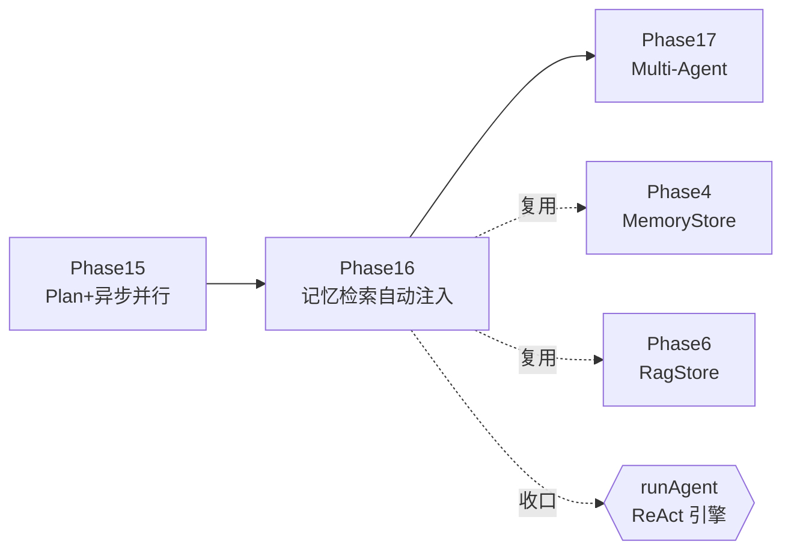
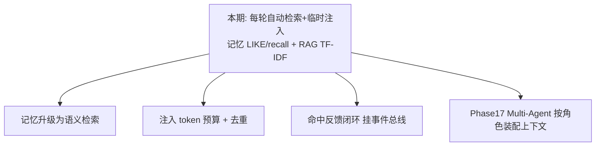

# 第 16 期学习文档：记忆与检索自动注入

## 0. 本期在全局路线图中的位置

Phase 16 把 easyCLI 从「记忆/RAG 要模型主动调工具才进上下文」（Phase 4 长期记忆、`recall`；Phase 6 向量 `rag_search`）升级为「**每轮自动检索、自动注入**」——这正是 Production RAG Agent 的标配范式（主动检索 → 注入），让模型在思考前就「带着上下文」，无需先发一次工具调用去翻记忆库。

本期**完全复用** Phase 4 / Phase 6 已有的存储层（`MemoryStore` SQLite、`RagStore` TF-IDF 向量），不另造轮子，只是新增一个**自动上下文层**（`src/core/context/`），并把注入点统一收口到 Agent 引擎（`runAgent`）。



## 1. 本节完成了什么（交付物）

| 文件 | 类型 | 作用 |
|---|---|---|
| `src/core/context/autoinject.ts` | **新增** | 核心：`buildAutoContext(query, sources, opts)` 从记忆库 + 知识库检索并拼接注入文本；`lastUserText(history)` 取最近一条 user 消息作检索 query；定义 `AutoContextSources` / `AutoContextResult` / `AutoContextOptions` 类型 |
| `src/core/context/index.ts` | **新增** | barrel 导出，统一从 `../context` 引入 |
| `src/core/agent/loop.ts` | 修改 | `AgentOptions` 新增 `autoContext?: string`；每轮模型调用前（压缩后）把该文本作为**临时系统消息** `prepend` 进 `messages` |
| `src/cli/repl.ts` | 修改 | 引入 `autoCtxEnabled`（**默认关**）、`autoCtxForTurn()`（按最新用户输入检索）、`/autoctx` 开关命令；`runTurn` / `runPlan` 改为 async 并在调用 `runAgent` 前注入；REPL 与单次模式都打印 `⚡ 自动注入上下文：记忆 N 条 / 知识库 M 段` |
| `src/cli/main.ts` | 修改 | 新增 `--auto-context`（**默认关闭**；commander 自动提供 `--no-auto-context` 否定形式，`opts.autoContext` 缺省 `undefined`），把 `memory` 与 `autoContextEnabled` 透传给 `runOnce` / `startRepl`（由 `?? false` 取默认关闭） |
| `tests/unit/autocontext.test.ts` | **新增** | 8 个单测覆盖：空源返回空、记忆命中（LIKE 子串）、空 query 走 `recall`、RAG 命中、`lastUserText` 取最近/无 user、`runAgent` 注入临时系统消息且**不污染**持久 history、无 `autoContext` 时不注入 |

> 真机验证路径：全量测试 **215 个全绿**（Phase 15 后 207 + 本期 8），typecheck 干净，tsup 构建通过。`runAgent` 注入测试用 `CapturingModel` 断言「模型收到的首条消息即注入的系统消息、原始 `history` 内容保留在之后、且 `history` 本身没有被写入注入文本」；关闭 `autoContext` 时首条消息仍是原始 `history[0]`。

## 2. 核心概念速览（先看这个）

- **自动上下文（Auto-Context）**：每一轮模型调用前，根据「最近一条用户输入」自动从记忆库 + 知识库检索相关片段，拼成一条系统消息注入。模型无需主动调 `recall` / `rag_search` 就能「带着上下文思考」。
- **临时注入（Temporary Injection）**：注入文本**只进本轮模型调用**，不写进持久 `history`。因此下一轮会重新检索、上下文随对话漂移，且不会在持久历史里累积/污染。
- **检索分派（Memory vs RAG）**：记忆库有 query 走 `search`（LIKE 子串），无 query 走 `recall`（最近 N 条）；知识库**仅在 query 非空时**检索（空 query 语义检索无意义）。
- **注入收口在引擎层**：检索动作在 CLI/REPL（持有 `memory`/`ragStore` 引用），但「注入」统一在 `runAgent` 完成，工具层/执行器完全无感知——保持解耦。

## 3. 设计方案与原理

### 3.1 检索与拼接：`buildAutoContext`

`buildAutoContext(query, sources, opts)` 的逻辑极简，但覆盖了「有 query / 无 query」「记忆有 / 无」「知识库有 / 无」的组合：

```mermaid
flowchart TD
  IN[query, sources{memory?, ragStore?}] --> Q{q 非空?}
  Q -->|是| MEM1[memory.search q<br/>LIKE 子串, top memoryLimit]
  Q -->|否| MEM2[memory.recall<br/>最近 memoryLimit 条]
  IN --> RAG{ragStore 存在 且 q 非空?}
  RAG -->|是| R[ragStore.search q,k<br/>TF-IDF 余弦]
  RAG -->|否| SKIP[跳过 RAG]
  MEM1 --> MERGE[拼装 parts]
  MEM2 --> MERGE
  R --> MERGE
  SKIP --> MERGE
  MERGE --> EMPTY{parts 为空?}
  EMPTY -->|是| OUT0[返回 text:''<br/>memoryCount:0,ragCount:0]
  EMPTY -->|否| OUT1[HEADER + parts<br/>返回计数]
```

- 记忆命中：`◆ 长期记忆（相关事实）：\n- #id [日期] fact`；RAG 命中：`◆ 知识库检索（相关片段）：\n` + `RagStore.toContext(rag)`（复用 Phase 6 的格式化方法）。
- 统一 `HEADER = '【自动上下文 · 由记忆库/知识库检索得到，仅供参考、无需复述】'`——明确告诉模型这是参考资料、**不要原样复述**，避免注入文本被 parrot 回输出。

### 3.2 注入点：`runAgent` 内、压缩之后、每轮重注入

注入发生在引擎主循环里**每一轮**模型调用前（在上下文压缩判定之后），且因为不写 `history`，每一轮都重新 `prepend`：

```mermaid
sequenceDiagram
  participant Loop as runAgent 循环
  participant Comp as 压缩判定
  participant AC as autoContext 注入
  participant M as 模型

  Loop->>Comp: 本轮先判断是否需要压缩 history
  Comp-->>Loop: messages = history（或压缩后）
  alt opts.autoContext 非空
    Loop->>AC: prepend {role:'system', content: autoContext}
    AC-->>Loop: messages = [注入系统消息, ...messages]
  end
  Loop->>M: complete(messages)
  M-->>Loop: 结果回填 history（注入消息不进 history）
```

### 3.3 REPL 交互：开关 + 每轮检索 + 状态展示

REPL 引入 `autoCtxEnabled`（默认 `true`）、`autoCtxForTurn()`、`/autoctx` 命令：

- `autoCtxForTurn()`：`if (!autoCtxEnabled) return`；取 `lastUserText(history)` 作 query（空则返回）；调 `buildAutoContext` 拿到结果（空文本则返回 undefined）。
- `runTurn` / `runPlan` 改为 `async`：先 `await autoCtxForTurn()`，命中则打印 `⚡ 自动注入上下文：记忆 N 条 / 知识库 M 段`，再把 `ac?.text` 作为 `autoContext` 传给 `runAgent`（规划阶段同样注入，帮助模型理解既有记忆/知识）。
- `/autoctx`：翻转 `autoCtxEnabled` 并打印开关状态。
- `runOnce`（非交互 `-p` 单次）：基于 `prompt` 本身检索记忆/知识库并注入，并打印同样的 `⚡` 状态行；`--auto-context` 开启自动注入（commander 自动提供 `--no-auto-context` 否定关闭），`opts.autoContext` 缺省 `undefined`，经 `?? false` 默认关、显式 `--auto-context` 开启。

## 4. 为什么这样设计（设计权衡）

| 决策点 | 选择 | 反方案 | 理由 |
|---|---|---|---|
| 注入是否写 history | **不写**，每轮临时 prepend | 把检索结果写进 history 持久化 | 临时注入让上下文随对话漂移、可重算、不污染持久历史；写进 history 会让注入文本逐轮累积、被模型鹦鹉学舌复述、且压缩逻辑更复杂 |
| 注入位置 | 引擎层 `runAgent` 每轮 | 只在 CLI 拼好一次性塞入 | 引擎层收口，工具/执行器零感知、完全解耦；任何调用 `runAgent` 的路径（REPL/单次/未来 Multi-Agent）自动获得注入能力 |
| 检索谁来做 | CLI/REPL（持有 `memory`/`ragStore`） | 引擎内部直接持有存储引用 | 引擎保持「纯逻辑、依赖注入」；存储引用由调用方提供，符合 Phase 4/6 既有的依赖注入风格 |
| 记忆检索策略 | 有 query→`search`，无→`recall` | 永远 `search` | 无用户输入时语义搜索无意义；`recall` 提供「最近上下文兜底」，保证空 query 也能带点记忆 |
| RAG 检索条件 | 仅 query 非空 | 空 query 也检索最近文档 | 空 query 的向量检索无锚点；强制要求 query 避免无意义的「最近文档灌水」 |
| 注入文本加 HEADER | 明确「仅供参考、无需复述」 | 不加任何说明 | 防止模型把注入文本当指令或原样回声，影响输出质量 |

## 5. 与其它方案对比（优势）

| 维度 | 本期方案 | Claude Code / 生产级 RAG Agent | 说明 |
|---|---|---|---|
| 检索触发 | 每轮基于最近 user 输入自动检索 | 通常也「主动检索注入」 | 思路一致；本期直接复用 Phase 4/6 存储，零新增依赖 |
| 注入持久性 | 临时（不写 history，每轮重算） | 多数也走 ephemeral context | 避免历史污染；本期用「引擎层 prepend + 不写回」实现，逻辑最简 |
| 解耦度 | 引擎层收口，工具层无感知 | 同（中间件/拦截器） | 注入对工具调用透明；测试可单测「注入进了 model 输入但未污染 history」 |
| 可关可控 | `/autoctx` + `--auto-context`（默认关闭） | 一般也有 feature flag | 本期把开关从 REPL 透传到单次模式，`?? false` 默认关、`--auto-context` 显式开 |
| 依赖 | 纯手写（复用既有 SQLite/TF-IDF） | 可能引 LangChain 之类 | 符合「纯手写、依赖克制」的项目基调 |

## 6. 面试话术（30 秒版 + 详版）

**30 秒版：**
> 我在 easyCLI 落地了「记忆与检索的自动上下文注入」。核心是把 Phase 4 的长期记忆和 Phase 6 的 RAG，从「模型主动调工具才进上下文」变成「每轮自动检索、自动注入」。做法是：每轮模型调用前，取最近一条用户输入作 query，从记忆库（有 query 走 LIKE 搜索、无 query 走最近 recall）和知识库（仅 query 非空时走 TF-IDF 检索）取出相关片段，拼成一条系统消息，在 `runAgent` 引擎层 prepend 进本轮 messages。关键是**注入不写持久 history**——它是临时的，下一轮重新检索，既不污染历史、也能随对话漂移，还加了 HEADER 提醒模型「仅供参考、无需复述」。REPL 里用 `/autoctx` 可开关，单次模式有 `--no-auto-context`。

**详版（被追问时）：**
> 为什么不复用历史写入？因为记忆/知识是「参考资料」，写进 history 会逐轮累积、被模型复述、且压缩逻辑要额外处理；临时注入让上下文每轮重算、保持新鲜、零历史负担。测试直接断言 `history` 不含注入文本、但 `model.complete` 收到的首条消息是注入的系统消息。
> 注入点为什么放引擎层？这样所有调用 `runAgent` 的路径（REPL、单次、未来 Multi-Agent）自动获得注入，工具层完全无感知——解耦。
> 记忆为什么区分 search/recall？有用户输入时语义搜索才有意义；空 query（比如开场）用 `recall` 取最近事实兜底，保证「哪怕没新问题也带点记忆」。
> RAG 为什么只在 query 非空时检索？向量检索需要锚点，空 query 检索「最近文档」是灌水，无意义。
> 怎么开/关？`autoCtxEnabled` 闭包变量 + `/autoctx` 命令；单次模式用 commander 的 `--auto-context`（默认关闭），`opts.autoContext` 缺省 `undefined`、`?? false` 默认关，`--auto-context` 显式开（`--no-auto-context` 显式关）。

## 7. 常见面试题（附答题要点）

1. **自动注入和「模型主动调 recall/rag_search」有什么区别？为什么要自动？**
   答：主动调需要模型先发一次工具调用才能拿到记忆，多一轮往返、且模型可能「忘了调」。自动注入在引擎层每轮无感注入，模型开箱即带上下文，体验接近生产 RAG Agent。

2. **注入文本为什么不写进 history？**
   答：它是参考资料、会随对话漂移；写进 history 会逐轮累积、被模型鹦鹉学舌复述、压缩逻辑更复杂。临时注入（引擎层 prepend + 不写回）保证「每轮重算、零历史污染」。测试断言 `history` 不含注入文本但 `model.complete` 收到了。

3. **记忆检索为什么要分 `search`（有 query）和 `recall`（无 query）两种情况？**
   答：有用户输入时 LIKE 子串搜索才有意义；空 query（如开场、待批准补充输入为空）用 `recall` 取最近事实兜底，保证「至少带点记忆」。RAG 同理只在 query 非空时检索。

4. **`runAgent` 的注入放在压缩之前还是之后？为什么？**
   答：放在压缩**之后**。注入是每轮重建 `messages` 时发生的：先压缩得到最终 `history` 视图，再把临时系统消息 prepend 上去。这样注入永远不会被压缩算法当成「对话内容」处理，也不进 `history`。

5. **如何保证「注入对工具层透明」？**
   答：注入只改 `runAgent` 内部传给 `model.complete` 的 `messages` 数组，执行器、工具注册表、权限系统都看不到这条系统消息；它们只处理 `history` 与工具调用，互不影响。

6. **`/autoctx` 关掉后，本轮还会注入吗？**
   答：不会。`autoCtxForTurn()` 第一行 `if (!autoCtxEnabled) return undefined`，`runTurn` 拿到 undefined 就不传 `autoContext`，引擎层 `if (opts.autoContext)` 跳过。开关即时生效，无需重启。

## 8. 关键代码索引

| 功能 | 位置 |
|---|---|
| 检索与拼接 | `src/core/context/autoinject.ts` → `buildAutoContext` / `lastUserText` / `HEADER` |
| 类型定义 | `src/core/context/autoinject.ts` → `AutoContextSources` / `AutoContextResult` / `AutoContextOptions` |
| barrel 导出 | `src/core/context/index.ts` |
| 引擎层注入点 | `src/core/agent/loop.ts` → `AgentOptions.autoContext` + 循环内 `messages = [{role:'system', content: opts.autoContext}, ...messages]` |
| REPL 开关/检索 | `src/cli/repl.ts` → `autoCtxEnabled` / `autoCtxForTurn` / `/autoctx` |
| REPL 注入（交互/规划） | `src/cli/repl.ts` → `runTurn` / `runPlan`（async，注入 + `⚡` 状态行） |
| 单次模式注入 | `src/cli/repl.ts` → `runOnce(... memory, autoContextEnabled ...)` |
| 命令行开关 | `src/cli/main.ts` → `--auto-context`（默认关闭）+ 透传 `memory` / `autoContext` |
| 单测 | `tests/unit/autocontext.test.ts` |

## 9. 踩坑与细节（来自真实实现）

1. **记忆 `search` 是 LIKE 子串匹配，query 必须命中子串**：`MemoryStore.search` 做的是 `LIKE '%q%'`，测试里最初用 `'TS 配置'` 作 query，但记忆事实是「用户偏好用 TypeScript strict 模式」——中文字面不重叠，匹配为 0。改成 `'TypeScript'`（事实子串）才命中。**教训**：写 LIKE 匹配的单测，query 必须是被检索文本的实分子串。

2. **`RagStore.search` 是异步的，必须 `await`**：`buildAutoContext` 因此必须是 `async`；REPL 的 `autoCtxForTurn` 与 `runTurn`/`runPlan` 都要 `async` 才能 `await`。漏掉 `await` 会导致传入 `autoContext` 的是 Promise 而非字符串（TypeScript 在 strict 下会直接报错，算一层保护）。

3. **注入绝不能写回 `history`**：初版最易犯的错是把拼接好的上下文 `history.unshift(...)`——这会逐轮累积、被复述、压缩时还要特殊处理。正确做法是只改 `runAgent` 内部 `messages`（来自 `history` 的副本），`history` 本身只追加模型最终回答。测试专门断言 `history` 不含注入文本。

4. **注入位置要在压缩之后、且每轮重做**：若把 `autoContext` 一次性 prepend 到 `history` 或只在循环外拼一次，就只对第一轮生效、且污染历史。放进循环内（压缩判定之后）的 `if (opts.autoContext)` 才能「每轮 fresh 注入」。

5. **`runTurn`/`runPlan` 要改成 async**：因为要在调用 `runAgent` 前 `await autoCtxForTurn()`。若保持同步签名，就无法 await 检索结果；这处从 `Promise<void>` 返回值链改成了 `async` 函数体，周边 `.then(...)` 链式调用也同步改成了 `await` + 顺序语句。

6. **commander `--auto-context` 的语义**：定义为 `--auto-context` 后，commander 自动提供 `--no-auto-context` 否定形式；未传时 `opts.autoContext` 为 `undefined`（而非 `true`）。REPL/runOnce 用 `autoContextEnabled ?? false` 取默认——未传时默认关闭，`--auto-context` 显式开、`--no-auto-context` 显式关。

7. **HEADER 的两重作用**：既给模型标注「这是参考资料、无需复述」，又给单测/调试一个稳定的字符串锚点（测试断言 `model.captured[0][0].content` 含 `【自动上下文】`）。不要用随机/动态内容做断言锚点。

## 10. 自测题（检验是否真懂）

1. 关闭 `autoCtxEnabled` 后，模型本轮 `complete` 收到的消息里还会不会有注入系统消息？持久 `history` 会变吗？（答案：都不会。`autoCtxForTurn` 直接返回 undefined，引擎层 `if (opts.autoContext)` 跳过；`history` 始终不含注入文本）
2. 用户开场第一句为空（如回车），`autoCtxForTurn` 会检索 RAG 吗？记忆会检索吗？（答案：query 为空 → RAG 跳过；记忆走 `recall` 取最近 N 条兜底）
3. 为什么 `buildAutoContext` 返回 `{text:'', memoryCount:0, ragCount:0}` 而不是抛错？（答案：无源/无命中是常态而非异常，调用方据此「本轮不注入」，避免空系统消息噪声）
4. 注入文本写在 `history` 里会有什么后果？用一句话概括。（答案：逐轮累积、被模型复述、压缩逻辑需额外处理——所以必须临时注入、不写回）
5. `runAgent` 注入发生在压缩前还是后？为什么？（答案：压缩之后；注入只改本轮 `messages`、不进 `history`，不会被压缩算法当成对话内容）

## 11. 延伸与下一步

- **检索质量提升**：记忆 `search` 目前是 LIKE 子串，可升级为同 RAG 的 TF-IDF/向量语义检索；对记忆文本建索引，支持「相似事实」而非「字面包含」。
- **注入预算与去重**：当记忆 + RAG 命中过多时，按相关性截断到 token 预算，并对已在本轮 `history` 中出现过的片段去重，避免重复喂送。
- **多轮记忆回流**：把每轮「自动上下文命中了哪几条」记进可观测层（呼应 Phase 14 事件总线），形成「哪些记忆真正被用上」的反馈闭环，指导记忆清理。
- **Multi-Agent 预演**：Phase 17 的 Planner/Worker 各持有独立 `autoContext` 来源（如 Worker 注入当前文件上下文），可直接复用本期注入机制做「按角色装配上下文」。
- **用户级修正信号**：用户说「以后别用 X 库」时自动 `memory.remember`，下轮自动注入即生效——把「用户纠正」变成可自动回收的长期信号。


