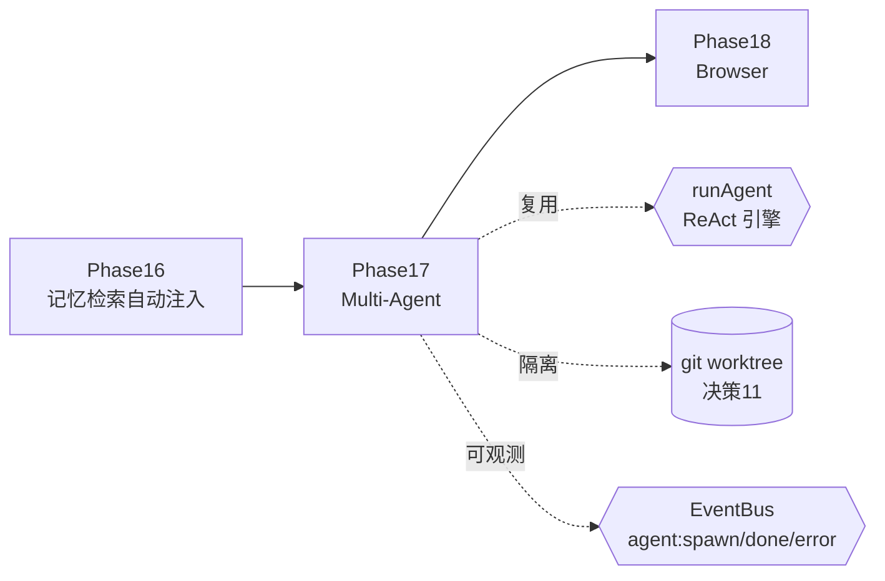
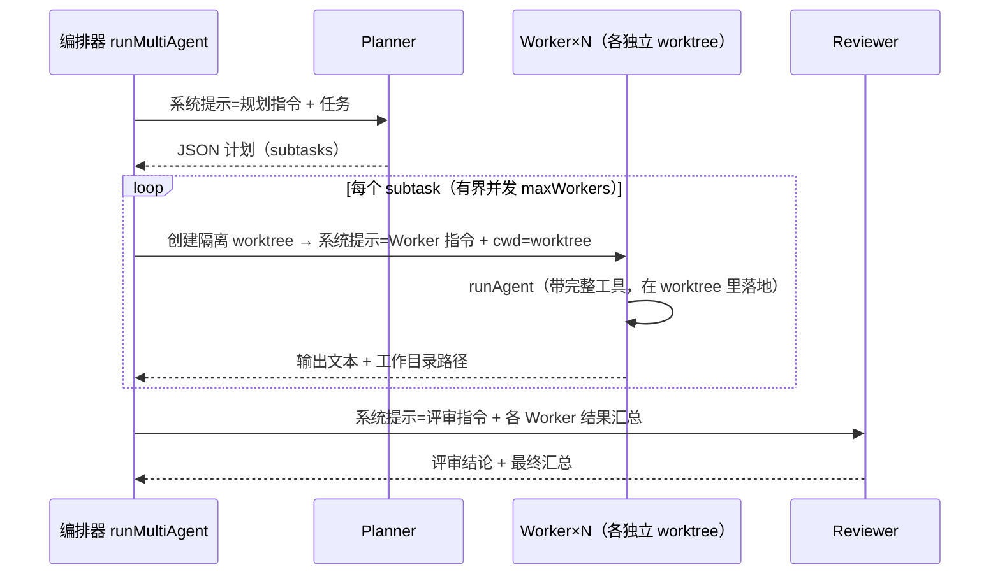
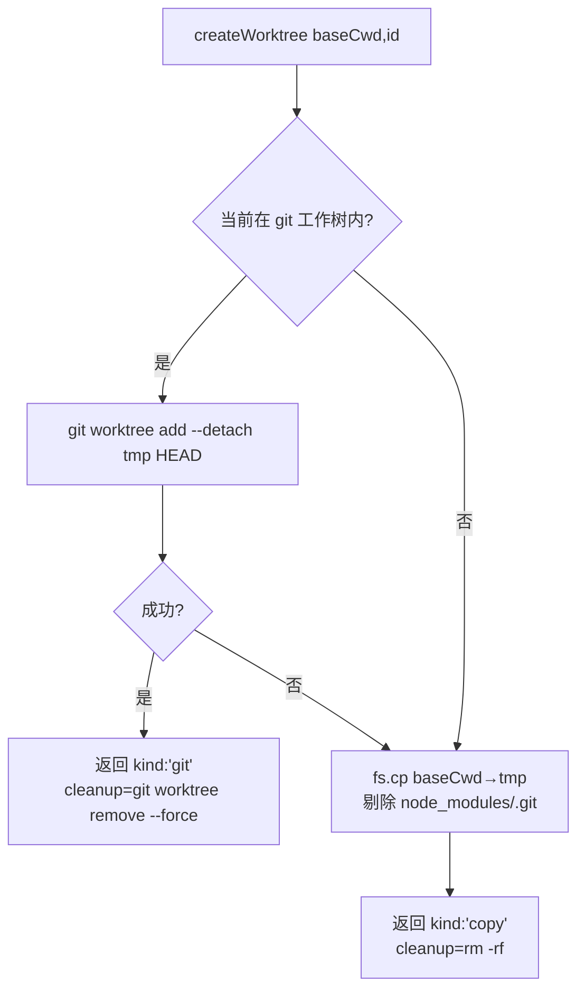
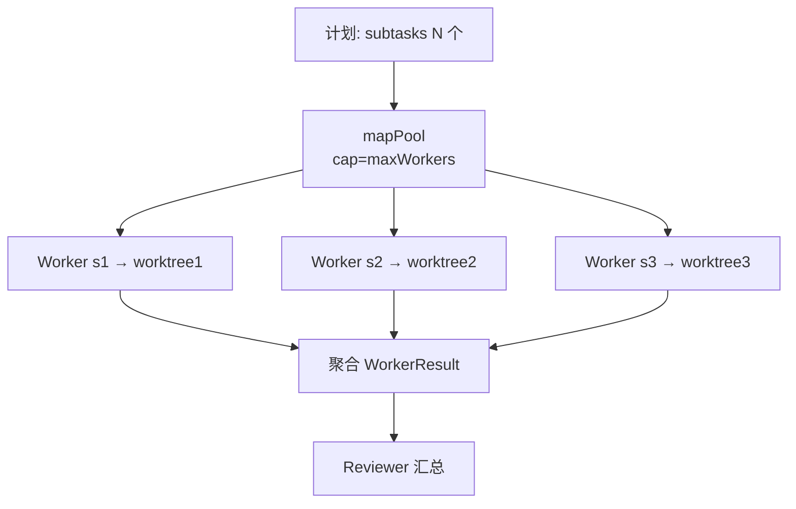
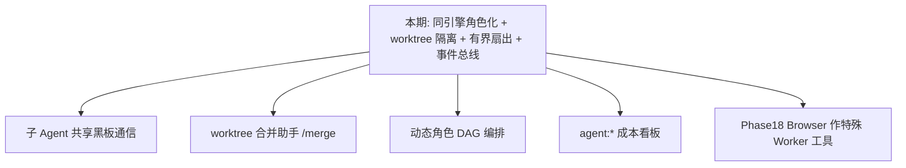

# 第 17 期学习文档：Multi-Agent（规划 + 并发 Worker + 评审）

## 0. 本期在全局路线图中的位置

Phase 17 把 easyCLI 从「单 Agent 串行执行」升级为「**多 Agent 协作**」——一个高层任务被拆给 Planner 拆解，再并发派发给若干 Worker 各自落地，最后由 Reviewer 汇总。这是 Claude Code / 生产级 Coding Agent 的核心范式之一，也是路线图里「子 Agent 各自独立 worktree」决断（决策 11）的落地。

本期**完全复用 Phase 1 的 `runAgent` 引擎**：Planner / Worker / Reviewer 不是三套代码，而是同一个 ReAct 循环的三个「角色配置」（不同系统提示 + 是否带工具）。新增的是一个轻量**编排层** `src/core/multiagent/`，外加把子 Agent 运行态通过**事件总线**暴露（呼应决策 9）。



## 1. 本节完成了什么（交付物）

| 文件 | 类型 | 作用 |
|---|---|---|
| `src/core/multiagent/types.ts` | **新增** | 核心类型：`AgentRole` / `Subtask` / `MultiAgentPlan` / `WorkerResult` / `MultiAgentResult` |
| `src/core/multiagent/worktree.ts` | **新增** | `createWorktree(baseCwd, id)`：每个 Worker 的**文件隔离工作目录**——优先 `git worktree add --detach`（真正工作树隔离），失败退化为目录拷贝（剔除 node_modules/.git） |
| `src/core/multiagent/prompts.ts` | **新增** | 三个角色系统提示：`buildPlannerSystemPrompt`（产出可解析 JSON 计划）/ `buildWorkerSystemPrompt`（隔离 worktree 内落地子任务）/ `buildReviewerSystemPrompt`（汇总给结论） |
| `src/core/multiagent/orchestrator.ts` | **新增** | `runMultiAgent(opts)`：Planner → Worker 扇出（有界并发、各跑独立 worktree 的 `runAgent`）→ Reviewer；发射 `agent:spawn/done/error`；内置 `mapPool` 有界并发池 |
| `src/core/multiagent/index.ts` | **新增** | barrel 导出 |
| `src/core/events/bus.ts` | 修改 | `AgentEventType` 新增 `'agent:spawn'` / `'agent:done'` / `'agent:error'` |
| `src/cli/repl.ts` | 修改 | 新增 `/agent <任务>` 命令与 `runMultiAgentCommand`（打印计划/各 Worker 结果含 worktree 路径/评审结论）；`printHelp` 增加一行 |
| `tests/unit/multiagent.test.ts` | **新增** | 7 个单测：计划解析、worktree 隔离（marker 落在各自副本、不污染基线）、并发峰值受 `maxWorkers` 约束、Worker 创建失败兜底、Planner 失败降级、事件总线发射 |

> 真机验证路径：全量测试 **222 个全绿**（Phase 16 后 215 + 本期 7），typecheck 干净，tsup 构建通过（multiagent 已拆为独立 chunk）。隔离测试用「写入 marker 文件的工具」验证：每个 Worker 把文件写进了**自己的** worktree 副本，基线目录无污染；并发测试用共享计数器验证 `maxWorkers=1 → 峰值≤1`、`maxWorkers=2 → 峰值≤2`。

## 2. 核心概念速览（先看这个）

- **角色化子 Agent（Role-based Sub-Agent）**：Planner / Worker / Reviewer 共用 `runAgent`，区别只在系统提示与是否带工具。没有「专门的规划引擎」或「专门的评审引擎」，符合「共享引擎」路线图意图。
- **文件隔离 worktree（决策 11）**：并发 Worker 若共用同一 `cwd` 会互相覆盖。每个 Worker 跑在独立的 `git worktree`（或目录拷贝）里，改动彼此隔离、可单独 review。
- **有界并发扇出（Fan-out with Bounded Concurrency）**：多个子任务同时派发，但并发数受 `maxWorkers` 上限约束（与 Phase 15 池子同思路），既提速又避免一次性打爆模型/磁盘。
- **事件总线落地（决策 9）**：子 Agent 的「启动/完成/失败」作为 `agent:spawn` / `agent:done` / `agent:error` 事件发到总线，审计/可观测层可订阅——Multi-Agent 不再是个黑盒。
- **保留而非自动清理**：Worker 跑完后**不**自动删 worktree（其改动需保留供用户 review/合并），`Worktree.cleanup` 由调用方按需调用。

## 3. 设计方案与原理

### 3.1 三类角色，一套引擎

所有子 Agent 都是 `runAgent(history, opts)` 的一次调用，差异仅由「塞进 history 首位的系统提示」与「是否给工具」决定：



- **Planner**：纯推理（`model.complete`，不带工具），要求输出可被程序解析的 JSON 计划（`{goal, subtasks:[{id,title,description}]}`）。
- **Worker**：`runAgent` + 完整工具集，但 `cwd` 设为自己的隔离 worktree 路径——工具的 `execute(args, {cwd})` 自然把相对路径解析到隔离目录。
- **Reviewer**：纯推理，把各 Worker 的「标题 / 工作目录 / 成败 / 产出」汇总后给结论。

### 3.2 文件隔离：`createWorktree`



隔离靠「每个 Worker 用各自 worktree 路径作为 `cwd`」实现：内置工具的 `execute` 都通过 `resolveSafe(ctx.cwd, path)` 解析相对路径（Phase 3 起就埋好的接口），所以共享同一张工具注册表、仅靠 `cwd` 不同就能物理隔离写入。

### 3.3 有界并发扇出：`mapPool`

与 Phase 15 的 `mapWithConcurrency` 同构：启动 `min(limit, N)` 个取数协程，每个取任务 → `await worker` → 递归取下一个，直到取空。Worker 之间互不依赖，故可并发；上限 `maxWorkers`（默认 3）防止一次性把 N 个子任务全压上模型/磁盘。



### 3.4 故障隔离与事件总线

- **Worker 失败不阻断整体**：`worktreeFactory` 抛错或 `runAgent` 抛错都被 `try/catch` 兜住，该 Worker 标记 `ok:false` + `error`，其余继续，Reviewer 照常汇总。
- **Planner 失败安全降级**：直接返回「空计划 + 空 Worker + Planner 失败说明」，不让整个调用崩溃。
- **事件总线**：每启动/完成/失败一个子 Agent，分别 `emit({type:'agent:spawn'|'agent:done'|'agent:error', ...})`，审计日志、未来监控都能 `bus.on` 订阅。

## 4. 为什么这样设计（设计权衡）

| 决策点 | 选择 | 反方案 | 理由 |
|---|---|---|---|
| 子 Agent 实现 | 同一 `runAgent` + 角色提示 | 各写 Planner/Worker/Reviewer 引擎 | 引擎逻辑集中、易测、不漂移；符合「共享引擎」意图 |
| Worker 隔离 | 独立 worktree（git 优先 / 拷贝兜底） | 共用 cwd 或进程级沙箱 | 共用会互相覆盖；进程沙箱太重。worktree 轻量且改动可单独 review/合并 |
| 自动清理 worktree？ | **不**自动清理，保留供 review | 跑完即 `rm -rf` | Worker 改动要给用户合并，删了就丢；Reviewer 也提示「逐一合并」 |
| 并发策略 | 有界并发池 `mapPool` | `Promise.all` 全并发 | 全并发对模型/磁盘不友好；池子上限可控、可测峰值 |
| 隔离手段 | 仅靠 `cwd` 不同（共享工具表） | 每 Worker 复制一份工具表 | 工具 `execute` 已是 `cwd` 参数化，靠 cwd 隔离零复制、零状态 |
| 可观测 | 走事件总线 `agent:*` | 内部计数/打印 | 复用决策 9 的事件总线范式，审计/UI 零侵入订阅 |
| Planner 输出 | 模型产 JSON（围栏包裹） | 自然语言段落 | 程序需结构化拆解结果才能扇出；JSON 可解析、可退化（解析失败→单子任务兜底） |

## 5. 与其它方案对比（优势）

| 维度 | 本期方案 | Claude Code / 生产级 | 说明 |
|---|---|---|---|
| 子 Agent 架构 | 同引擎 + 角色提示 | 通常也是「同一运行时 + 不同 system」 | 思路一致；本期显式复用 `runAgent`，无重复引擎 |
| 隔离 | git worktree / 目录拷贝，靠 cwd 隔离 | 常也用 worktree 或独立沙箱 | 轻量；改动保留可合并，符合评审流 |
| 并发 | 有界并发池 + 峰值受控 | 通常也池化 | 本期 `maxWorkers` 可调，且能测峰值 |
| 可观测 | 事件总线 `agent:spawn/done/error` | 一般有 trace/span | 复用既有总线，零新增基础设施 |
| 依赖 | 零新增第三方并发/编排库 | 可能引 bullmq/agent-sdk | 手写池子约 30 行，符合「纯手写、依赖克制」 |
| 故障隔离 | Worker 失败不阻断、Planner 失败降级 | 同 | 单点失败不雪崩，整体仍产出可审阅结果 |

## 6. 面试话术（30 秒版 + 详版）

**30 秒版：**
> 我在 easyCLI 落地了 Multi-Agent：一个高层任务先给 Planner 拆成结构化子任务，再用有界并发池扇发给多个 Worker——每个 Worker 跑在**独立的 git worktree（或目录拷贝）**里、靠不同 `cwd` 实现文件隔离，复用同一个 `runAgent` 引擎只带不同的系统提示；全部跑完后由 Reviewer 汇总给结论。关键点：子 Agent 不是另写引擎，而是「同一引擎 + 角色配置」；隔离靠 worktree 而非复制工具表；并发受 `maxWorkers` 上限约束；子 Agent 的启动/完成/失败都通过事件总线暴露，审计层能订阅。Worker 跑完不自动清理 worktree，因为改动要留着给用户 review/合并。

**详版（被追问时）：**
> 为什么不复用引擎、要写三个引擎？规划/执行/评审本质都是 ReAct 循环，区别只在提示与是否带工具。另写三套会重复历史回填、工具调度逻辑，且易漂移。本期把 `runAgent` 当「角色运行时」，Planner/Reviewer 甚至不调工具、只用 `model.complete`。
> 隔离怎么保证？每个 Worker 拿到自己的 worktree 路径作 `cwd`。内置工具的 `execute(args,{cwd})` 早已按 `cwd` 解析相对路径，所以共享同一张工具表、仅靠 `cwd` 不同就物理隔离了写入——零工具复制。
> 为什么保留 worktree 不删？Worker 的改动是用户要合并的产出，删了就丢；Reviewer 也提示「逐一 review/合并」。所以 `cleanup` 留给调用方按需调用。
> 并发怎么控？`mapPool` 启动 `min(maxWorkers, N)` 个协程，活跃数峰值受 `maxWorkers` 约束——比 `Promise.all` 全并发更可控。
> 失败怎么办？Worker 创建 worktree 失败或 `runAgent` 抛错都被兜住，标记 `ok:false` 但其余继续、Reviewer 照常汇总；Planner 失败则整体安全降级（空计划 + 说明）。

## 7. 常见面试题（附答题要点）

1. **子 Agent 是三个引擎还是一套？**
   答：一套。`runAgent` 是「角色运行时」，Planner/Worker/Reviewer 只是不同系统提示（+ Worker 带工具）。复用避免重复循环/回填逻辑、防漂移。

2. **多个 Worker 并发改同一份代码不会互相覆盖吗？**
   答：不会。每个 Worker 有独立 worktree，`cwd` 不同；工具按 `cwd` 解析相对路径，写入天然隔离。这是决策 11 的落地。

3. **worktree 创建失败（如 git 工作树不干净）怎么办？**
   答：`createWorktree` 退化为目录拷贝兜底；若仍抛错，编排器在 `worktreeFactory` 层 `catch`，该 Worker 标记失败、其余继续，不雪崩。

4. **为什么 Worker 跑完不自动清理 worktree？**
   答：Worker 的改动是用户要 review/合并的产出，删了就丢；Reviewer 结论也提示「逐一合并」。故只保留句柄，`cleanup` 由调用方按需调用。

5. **`agent:spawn/done/error` 事件有什么用？**
   答：把子 Agent 运行态暴露给事件总线（决策 9 范式）。审计日志可记录「哪些子 Agent 跑了、成败」，未来监控可做并发/耗时看板，零侵入。

6. **有界并发和 Phase 15 的并发池是什么关系？**
   答：同思路、不同层级。Phase 15 的池子管「单批工具调用的只读并行」；本期 `mapPool` 管「多子任务的并发扇出」。都受上限约束、都可测峰值。

7. **Planner 输出的 JSON 解析失败会怎样？**
   答：`parsePlan` 捕获异常，退化成「单子任务」（整段文本当一个 subtask），保证编排不中断；这是「解析失败不崩溃」的兜底。

## 8. 关键代码索引

| 功能 | 位置 |
|---|---|
| 核心类型 | `src/core/multiagent/types.ts` → `AgentRole` / `Subtask` / `MultiAgentPlan` / `WorkerResult` / `MultiAgentResult` |
| 文件隔离 | `src/core/multiagent/worktree.ts` → `createWorktree`（git worktree 优先 / 拷贝兜底） |
| 角色提示 | `src/core/multiagent/prompts.ts` → `buildPlannerSystemPrompt` / `buildWorkerSystemPrompt` / `buildReviewerSystemPrompt` |
| 编排器 | `src/core/multiagent/orchestrator.ts` → `runMultiAgent` + `mapPool` + `parsePlan` |
| 事件类型 | `src/core/events/bus.ts` → `AgentEventType` 加 `agent:spawn`/`agent:done`/`agent:error` |
| REPL 入口 | `src/cli/repl.ts` → `runMultiAgentCommand` + `/agent <任务>` + `printHelp` 行 |
| 单测 | `tests/unit/multiagent.test.ts` |

## 9. 踩坑与细节（来自真实实现）

1. **Reviewer 提示也含「隔离工作目录」，mock 误路由**：测试用的角色感知 mock 原本用「执行工程师 OR 隔离工作目录」判定 Worker，结果 Reviewer 提示（含「在各自隔离工作目录中」）被误判成 Worker 分支，返回空 content + tool_call，导致 `review` 为空。**教训**：角色判定要用**唯一标识词**（Planner=任务拆解专家 / Reviewer=评审专家 / Worker=执行工程师），且判定顺序要让 Reviewer 先于 Worker——避免提示词里的描述性短语造成碰撞。真实模型按指令工作不会触发，但单测的「子串匹配」会。

2. **自动 cleanup 会丢掉 Worker 产出**：最初在 Worker 的 `finally` 里 `wt.cleanup()`，结果测试事后找不到写入的 `marker.txt`——worktree 已被删。更关键的是，真实场景里「跑完即删」会让用户拿不到改动。改为**不自动清理**，worktree 保留供 review/合并（Reviewer 也要求提示用户合并），`cleanup` 交给调用方。

3. **`worktreeFactory` 抛错时 `wt` 未赋值**：`let wt` 在 `try` 里赋值，若 `worktreeFactory` 抛错会进 `catch` 提前 `return`（用基线 `cwd`），不会在 `catch` 里访问 `wt.path`——否则会 `TypeError`。**教训**：失败路径返回基线 `cwd` 而非 `wt.path`，且 `return` 让 TS 确信「后续代码只在赋值成功后可达」，通过 definite-assignment 检查。

4. **Worker 共享工具表的安全性**：所有 Worker 共用同一 `ToolRegistry`，隔离完全靠各自 `cwd`。这依赖「工具的 `execute` 是 `cwd` 参数化」这一前置约定（Phase 3 起就是）。若某工具偷偷读了全局状态（如写 `~/.config`），隔离就会破功——本期靠约定保证，文档已点明。

5. **JSON 计划解析要兜底**：模型不一定严格输出可解析 JSON（可能加解释文字、用裸 JSON 而非围栏）。`parsePlan` 先尝试 ```` ```json ```` 围栏，再退化到首个 `{...}`，最后整体解析失败时退化成单子任务——保证编排不中断。

6. **并发峰值测试用共享计数器**：用「工具内 `active++` → 记录 `max` → `await sleep` → `active--`」的计数器验证 `maxWorkers` 约束，比计时断言更稳。注意 `active++` 要在 `await` 之前同步自增，否则峰值统计偏低（同 Phase 15 的坑）。

## 10. 自测题（检验是否真懂）

1. 三个子 Agent 是几套引擎？Worker 之间靠什么隔离写入？（答案：一套 `runAgent` 引擎 + 角色提示；靠各自独立 worktree 的 `cwd` 不同，工具按 `cwd` 解析路径实现物理隔离）
2. `maxWorkers=2` 派发 3 个子任务，最多同时有几个 Worker 在跑？（答案：2；`mapPool` 上限约束）
3. 某个 Worker 的 `runAgent` 抛错，整体会怎样？（答案：该 Worker 标记 `ok:false` + `error`，其余继续，Reviewer 仍汇总，整体不崩溃）
4. Worker 跑完后 worktree 会被自动删除吗？为什么？（答案：不会；改动需保留供用户 review/合并）
5. 若 Planner 返回的 JSON 解析失败，`runMultiAgent` 会崩溃吗？（答案：不会；`parsePlan` 退化成单子任务兜底）
6. `agent:spawn` 事件在什么时机发射？（答案：每个子 Agent（Planner / 每个 Worker / Reviewer）真正开始前，`emit` 到事件总线）

## 11. 延伸与下一步

- **子 Agent 间通信**：当前 Worker 互不通信、只向 Reviewer 汇总。可加「Worker 写共享黑板（Phase 4 记忆）」让后续 Worker 读到前文结论，支持有依赖的串行子任务。
- **工作树合并助手**：在 `/agent` 后加 `/merge <workerId>` 自动 `git worktree` 差异预览 + 合并，把「保留 worktree」闭环成「review → 合并」。
- **动态角色**：除 Planner/Worker/Reviewer，可加 Critic（挑刺）、Researcher（只检索）等角色，编排成更丰富的 DAG（非纯扇出）。
- **成本/可观测看板**：用 `agent:*` 事件 + Phase 14 的 `CostTracker`，画出「各子 Agent 耗时/ token / 成败」面板。
- **Browser 预演**：Phase 18 的 CDP 浏览器可作为一个「特殊 Worker 工具」，被本期的 Worker 直接调用做端到端验证。


