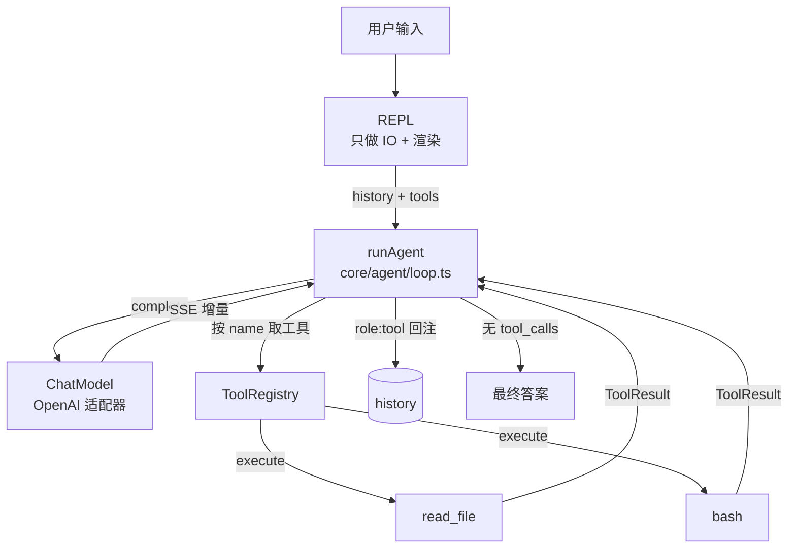
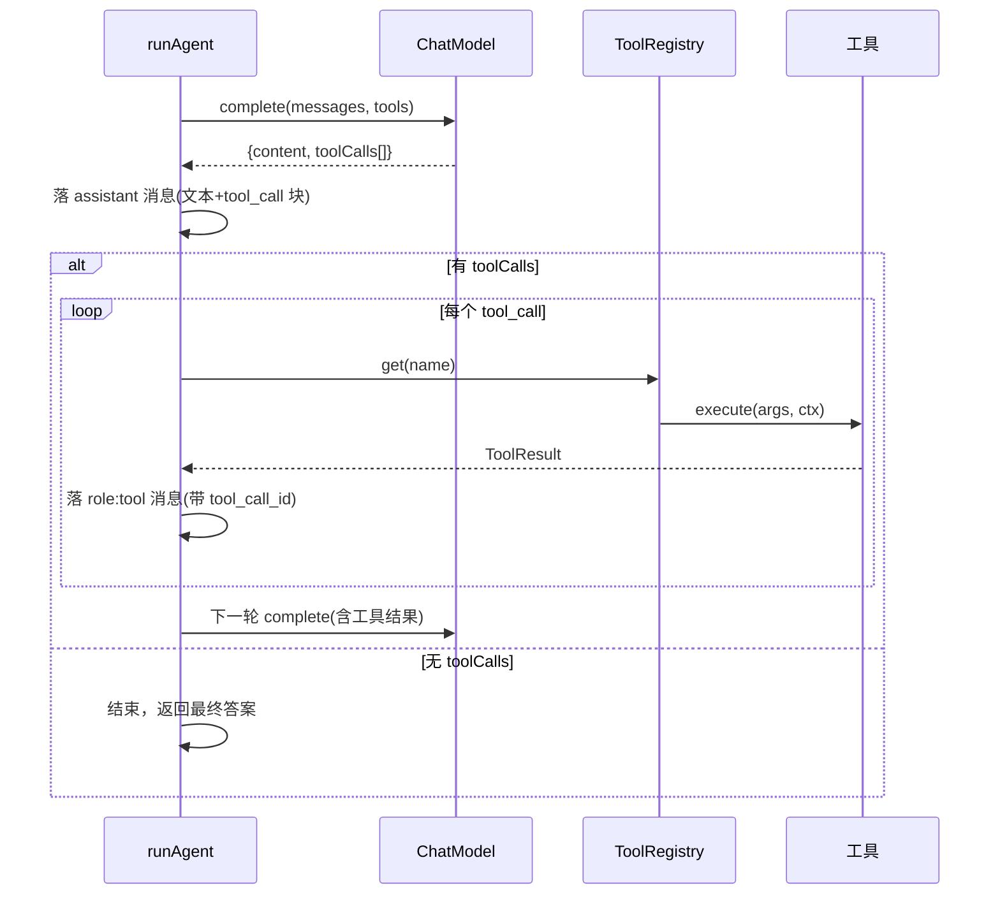

# 第 2 期学习文档：ReAct 循环 + Tool Calling + 最小内置工具

> 目标读者：想吃透 Agent 底层原理、并能在面试中讲清「为什么这么写」的人。
> 阅读建议：先读 §2 概念速览，再看 §3 设计原理（含图），最后用 §10 自测题、§7 面试题检验。

---

## 0. 本期在全局路线图中的位置

| 期 | 模块 | 状态 |
|---|---|---|
| 1 | 脚手架 + REPL + 流式对话 + ChatModel/OpenAI 适配器 | ✅ 已完成 |
| **2** | **ReAct 循环 + Tool Calling + 最小内置工具（read_file/bash）** | ✅ 已完成 |
| **3** | **内置工具扩展 + 安全围栏（isReadOnly/isDestructive；读并行/写串行；三级权限+围栏+黑名单+HITL+审计）** | ✅ 已完成 |
| 4 | 上下文压缩（裁剪/去重/折叠/摘要）+ 长期记忆（SQLite） | 待做 |
| 5 | MCP 客户端（stdio，JSON-RPC 连接状态机） | 待做 |
| 6 | RAG | 待做 |
| 7 | Skill 系统（三层加载 + 渐进式披露保护 cache） | 待做 |
| 8 | Multi-Agent（Planner/Worker/Reviewer + 文件隔离 worktree + 事件总线） | 待做 |
| 9 | MCP Server + 多模型补全（补齐 Anthropic/Ollama 适配器 + fallback model 降级） | 待做 |
| 10 | Plan 模式 + 异步并行（与 ReAct 共享同一引擎） | 待做 |
| 11 | Browser（CDP） | 待做 |

**第 2 期是 Agent 的「灵魂上线期」**：第 1 期只会聊天，第 2 期让模型能**自主调工具、观察结果、再决定下一步**，Agent 第一次具备「自己干活」的能力。同时把第 1 期遗留的一个隐患（assistant 历史只存文本、丢了 `tool_calls`）一并修复——否则多轮工具调用会「失忆」。

---

## 1. 本节完成了什么（交付物）

| 模块 | 文件 | 说明 |
|---|---|---|
| ReAct 循环 | `src/core/agent/loop.ts` | `runAgent()`：推理→行动→观察，直到模型不再请求工具 |
| 工具注册表 | `src/core/tools/registry.ts` | `ToolRegistry` + `createToolRegistry()`，内置/MCP 工具统一入表 |
| 最小内置工具 | `src/core/tools/builtin.ts` | `read_file`（只读）、`bash`（执行命令） |
| 类型扩展 | `src/core/chatmodel/types.ts` | `ToolDef` 补 `execute` + `isReadOnly/isDestructive`；新增 `ToolContext` |
| REPL 接入 | `src/cli/repl.ts` | REPL 改为调用 `runAgent`，只负责 IO；新增 `/tools` 命令、Ctrl+C 中断 |
| 组合根 | `src/cli/main.ts` | 构建 `ToolRegistry` 注入 REPL |
| 测试 | `tests/unit/agent.test.ts`、`tests/unit/tools.test.ts` | 12 个单测（循环全流程/工具执行/边界），全绿 |

**命令用法**：
```bash
export AGENTCLI_API_KEY=你的Key
export AGENTCLI_BASE_URL=https://api.deepseek.com/v1
export AGENTCLI_MODEL=deepseek-chat
pnpm dev                      # 进入交互 REPL，模型可自主调用 read_file / bash
```

---

## 2. 核心概念速览（先看这个）

- **ReAct（Reasoning + Acting）**：Agent 的核心循环范式。模型先「想」（输出思考/文本），再「做」（请求调用工具），然后「看」（工具返回结果），带着结果再想……直到给出最终答案。相比纯「思考链 CoT」，ReAct 把**外部工具**作为推理的一环，让模型能查真实世界。
- **Tool Calling / Function Calling**：模型不在文本里假装调工具，而是输出结构化 `tool_calls: [{id, name, arguments}]`。本期**解析并执行**了（第 1 期只解析不执行）。
- **工具结果回注（tool result）**：工具执行完后，结果要以 `role: 'tool'`、带 `tool_call_id` 的消息塞回对话历史，模型下一轮才能「看到」结果。
- **ContentBlock**：一条消息可以是纯文本，也可以是「文本块 + 工具调用块」的混合数组。这是贯穿后续各期的归一化结构——**本期正是用它在历史里保留了模型的 `tool_calls`**。
- **Agent 循环与 IO 分离**：循环逻辑（调模型→执行工具→回注）放在 `core/agent/`，REPL 只负责「把用户输入喂进去、把过程打印出来」。这样 REPL、`-p` 单次模式、未来的 Server 模式都能复用同一个循环。

---

## 3. 设计方案与原理

### 3.1 整体架构



关键点：**REPL 不再直接 `fetch` 也不直接调模型**，而是把「决策」交给 `runAgent`。`runAgent` 只依赖 `ChatModel` 接口和 `ToolRegistry`，与具体 UI 无关。

### 3.2 ReAct 主循环（核心不变量）



**不变量（最重要）**：每个 `assistant(tool_call)` 之后都紧跟对应的 `tool` 结果消息。原因有二：
1. **OpenAI 协议要求**：`assistant` 带 `tool_calls` 时，后续必须出现对应的 `role:'tool'`，否则 API 报错。
2. **模型需要看见自己的决定**：下一轮模型必须知道「我上一轮调了什么工具、拿到了什么结果」，否则多轮工具调用就是「失忆」。

### 3.3 历史如何保留工具调用（修复第 1 期隐患）

第 1 期 `repl.ts` 把 assistant 回复当纯字符串存，导致 `tool_calls` 被丢弃。本期改为：

```ts
const blocks: ContentBlock[] = [];
if (result.content) blocks.push({ type: 'text', text: result.content });
for (const tc of result.toolCalls)
  blocks.push({ type: 'tool_call', id: tc.id, name: tc.name, arguments: tc.arguments });
history.push({ role: 'assistant', content: hasToolCall ? blocks : result.content });
```

`toOpenAIMessages`（第 1 期已写好）能把这个 `ContentBlock[]` 还原成 OpenAI 的 `tool_calls` 字段——**所以本期只需改存储方式，适配器零改动**。这正是第 1 期「类型契约先行」带来的红利。

### 3.4 事件钩子雏形（决策 9 预埋）

`runAgent` 暴露 `onText / onToolCall / onToolResult` 三个钩子，REPL 用来把过程可视化（流式文本、🔧 调用工具、✓/✗ 结果）。这其实就是**决策 9「事件总线」的最小形态**——本期先用轻量回调，Phase 3 落 `EventBus` 时可直接升级，不推翻结构。

---

## 4. 为什么这样设计（设计权衡）

| 设计决策 | 为什么 | 不这样做会怎样 |
|---|---|---|
| **Agent 循环独立成 `core/agent/`，不写进 REPL** | IO 与决策分离，REPL/`-p`/未来 Server 复用同一循环 | 循环逻辑散落在 UI 里，加一个入口就要重写一遍 ReAct |
| **工具统一进 `ToolRegistry`，按 name 检索** | 内置工具与未来 MCP 工具同一张表，循环只认接口 | 每次调工具都 `if (name==='read_file')`，Phase 5 会爆炸 |
| **历史用 `ContentBlock[]` 保留 `tool_calls`** | 满足 OpenAI 合法性 + 多轮工具记忆 | 第 1 期那样只存文本 → 模型「失忆」、API 报错 |
| **`execute` 补进 `ToolDef`（决策落地）** | 工具自带执行体，注册表调度，调用方零分支 | 把执行逻辑堆在循环里，越写越乱 |
| **轻量回调钩子而非 EventBus** | 满足 Phase 2 可视化即可，不过度设计 | 一期就造 EventBus，YAGNI |
| **`maxIterations` 截断前补完工具结果** | 保证历史始终合法，不留悬空 `tool_call` | 截断时留下无结果的 `tool_call` → 下一轮 API 报错 |

---

## 5. 与其它方案对比（优势）

| 方案 | 学习价值 | 可控性 | 说明 |
|---|---|---|---|
| **A. 自写 ReAct 循环 + ToolRegistry（本期采用）** | ⭐⭐⭐ 最高，循环/工具调度/结果回注全透明 | 高，每步可控 | 能说清「模型怎么决定调工具、结果怎么喂回去」 |
| B. 用 LangChain / OpenAI Agents SDK | ⭐⭐ 中 | 中，受框架约束 | `Agent`+`Tool` 几行搞定，但循环黑盒 |
| C. 只调一次 `complete` 不循环 | ⭐ 低 | — | 模型只能给一次性答案，无法多步干活 |

**结论**：本项目目标是「加强理解」，选 A。面试时这正是加分项——你能讲清 B/C 帮你省了什么、又让你丢了什么。

---

## 6. 面试话术（30 秒版 + 详版）

**30 秒版**：
> 第 2 期我让 Agent 能真正干活。核心是手写一个 ReAct 循环 `runAgent`：调模型→若返回 `tool_calls` 就按 name 从 `ToolRegistry` 取出工具执行、把结果以 `role:'tool'` 回注历史，再进入下一轮，直到模型不再要工具。我把循环放在独立的 `core/agent/`，REPL 只做 IO。还修了一个隐患：历史用 `ContentBlock[]` 保留模型的 `tool_calls`，保证多轮工具调用不「失忆」且符合 OpenAI 协议。

**详版（被追问时）**：
> - 为什么工具结果要单独一条 `role:'tool'` 消息？因为 OpenAI 要求 `assistant(tool_calls)` 之后必须跟对应 `tool` 结果，且下一轮模型需要看见结果才能继续推理；我们把它作为不变量在循环里保证。
> - 为什么循环和 REPL 分开？因为决策逻辑（调模型/执行工具）和展示（终端渲染）是两件事，分开后 `-p` 单次模式、未来的 Server 都能复用同一个 `runAgent`。
> - 工具怎么管理？统一进 `ToolRegistry`，内置和未来的 MCP 工具同一张表、同一套执行与安全检查，循环零分支。
> - 中断怎么处理？`Ctrl+C` 触发 `AbortController`，循环检测到 `aborted` 就停；并且 `fetch` 抛的 `AbortError` 要就地消化，否则会冲垮 REPL。

---

## 7. 常见面试题（附答题要点）

**Q1：ReAct 和普通 CoT（思维链）有什么区别？**
- 答：CoT 只在模型「脑内」推理；ReAct 把**外部动作（工具调用）**作为推理的一环——想、做、看、再想，能查真实世界（读文件、跑命令、查库），解决 CoT 无法获取实时信息的问题。

**Q2：Agent 循环里，工具执行结果怎么回传给模型？**
- 答：作为 `role:'tool'` 消息，带 `tool_call_id` 关联被调用的工具，塞回对话 `history`；下一轮 `complete` 时整段历史（含这条结果）一起发给模型。且必须保证每个 `tool_call` 都有对应 `tool` 结果，否则 API 报错。

**Q3：如果模型一直调用工具不停止怎么办？**
- 答：设 `maxIterations` 上限；截断前要把当前轮的工具结果补完，保持历史合法。更进一步可加「预算/步数」统计（决策 10 的错误恢复）。

**Q4：多工具调用要并行还是串行？**
- 答：本期串行（简单可靠）；决策 8 规定 Phase 3 按 `isReadOnly` 标记做「只读并行、写串行」——写操作串行避免竞态，只读（如多次读文件）可并行提速。

**Q5：你的 Agent 怎么处理用户中途 Ctrl+C 中断？**
- 答：`AbortController` 注入循环，每轮开头检测 `aborted` 即停；`fetch`/工具执行传入 `signal`，中断时 `fetch` 抛 `AbortError`——必须在循环里 `try/catch` 消化成「正常停止」，否则异常冒泡会冲垮 REPL 的 for-await。

---

## 8. 关键代码索引

| 想看什么 | 去哪 |
|---|---|
| ReAct 主循环 | `src/core/agent/loop.ts` → `runAgent` |
| 工具注册与检索 | `src/core/tools/registry.ts` → `ToolRegistry` / `createToolRegistry` |
| 最小内置工具 | `src/core/tools/builtin.ts` → `read_file` / `bash` |
| 类型契约（含 execute） | `src/core/chatmodel/types.ts` → `ToolDef` / `ToolContext` |
| 历史保留 tool_calls | `src/core/agent/loop.ts` → `blocks` 拼装 + `toOpenAIMessages` |
| REPL 接入循环 | `src/cli/repl.ts` → `runTurn` / `handleSlash` |
| 中断处理 | `src/core/agent/loop.ts` → `try/catch(AbortError)`；`src/cli/repl.ts` → `rl.on('SIGINT')` |

---

## 9. 踩坑与细节（来自真实实现）

1. **第 1 期隐患：assistant 历史只存文本，丢了 `tool_calls`**。本期用 `ContentBlock[]` 修复——这是 Phase 2 最该先修的坑，否则多轮工具必然失忆。
2. **`AbortError` 冲垮 REPL**：`Ctrl+C` 后 `fetch` 抛 `AbortError`，`runAgent` 里 `await model.complete` 未捕获会一路冒泡。已加 `try/catch`：中断就 `break`，其它错误照抛。
3. **`maxIterations` 截断的合法性**：若在「落了 `tool_call` 但还没执行工具」时直接 `break`，会留下无对应结果的 `tool_call`，下一轮 API 报错。本期在截断前先把本轮工具结果补完。
4. **`noUncheckedIndexedAccess` 下的测试写法**：访问 `history[2]` 会报「可能 undefined」，需 `history[2]!` 断言；`ScriptedModel`（mock）要循环返回队列，否则队列耗尽返回「无工具调用」会让循环提前退出，测试失真。
5. **`bash` 输出 `maxBuffer`**：`execAsync` 默认 1MB，超大输出会报错；本期设为 `1024*1024`，Phase 3 可加输出截断。
6. **`complete()` 的 `tools` 始终传入**：只要有工具注册表就传 `tools: list()`，让模型自行决定是否调用（而不是每轮强制）。

---

## 10. 自测题（检验是否真懂）

1. 为什么 `assistant(tool_calls)` 之后必须紧跟 `role:'tool'` 消息？不跟会怎样？
2. 把 ReAct 循环写进 `repl.ts` 而不是独立 `core/agent/`，未来加 `-p` 单次模式和 Server 模式时会有什么代价？
3. 模型返回 `tool_calls` 但 `arguments` 是非法 JSON，本期会怎样？应该在哪一期、用什么修？（提示：zod）
4. 用户在第 3 轮按 Ctrl+C，`fetch` 正在流式接收，如果不 `try/catch` 会发生什么？
5. `read_file` 和 `bash` 现在没有任何限制，Phase 3 的安全围栏应该从哪几个维度拦？（提示：路径围栏 / 命令黑名单 / HITL）

---

## 11. 延伸与下一步

- **延伸阅读**：ReAct 原论文（Yao et al., 2022）；OpenAI Function Calling 文档；Claude Code 真实架构中「Tool Use Loop / 工具统一接口 / 只读并行写串行」一节（how-claude-code-works）。
- **第 3 期预告 —— 内置工具扩展 + 安全围栏**：
  - 工具集扩展（写文件、列目录、glob、grep 等），并落地**读并行/写串行**执行器（用 `isReadOnly` 标记）；
  - **三级权限 + 路径围栏 + 命令黑名单 + HITL**，把本期「模型能跑任意命令」的敞口关上；
  - 用 `zod` 校验工具入参（接第 5 题的坑）；审计日志挂到事件钩子上。
- **代码审查结论**：本期审查发现并修复了 `AbortError` 未捕获的健壮性缺陷（§9.2）；其余边界（路径围栏、参数校验、并行执行）均按路线图归属第 3 期，非本期 bug。

> 文档模板约定（后续各期沿用）：定位 → 交付物 → 概念 → 设计原理(图) → 设计权衡 → 方案对比 → 面试话术 → **常见面试题** → 代码索引 → 踩坑 → 自测题 → 延伸。
