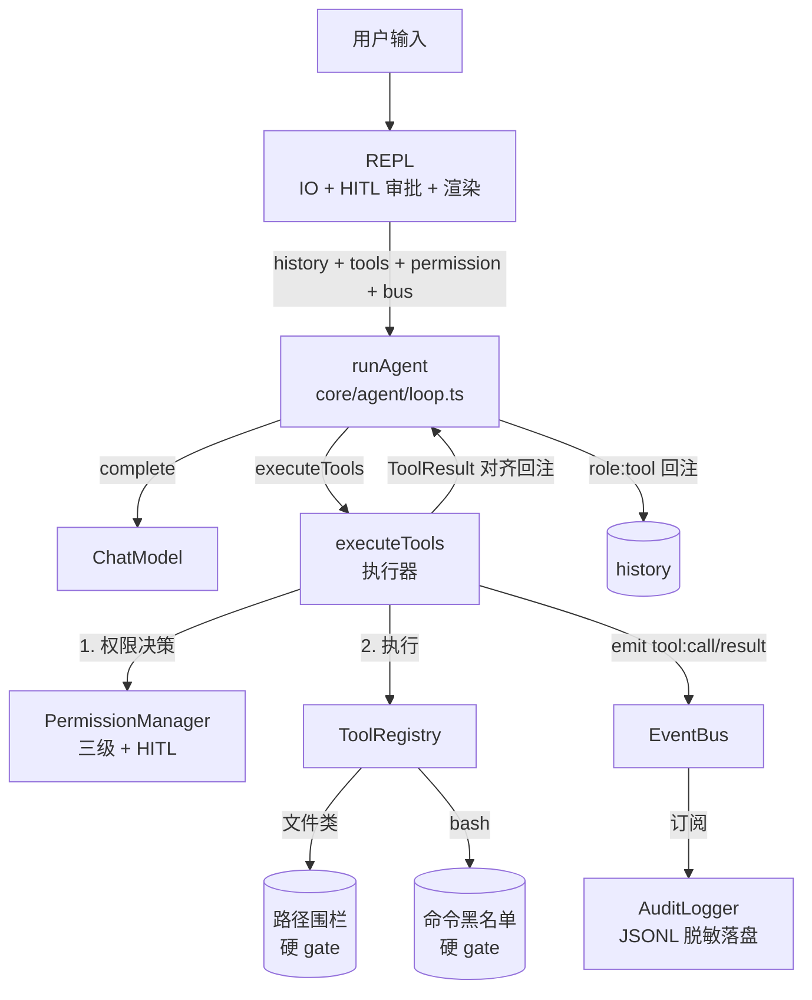
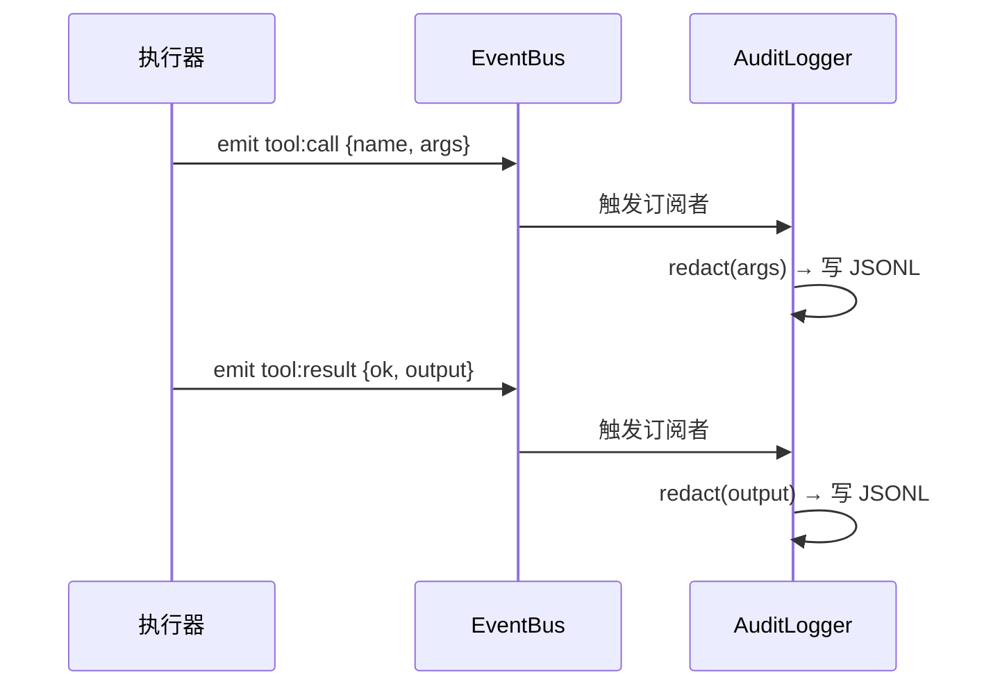

# 第 3 期学习文档：内置工具扩展 + 安全围栏（权限 / 围栏 / 黑名单 / HITL / 审计）

> 目标读者：想吃透「能跑命令的 Agent 怎么不被玩坏」、并能在面试里讲清安全设计取舍的人。
> 阅读建议：先读 §2 概念速览，再看 §3 设计原理（含 4 张图），最后用 §10 自测题、§7 面试题检验。

---

## 0. 本期在全局路线图中的位置

| 期 | 模块 | 状态 |
|---|---|---|
| 1 | 脚手架 + REPL + 流式对话 + ChatModel/OpenAI 适配器 | ✅ 已完成 |
| 2 | ReAct 循环 + Tool Calling + 最小内置工具（read_file/bash） | ✅ 已完成 |
| **3** | **内置工具扩展 + 安全围栏（isReadOnly/isDestructive；读并行/写串行；三级权限+围栏+黑名单+HITL+审计）** | ✅ 已完成 |
| 4 | 上下文压缩（裁剪/去重/折叠/摘要）+ 长期记忆（SQLite） | ✅ 已完成 |
| 5 | MCP 客户端（stdio，JSON-RPC 连接状态机） | 待做 |
| 6 | RAG | 待做 |
| 7 | Skill 系统（三层加载 + 渐进式披露保护 cache） | 待做 |
| 8 | Multi-Agent（Planner/Worker/Reviewer + 文件隔离 worktree + 事件总线） | 待做 |
| 9 | MCP Server + 多模型补全（补齐 Anthropic/Ollama 适配器 + fallback model 降级） | 待做 |
| 10 | Plan 模式 + 异步并行（与 ReAct 共享同一引擎） | 待做 |
| 11 | Browser（CDP） | 待做 |

**第 3 期是 Agent 的「戴上镣铐期」**：第 2 期模型能跑任意文件读写与 shell 命令——爽是真爽，但「`rm -rf`、读 `/etc/shadow`、写 `/Users/...` 私人目录」全开。本期把**能力**和**约束**同时做厚：工具从 2 个扩到 7 个，同时立起四道安全闸（路径围栏、命令黑名单、三级权限 + HITL、审计），并用「只读并行 / 写串行」执行器把并发与竞态问题一次性解决。

---

## 1. 本节完成了什么（交付物）

| 模块 | 文件 | 说明 |
|---|---|---|
| 路径围栏（硬 gate） | `src/core/security/path-fence.ts` | `resolveSafe(root, p)`：解析到 root 内，越界即抛错 |
| 命令黑名单（硬 gate） | `src/core/security/command-blacklist.ts` | `checkCommand(cmd)`：正则拦截 `rm -r`/`sudo`/`mkfs`/`dd`/`chmod 777` 等 |
| 三级权限 + HITL | `src/core/security/permission.ts` | `PermissionManager`：deny→allow→默认策略；`ask` 走交互审批；持久化 allow/deny |
| 审计日志（脱敏） | `src/core/security/audit.ts` | `AuditLogger` 订阅总线，JSONL 落盘；`redact()` 遮蔽密钥 |
| 事件总线 | `src/core/events/bus.ts` | `EventBus`：解耦循环与审计/可观测（决策 9 落地） |
| 读并行/写串行执行器 | `src/core/tools/executor.ts` | `executeTools`：按权限决策 → 只读 `Promise.all`、写串行、被拒不执行 |
| 内置工具扩展 | `src/core/tools/builtin.ts` | 7 个工具：read/write/edit/list_dir/glob/grep/bash，文件类统一走围栏；`grep` 走 ripgrep 后端（gitignore 感知、跳过二进制/超大文件，环境无 `rg` 时回退进程内 JS 扫描） |
| 循环接入权限+总线 | `src/core/agent/loop.ts` | `runAgent` 委托 `executeTools`，仅负责「调模型 + 回注历史」 |
| REPL + HITL 接线 | `src/cli/repl.ts` | `runOnce`（安全默认）/ `startRepl`（交互式 y/n/a 审批、新增 `/perm`） |
| 组合根接线 | `src/cli/main.ts` | 构造 `EventBus`+`PermissionManager`+`AuditLogger` 并注入 |
| 测试 | `tests/unit/security.test.ts`、`tests/unit/executor.test.ts`、`tests/unit/integration.test.ts` | 共 26 个新增用例（围栏/黑名单/权限/审计/并发/集成），全绿 |

**命令用法**：
```bash
export AGENTCLI_API_KEY=你的Key
export AGENTCLI_BASE_URL=https://api.deepseek.com/v1
export AGENTCLI_MODEL=deepseek-chat
pnpm dev                # 交互 REPL；写/危险操作会弹 y/n/a 审批
pnpm dev -p "列出 src 下的 ts 文件"   # 单次模式：默认只读放行、写/危险操作拒绝
```

---

## 2. 核心概念速览（先看这个）

- **纵深防御（Defense in Depth）**：安全不能只靠一层。本期用「硬 gate（围栏 + 黑名单）→ 软策略（三级权限 + HITL）→ 事后追溯（审计）」三层把关。硬 gate 不可关闭，软策略可被用户放行，审计兜底留痕。
- **硬 gate vs 软策略**：路径围栏、命令黑名单是**硬 gate**——不管用户怎么授权、模型怎么坚持，命中的操作直接失败，代码里没有「开关」能绕过。三级权限是**软策略**——`ask` 时用户可放行（或 `a` 持久预批准），是体验与安全的平衡。
- **三级权限（allow / deny / ask）**：`deny` 永久拒绝（最高优先级），`allow` 永久放行，`ask` 交给人在环路（HITL）当场决策。默认策略：只读工具 `allow`、其余 `ask`。
- **HITL（Human-in-the-Loop）**：需要审批的动作，运行时弹出 `y/n/a` 让真人拍板。`a`（always allow）会把该工具加入持久化 allow 列表，下次免问。
- **事件总线（EventBus）**：循环只负责 `emit('tool:call' | 'tool:result' | 'error' | 'turn')`，审计、监控作为独立订阅者挂上，互不耦合（决策 9）。
- **读并行 / 写串行**：只读工具之间无依赖、可 `Promise.all` 并发提速；写/破坏性工具串行执行，避免「两个写竞态导致状态错乱」。这是决策 8 的落地。
- **审计脱敏（redact）**：日志里不能出现 `sk-`、`ghp_`、`Bearer` 等密钥——落盘前正则替换为前缀 `***`，否则审计日志本身成了泄密源。

---

## 3. 设计方案与原理

### 3.1 整体架构（四道安全闸如何串进 ReAct 循环）



关键点：**硬 gate 在工具内部、权限之外先拦**；权限只决定「软策略是否放行」；总线把「执行了什么」播给审计。三层互不影响、可独立升级（例如把黑名单换成 tree-sitter AST 分析）。

### 3.2 执行器：读并行 / 写串行 + 权限 + 总线

```mermaid
flowchart TD
  IN[executeTools(calls)] --> PLAN[并行: 逐个 resolve 权限\n得到 allowed / readOnly]
  PLAN --> SPLIT{分流}
  SPLIT -->|allowed && readOnly| READ[Promise.all 并行执行]
  SPLIT -->|allowed && !readOnly| WRITE[for 循环串行执行]
  SPLIT -->|!allowed| DENY[直接产出 权限拒绝\n不执行工具体]
  READ --> EMIT[每个工具 emit\ntool:call + tool:result]
  WRITE --> EMIT
  DENY --> EMIT
  EMIT --> ALIGN[结果按 index 对齐返回]
```

不变量：**返回结果与入参 `calls` 顺序严格对齐**（`results[index]`），循环才能按 `tool_call_id` 正确回填历史。被拒工具同样 emit 事件——因为「曾尝试并已被拦截」恰恰是审计最该记录的。

### 3.3 三级权限决策流

```mermaid
flowchart TD
  A[decide(tool, detail)] --> D{deny 列表命中?}
  D -->|是| DENY[deny]
  D -->|否| AL{allow 列表命中?}
  AL -->|是| ALLOW[allow]
  AL -->|否| RO{工具 isReadOnly?}
  RO -->|是| ALLOW2[allow\n默认放行只读]
  RO -->|否| ASK[ask]
  ASK --> R{有 resolver?\nHITL 提示器}
  R -->|有| HR[用户 y/n/a]
  R -->|无| DEF[defaultForAsk\ndefault='deny']
  HR --> BO{通过?}
  BO -->|是| ALLOW3[allow]
  BO -->|否| DENY2[deny]
```

约定：`detail` 为命令串或路径，allow/deny 既支持「整工具」（`bash`）也支持「具体动作」（`bash:ls -la`）。REPL 里按 `a` 时只记整工具级（`addAllow(tool)`），即「这个工具以后都免问」。

### 3.4 事件总线解耦审计



循环完全不知道审计的存在——它只 `emit`。新增监控、用量统计只需再加一个订阅者，零改动核心循环。

---

## 4. 为什么这样设计（设计权衡）

| 设计决策 | 为什么 | 不这样做会怎样 |
|---|---|---|
| **硬 gate（围栏/黑名单）独立于权限层** | 破坏性操作「不该被授权绕过」，代码里没有开关 | 若围栏归属权限、且 allow 能盖过围栏，一个 `a` 就能让 `rm -rf` 通过 |
| **硬 gate 放在工具 `execute` 内部** | 任何调用方（REPL/`-p`/未来 Server）都必经，无法绕过 | 放在 REPL 层 → 换入口就漏检 |
| **三级权限而非二元 allow/deny** | `ask` 把体验与安全解耦：默认安全，必要时人拍板 | 只有 allow/deny → 要么烦死（每次都问），要么危险（全放行） |
| **只读并行 / 写串行** | 只读之间无竞态可提速；写串行避免「A 写一半 B 覆盖」的状态错乱 | 全串行浪费 IO；全并行会让并发写互相踩 |
| **权限决策与执行分离在 `executeTools`** | 先批量决策再执行，便于「只读并行」分组；循环只管历史 | 边决策边执行 → 无法按只读/写分组，并发控制失效 |
| **事件总线而非直接调审计** | 审计是「可观测性」关注点，不该污染决策路径 | 循环里直接 `fs.appendFile` → 循环耦合 IO、难测、难扩展 |
| **审计前置脱敏 `redact`** | 日志本身是泄密面，必须先把密钥抹掉再落盘 | 明文落盘 → 审计日志成最大安全漏洞 |
| **被拒工具也 emit 事件** | 「谁试图干坏事」是审计核心，必须留痕 | 被拒不记录 → 审计只看得到成功动作，形同失明 |

---

## 5. 与其它方案对比（优势）

| 方案 | 安全强度 | 学习价值 | 说明 |
|---|---|---|---|
| **A. 本项目：硬 gate + 三级权限 + HITL + 审计 + 总线（本期）** | 高，纵深防御 | ⭐⭐⭐ 最高，每道闸透明可讲 | 能说清「为什么分层、每层拦什么、HITL 何时介入」 |
| B. Claude Code：tree-sitter AST 分析命令意图 + 同样的权限模型 | 更高（语义级） | ⭐⭐ 需读源码 | 黑名单是「词法级」，AST 是「语义级」，本项目第 8 章规划升级 |
| C. 仅「每次危险操作弹确认框」 | 中，靠人肉 | ⭐ 低 | 无围栏兜底，人疲劳/误点就出事；无审计不可追溯 |
| D. 完全不限制（第 2 期原状） | 无 | — | 模型能 `rm -rf`，仅适合玩具 |

**结论**：学习项目用 A（正则黑名单 + 权限 + HITL + 审计），既把「纵深防御」四层都摸到，又给第 8 章「升级到 AST 分析」留了清晰的演进路线。

---

## 6. 面试话术（30 秒版 + 详版）

**30 秒版**：
> 第 3 期我给能跑命令的 Agent 加了安全围栏。核心是「纵深防御」四层：第一，路径围栏和命令黑名单是**硬 gate**，命中直接失败、不可被授权绕过，文件类工具统一解析到项目根内、bash 拦截 `rm -rf`/`sudo` 这类；第二，三级权限 `allow/deny/ask`，只读默认放行、写操作默认 `ask` 交给人在环路当场审批；第三，执行器按 `isReadOnly` 做「只读并行、写串行」，既提速又避免写竞态；第四，所有工具调用通过事件总线播给审计日志落盘，且落盘前脱敏密钥。关键是硬 gate 独立于权限层——危险操作连被「授权放行」的资格都没有。

**详版（被追问时）**：
> - 为什么硬 gate 要独立于权限？因为权限是「软策略」、可被人放行，而 `rm -rf`、越权读私人文件这类操作不该有任何「开关」能绕过。把它们做成工具内部、权限之外先拦，保证换入口、加授权都漏不掉。
> - 为什么只读并行、写串行？只读之间无依赖、无状态变更，并发安全且提速；写/破坏性操作串行，避免两个写互相覆盖导致的状态错乱。执行器先批量做权限决策、再按「只读/写」分组，这是能把并发控制做对的前提。
> - 权限怎么不烦人？默认策略是「只读放行、其余 ask」；首次 `ask` 时用户按 `a` 可把该工具持久预批准，后续免问。deny 列表永远最高优先级。
> - 审计为什么用事件总线？循环只负责 `emit`，审计是独立订阅者，未来加监控/统计零改动核心。且脱敏必须在落盘前做，否则日志本身成泄密源。

---

## 7. 常见面试题（附答题要点）

**Q1：你这个 Agent 怎么防止模型 `rm -rf /`？**
- 答：多层防御。最直接的是**命令黑名单**这个硬 gate——`bash` 工具执行前先过 `checkCommand`，正则命中的 `rm -r`/`sudo`/`mkfs`/`dd`/`chmod 777` 等直接拒绝，这是「词法级」拦截；再叠加**三级权限**，写/危险操作默认 `ask` 让人拍板；最后**审计**记录每次尝试。更进一步可像 Claude Code 那样用 tree-sitter 做「语义级」AST 分析（识别 `rm -rf ~` 这种变体），本项目路线图第 8 章规划。

**Q2：路径围栏的原理是什么？为什么用 `resolve` 而不是字符串前缀判断？**
- 答：`resolveSafe(root, p)` 用 `path.resolve` 把相对/绝对路径规整成绝对路径，再判断是否等于 root 或以 `root + sep` 开头；越界抛错。用 `resolve` 而非字符串 `startsWith` 是因为路径可能含 `..`、`/`、`~`、符号链接等歧义——`resolve` 一次性归一化，避免 `../../etc/passwd` 这种绕过；同时把绝对路径（如 `/etc/shadow`）也拦住（绝对路径默认脱离 root）。

**Q3：只读工具并行、写工具串行，怎么判断「只读」？如果工具标记错了会怎样？**
- 答：工具定义时由作者声明 `isReadOnly`/`isDestructive` 标记（决策 8）。执行器按标记分组。若标记错——比如把一个会写的工具误标 `isReadOnly`，它会被并行执行，可能与其他写竞态。所以标记是**信任边界**：作者要对工具语义负责；更稳的做法是静态分析或运行时分类，但学习项目先用显式标记。

**Q4：三级权限里 `ask` 时用户不在线（比如 `-p` 单次模式、或 Server 模式）怎么办？**
- 答：`PermissionManager` 支持 `resolver`（HITL 提示器）和 `defaultForAsk` 兜底。REPL 注入真实 `readline` 提示器；`-p`/非交互模式不注入 resolver，于是 `ask` 走 `defaultForAsk='deny'`——**安全默认**：只读放行、写/危险拒绝。服务端可注入「自动 deny」或「按策略文件决策」的 resolver。

**Q5：为什么被拒绝的工具也要写审计日志？**
- 答：安全审计的价值恰恰在于「谁试图干了什么坏事」。如果被拒不记录，日志里只剩成功动作，等于对攻击视而不见。所以执行器对被拒动作也 emit `tool:call`/`tool:result(权限拒绝)`，审计照样留痕。

**Q6：审计日志里会不会泄露 API Key？怎么防？**
- 答：会，如果明文落盘，工具参数或输出可能含 `sk-`、`ghp_`、`Bearer xxx`、`api_key=...`。本期在 `AuditLogger.write` 落盘前统一过 `redact()`，正则把这些凭据替换成「前缀 + `***`」。这是「日志即攻击面」意识的体现。

**Q7：事件总线和直接调用审计函数比，好处在哪？还有什么订阅者可以挂？**
- 答：总线让循环与可观测性解耦——循环只 `emit`，不知道谁在听。好处：审计可独立测试、可插拔；未来可挂**用量统计、成本监控、实时 UI 进度、告警**。若直接 `fs.appendFile`，循环就耦合了 IO 与具体落盘逻辑，难测且难扩展。

**Q8：HITL 审批时用户输入和 Agent 正在跑的生成如何不互相打架（终端里）？**
- 答：REPL 用 `busy` 标志 + `AbortController`。一个 turn 运行时 `busy=true`，`rl.on('line')` 开头的 `if (busy) return` 直接丢弃中途输入；HITL 的 `rl.question` 用独立的 one-time 监听拿用户的选择。turn 跑完 `busy=false` 再 `rl.prompt()`。关键是 `runTurn` 必须**被 await**，否则 `busy` 会提前复位导致重入——这是本期审查修掉的一个真实 bug。

---

## 8. 关键代码索引

| 想看什么 | 去哪 |
|---|---|
| 路径围栏硬 gate | `src/core/security/path-fence.ts` → `resolveSafe` |
| 命令黑名单硬 gate | `src/core/security/command-blacklist.ts` → `checkCommand` |
| 三级权限 + HITL + 持久化 | `src/core/security/permission.ts` → `PermissionManager`（`decide`/`resolve`/`addAllow`/`setResolver`） |
| 审计 + 脱敏 | `src/core/security/audit.ts` → `AuditLogger` / `redact` |
| 事件总线 | `src/core/events/bus.ts` → `EventBus`（`on`/`emit`） |
| 读并行/写串行执行器 | `src/core/tools/executor.ts` → `executeTools` / `runOne` |
| 7 个内置工具 | `src/core/tools/builtin.ts` → `getBuiltinTools` |
| 循环委托执行 | `src/core/agent/loop.ts` → `runAgent`（调 `executeTools`） |
| REPL + HITL 接线 | `src/cli/repl.ts` → `runOnce` / `startRepl` / `makeResolver` / `/perm` |
| 组合根接线 | `src/cli/main.ts` → `EventBus`+`PermissionManager`+`AuditLogger` |

---

## 9. 踩坑与细节（来自真实实现）

1. **REPL 的 `busy` 重入 bug（本期审查修掉）**：最初 `runTurn` 是 `void runAgent(...)` 即 fire-and-forget，`processLine` 不等它就 `return 'continue'`，导致 `finally` 里 `busy=false` 在 Agent 还在跑时就复位，用户再敲回车会启动第二个重叠 turn。修法：`runTurn` 返回 `Promise` 且 `processLine`/`handleSlash` 都 `await` 它，`busy` 才真正管住并发。
2. **被拒工具不 emit 事件（本期修掉）**：初版执行器把被拒工具走独立分支、直接塞结果，**不调用 `runOne`**，于是审计日志完全看不到「被拦截的尝试」。修正：把 `if (!p.allowed)` 的判断移进 `runOne` 内部、在 emit 之后返回「权限拒绝」，保证被拒也留痕。
3. **HITL resolver 没接到权限管理器**：`repl.ts` 一度把 `resolver` 直接传给 `runAgent` 的 opts，但 `AgentOptions` 没有该字段、且 `PermissionManager.resolve` 用的是实例上的 `this.resolver`。结果 `runTurn` 里塞的 resolver 形同虚设、HITL 永远不触发。修法：给 `PermissionManager` 加 `setResolver(r)`，REPL 拿到 `readline.Interface` 后 `permission.setResolver(resolver)`。
4. **`chmod 777` 黑名单正则匹配不到**：初版 `/\bchmod\s+-R?\s+777\b/` 要求 `chmod ` 和 `777` 之间有额外空格（被 `-R?` 消耗掉可选 `-R` 后还要一个 `\s+`），`chmod 777 file` 因而漏网。改为 `/\bchmod\b.*\b777\b/` 覆盖 `chmod 777` / `chmod -R 777`。
5. **测试里 `fs.promises.exists` 不存在**：`exists` 不在 `fs/promises`（Node 里用 `existsSync` 或 `access`）。集成测试里改用 `existsSync`。
6. **`noUncheckedIndexedAccess` 下 mock resolver 类型收窄**：`async () => 'allow'` 返回类型会被 TS 把字面量拓宽成 `string`，与 `Resolver` 的 `Decision` 不符；需显式标注 `(async (): Promise<Decision> => 'allow')`。
7. **`PermissionManager.resolver` 不能 `readonly`**：因为 resolver 由 REPL 晚于构造时注入（`setResolver`），字段声明须去掉 `readonly` 才能赋值。

---

## 10. 自测题（检验是否真懂）

1. 路径围栏为什么必须用 `path.resolve` 归一化后再判断，而不能简单 `path.startsWith(root)`？列举两种能绕过字符串前缀判断的路径写法。
2. 把命令黑名单做成「软策略」（可被 `a` 永久放行绕过）会有什么后果？为什么硬 gate 必须独立于权限层？
3. 执行器「先批量做权限决策、再按只读/写分组执行」——如果改成「边决策边执行」，为什么就做不出「只读并行、写串行」？
4. `-p` 单次模式没有真人，`ask` 决策怎么落地？如果 `defaultForAsk` 设成 `'allow'` 会怎样（安全角度）？
5. 被拒绝的工具要不要写审计？为什么？代码上本期是怎么保证「被拒不漏记」的？
6. 事件总线里 `AuditLogger` 是订阅者。除了审计，你还能列出 3 个值得挂到 `tool:call`/`tool:result` 上的订阅者吗？
7. `PermissionManager` 的 `resolver` 为什么不能在构造函数里直接传 `readline` 提示器？（提示：构造时序）它最终在哪一步被注入？
8. 若把一个会写文件的工具误标 `isReadOnly: true`，在并发场景下会发生什么具体问题？

---

## 11. 延伸与下一步

- **延伸阅读**：Claude Code 安全模型（`how-claude-code-works` 中「Permission Mode / 命令风险分级 / 审计」一节）；OWASP 对「日志注入与敏感信息泄露」的指南；tree-sitter 做 shell AST 解析（黑名单的语义级升级方向）。
- **第 4 期预告 —— 上下文压缩 + 长期记忆**：
  - 随着多轮工具调用，历史会爆 token；需用「裁剪/去重/折叠/摘要」四级压缩（CLAUDE.md 决策 7、§8 护城河第 2 条），并在压缩时保留 `tool_call ↔ tool_result` 配对不被拆散；
  - 用 SQLite 落长期记忆，让跨会话也能「记得」用户偏好与项目事实。
- **代码审查结论（本期 DoD 第 3 关）**：审查发现并修复了 3 个真实缺陷——(1) REPL `busy` 重入导致重叠 turn；(2) 被拒工具不进审计日志；(3) HITL resolver 未真正注入权限管理器。另修正命令黑名单 `chmod 777` 正则漏匹配。新增 26 个用例覆盖围栏/黑名单/权限/审计/并发/集成，全绿；`typecheck` 与 `tsup` 构建均通过。

> 文档模板约定（后续各期沿用）：定位 → 交付物 → 概念 → 设计原理(图) → 设计权衡 → 方案对比 → 面试话术 → **常见面试题** → 代码索引 → 踩坑 → 自测题 → 延伸。
