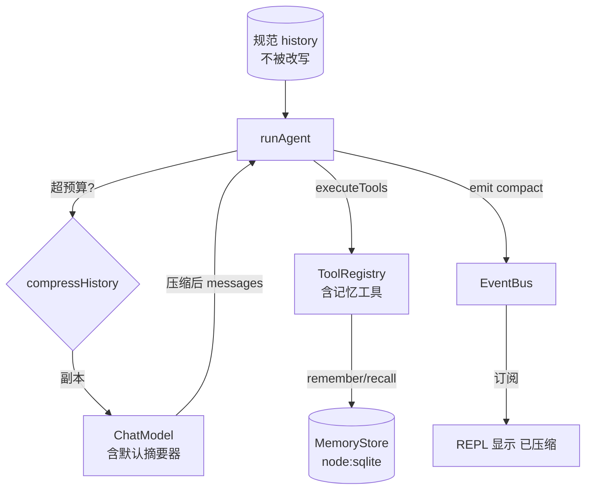
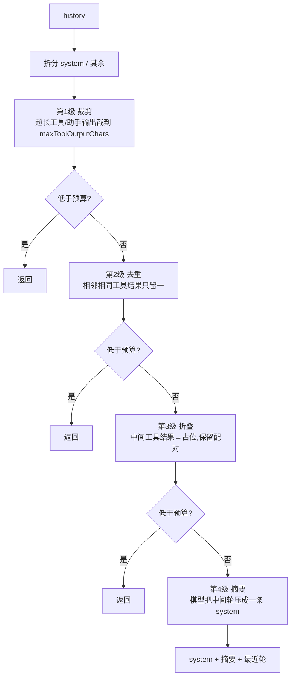
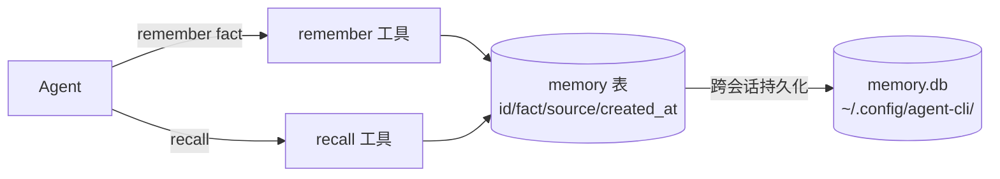
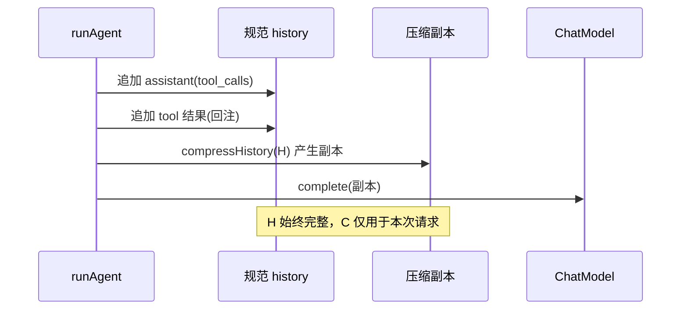

# 第 4 期学习文档：上下文压缩 + 长期记忆（SQLite）

> 目标读者：想搞懂「长会话怎么不爆 token、跨会话怎么记住用户」、并能在面试里讲清压缩策略与记忆设计的同学。
> 阅读建议：先读 §2 概念速览，再看 §3 设计原理（含 4 张图），最后用 §10 自测题、§7 面试题检验。

---

## 0. 本期在全局路线图中的位置

| 期 | 模块 | 状态 |
|---|---|---|
| 1 | 脚手架 + REPL + 流式对话 + ChatModel/OpenAI 适配器 | ✅ 已完成 |
| 2 | ReAct 循环 + Tool Calling + 最小内置工具 | ✅ 已完成 |
| 3 | 内置工具扩展 + 安全围栏 | ✅ 已完成 |
| **4** | **上下文压缩（裁剪/去重/折叠/摘要）+ 长期记忆（SQLite）** | ✅ 已完成 |
| 5 | MCP 客户端（stdio，JSON-RPC 连接状态机） | 待做 |
| 6 | RAG | 待做 |
| 7 | Skill 系统 | 待做 |
| 8 | Multi-Agent | 待做 |
| 9 | MCP Server + 多模型补全 | 待做 |
| 10 | Plan 模式 + 异步并行 | 待做 |
| 11 | Browser（CDP） | 待做 |

**第 4 期是 Agent 的「记忆与节制期」**：前 3 期 Agent 能跑工具、有安全围栏，但历史会无限增长——跑几十轮后 token 爆表、成本飙升、模型被无关早轮噪声干扰。本期给两条独立的能力线：**上下文压缩**（每次发给模型的视图做减法，决策 7 + §8.1 的 4 级渐进压缩）与**长期记忆**（SQLite 持久化「跨会话事实」，决策 7 明确它与压缩彼此独立）。

---

## 1. 本节完成了什么（交付物）

| 模块 | 文件 | 说明 |
|---|---|---|
| 4 级压缩器 | `src/core/memory/compressor.ts` | `compressHistory`：裁剪→去重→折叠→摘要，逐级提前返回；`estimateTokens`/`messageText` |
| 长期记忆仓库 | `src/core/memory/store.ts` | `MemoryStore`：Node 22 内置 `node:sqlite`（零依赖），`remember/recall/search/clear` |
| 记忆工具 | `src/core/memory/tools.ts` | `remember`/`recall` 两个 `ToolDef`，注册进统一 `ToolRegistry` |
| 压缩接入循环 | `src/core/agent/loop.ts` | `runAgent` 超预算时压缩「发给模型的副本」，内置默认摘要器（用当前模型总结） |
| 事件总线扩展 | `src/core/events/bus.ts` | 新增 `compact` 事件类型（决策 9 的 `onCompact` 挂载点） |
| REPL/组合根接线 | `src/cli/repl.ts`、`src/cli/main.ts` | 注入 `compress` 配置、记忆仓库与记忆工具，REPL 显示「上下文已压缩」 |
| 测试 | `tests/unit/compressor.test.ts`、`tests/unit/memory.test.ts`、`tests/unit/integration.test.ts` | 共 13 个新增用例（4 级压缩/配对不变量/SQLite/循环触发），全绿 |

**用法**：
```bash
export AGENTCLI_API_KEY=你的Key
pnpm dev                      # 长会话自动压缩；可用 remember/recall 工具
pnpm dev -p "记住：用户偏好中文；然后回忆你记住的事实"   # 单次模式验证记忆
```
默认压缩配置：`budgetTokens: 8000`、`keepRecentTurns: 4`、`maxToolOutputChars: 1500`。

---

## 2. 核心概念速览（先看这个）

- **上下文压缩（Context Compression）**：Agent 每轮要把整段历史发给模型，历史越长 token 越贵、噪声越多。压缩=在「发给模型的副本」上做减法，但不改规范 `history`（工具结果回注的正确性依赖规范历史完整）。
- **4 级渐进压缩**（Claude Code 同款思路，§8.1）：① 裁剪（截掉超长工具/助手输出）→ ② 去重（相邻相同工具结果）→ ③ 折叠（旧工具结果替换为占位，保留 `tool_call` 配对）→ ④ 摘要（用模型把中间轮压成一条）。**每级都可能释放足够空间，不必走到最后一级**——这是「渐进」的关键。
- **`tool_call ↔ tool_result` 配对不变量**：OpenAI 要求 `assistant(tool_calls)` 后必须有对应 `role:'tool'`。压缩必须以「整轮」为原子单位操作，绝不能把配对拆散，否则 API 报错。
- **长期记忆（Long-term Memory）**：压缩管「本次会话发给模型的视图」，记忆管「跨会话该记住的事实」（用户偏好、项目约定）。两者正交（决策 7）。记忆用 SQLite 持久化，Agent 可随时 `recall` 取回、`remember` 写入。
- **压缩副本 vs 规范历史**：循环压缩的是「发给模型的副本」，规范 `history` 不被动——避免重复摘要、保证工具结果回注正确（详见 §3.4）。
- **`node:sqlite`**：Node 22 内置的零依赖 SQLite（同步 API `DatabaseSync`），比引第三方 `better-sqlite3` 更轻、无需 native 编译。

---

## 3. 设计方案与原理

### 3.1 整体架构（压缩 + 记忆如何挂进 ReAct）



关键点：**压缩只产生「发给模型的副本」**，规范 `history` 始终完整；记忆走独立 SQLite，与压缩互不可见。

### 3.2 4 级渐进压缩流水线



每级之后即检查预算，**任一级达标就提前返回**，不浪费模型调用（第 4 级才需要一次额外 `complete`）。

### 3.3 长期记忆（SQLite）结构



`ToolDef` 统一进 `ToolRegistry`：`remember` 标 `isReadOnly:false`（写库，默认 `ask`），`recall` 标 `isReadOnly:true`（默认放行）。仓库层用 `node:sqlite` 的 `DatabaseSync`，`:memory:` 用于测试。

### 3.4 为什么压缩「副本」而非改写规范历史



若直接改写 `H`，下轮压缩会**重复摘要**已摘要过的内容，且工具结果回注依赖 `H` 的配对完整性——副本方案规避了这两个坑。代价是超长会话规范 `H` 仍增长（内存），属可接受的权衡（见 §4、§11）。

---

## 4. 为什么这样设计（设计权衡）

| 设计决策 | 为什么 | 不这样做会怎样 |
|---|---|---|
| **压缩改「副本」不改规范 history** | 避免重复摘要、保证工具结果回注配对正确 | 改写规范历史 → 下轮再摘要已摘要内容、配对错乱 |
| **4 级渐进、逐级提前返回** | 多数场景第 1–2 级就够了，不必每次都调模型摘要（省钱省延迟） | 一上来就摘要 → 每个超预算回合都多花一次模型调用 |
| **以「整轮」为原子单位压缩** | 保证 `tool_call↔tool_result` 配对不被拆散，符合 OpenAI 协议 | 单消息粒度裁剪 → 留下无对应结果的 `tool_call` → API 报错 |
| **system 消息永远原样保留** | system 通常是角色/规则，最短且最关键，不应被裁 | 误裁 system → 模型丢失行为约束 |
| **记忆与压缩相互独立（决策 7）** | 压缩是「视图优化」，记忆是「事实持久化」，目标不同、生命周期不同 | 混为一谈 → 压缩把该长期记住的事实也清掉 |
| **`node:sqlite` 而非第三方库** | Node 22 内置、零依赖、无 native 编译，学习项目够用 | 引 `better-sqlite3` → 需编译、加依赖、增加出错面 |
| **`createRequire` 运行时加载 `node:sqlite`** | 避开打包器/测试运行器对 `node:` 前缀的静态误解析 | 静态 `import 'node:sqlite'` → vite 把 `node:` 当裸包 `sqlite` 找不到 |

---

## 5. 与其它方案对比（优势）

| 方案 | 压缩质量 | 依赖 | 说明 |
|---|---|---|---|
| **A. 本项目：4 级渐进 + 副本 + SQLite 记忆（本期）** | 高，渐进且保配对 | 零（Node 内置） | 能讲清每级触发条件、配对不变量、记忆正交性 |
| B. 只截断旧消息（简单滑动窗口） | 低，易丢关键信息、可能拆散配对 | 零 | 实现快但长会话丢上下文、可能破坏 tool 配对 |
| C. 每次都全文摘要（无分级） | 中，但每次多一次模型调用 | 零 | 贵；且摘要本身累积成新噪声 |
| D. 向量库做长期记忆（RAG 化） | 语义检索强 | 需向量库/embedding | 第 6 期方向；本期用 LIKE 模糊检索足够 |

**结论**：学习项目用 A——把「渐进压缩」与「持久记忆」两条线都摸到，且零依赖；语义检索/向量库留作第 6 期升级。

---

## 6. 面试话术（30 秒版 + 详版）

**30 秒版**：
> 第 4 期我给 Agent 加了「记忆与节制」。两条独立能力线：一是上下文压缩，用 4 级渐进策略（裁剪超长输出→去重→折叠旧工具结果→模型摘要中间轮），每级达标就提前返回，避免每轮都调模型；压缩只产生「发给模型的副本」，规范历史不动，保证工具结果回注的 `tool_call↔tool_result` 配对不被拆散。二是长期记忆，用 Node 22 内置的 `node:sqlite` 持久化跨会话事实，Agent 通过 `remember`/`recall` 工具读写。两者正交——压缩管视图、记忆管事实。

**详版（被追问时）**：
> - 为什么压缩副本而不改规范历史？因为工具结果要按配对回注给模型，规范历史必须完整；且副本方案避免下轮对「已摘要内容」重复摘要。
> - 4 级为什么「渐进」？绝大多数长会话第 1–2 级（裁剪/去重）就够，只有真正超预算才走到模型摘要（最贵的一级）。逐级提前返回省钱省延迟。
> - 怎么保证不破坏 `tool_call↔tool_result` 配对？压缩/折叠都以「整轮（user+assistant+tool 结果）」为原子单位；system 永远保留；摘要时把整段中间轮替换为一条，不会留下悬空 `tool_call`。
> - 记忆为什么不用向量库？学习项目用 SQLite + LIKE 模糊检索足够；语义检索（embedding/RAG）是更重的升级，放到第 6 期。
> - `node:sqlite` 怎么加载？用 `createRequire` 在运行时加载，避开打包器把 `node:` 前缀误当裸包解析。

---

## 7. 常见面试题（附答题要点）

**Q1：长会话怎么防止 token 爆表？有哪几种压缩策略？**
- 答：4 级渐进——裁剪（截超长工具/助手输出）、去重（相邻相同工具结果）、折叠（旧工具结果变占位，保留配对）、摘要（模型把中间轮压成一条）。逐级提前返回，省模型调用。

**Q2：压缩时怎么保证 OpenAI 的 `tool_call↔tool_result` 配对不失效？**
- 答：以「整轮」为原子单位操作；折叠只替换工具结果内容、保留 `tool_call_id`；摘要把整段中间轮（含其 assistant(tool_calls) 与 tool 结果）一起替换，不会留下悬空 `tool_call` 或悬空 `tool` 结果。

**Q3：为什么压缩「发给模型的副本」而不是改规范历史？**
- 答：规范历史用于工具结果回注，必须完整且配对正确；副本方案避免重复摘要、避免破坏回注。代价是超长会话规范历史仍增长（内存），可接受。

**Q4：上下文压缩和长期记忆有什么区别？能合并吗？**
- 答：压缩是「本次会话发给模型的视图优化」，随回合变化；记忆是「跨会话持久化的事实」。目标与生命周期不同，应独立（决策 7）——把记忆当压缩的一部分会误删该长期保留的事实。

**Q5：为什么用 `node:sqlite` 而不是 `better-sqlite3` 或 JSON 文件？**
- 答：`node:sqlite` 是 Node 22 内置、零依赖、无需 native 编译，最轻；JSON 文件在并发/查询上弱，第三方库增加依赖与编译面。学习项目选内置最省心。

**Q6：压缩触发后，最新的对话还会被压掉吗？**
- 答：不会。配置 `keepRecentTurns` 保护最近 N 轮原样保留，只有「中间」部分被折叠/摘要；system 也永远保留。

**Q7：摘要器失败了（模型调用报错）怎么办？**
- 答：压缩器对摘要调用 `try/catch`，失败时回退到「折叠」策略（不依赖模型），保证主流程不中断——这是决策 10「错误恢复」的体现。

---

## 8. 关键代码索引

| 想看什么 | 去哪 |
|---|---|
| 4 级压缩流水线 | `src/core/memory/compressor.ts` → `compressHistory` |
| token 估算 / 消息转文本 | `src/core/memory/compressor.ts` → `estimateTokens` / `messageText` |
| 压缩接入 ReAct 循环 | `src/core/agent/loop.ts` → `runAgent`（超预算分支 + `defaultSummarizer`） |
| 长期记忆仓库 | `src/core/memory/store.ts` → `MemoryStore` |
| 记忆工具 | `src/core/memory/tools.ts` → `getMemoryTools`（`remember`/`recall`） |
| 压缩事件 | `src/core/events/bus.ts` → `AgentEventType` 含 `'compact'`；`src/cli/repl.ts` → `onCompact` |
| 组合根接线 | `src/cli/main.ts` → 建 `MemoryStore` + 注册记忆工具 + `compress` 配置 |

---

## 9. 踩坑与细节（来自真实实现）

1. **vite 把 `node:sqlite` 误解析为裸包 `sqlite`**：vite 的静态分析会剥掉 `node:` 前缀再去找 `sqlite` 包，导致测试报 `Failed to load url sqlite`。修法：在 `store.ts` 用 `createRequire(import.meta.url)` 在**运行时**加载 `node:sqlite`，vite 不再静态处理该模块（vitest 再配 `deps.external`/`ssr.external` 双保险）。
2. **`resolve.external` 在 vite 类型里不存在**：最初在 `vitest.config.ts` 顶层写 `resolve: { external: [...] }` 触发 tsc 报错（该字段不在 `ResolveOptions`）。最终只在 `ssr.external` + `test.deps.external` 配置即可。
3. **`noUncheckedIndexedAccess` 下数组解构可能为 undefined**：`getMemoryTools(s)` 返回 `ToolDef[]`，解构出的工具在严格模式下是 `ToolDef | undefined`，测试里需用 `mt[0]!` 断言。
4. **压缩预算不能小于「受保护最近轮」的体积**：若 `budgetTokens` 小于最近 `keepRecentTurns` 轮的总 token，压缩后必超预算——这是设计使然（最近轮不可压），测试断言预算时需取 ≥ 最近轮体积的值。
5. **`node:sqlite` 的 `lastInsertRowid` 是 `number | bigint`**：用 `Number(...)` 归一化，避免类型与 BigInt 混用。
6. **摘要器失败回退折叠**：`compressHistory` 对 `await opts.summarizer(...)` 包 `try/catch`，失败则 `summary=''` 走折叠分支，主流程不中断（决策 10 的错误恢复雏形）。

---

## 10. 自测题（检验是否真懂）

1. 4 级压缩里，哪一级「必然」需要再调一次模型？前三级为什么尽量别走到它？
2. 为什么说「以整轮为原子单位压缩」才能保住 `tool_call↔tool_result` 配对？画一个会被拆散的反例。
3. 压缩「副本」而不是规范 `history`——如果改成直接改写 `history`，下轮循环会发生什么具体问题？
4. `keepRecentTurns: 4` 但 `budgetTokens` 设得比最近 4 轮还小，压缩结果能低于预算吗？为什么？
5. 长期记忆和上下文压缩的目标差异是什么？如果把 `remember` 写的事实也当成「可压缩内容」处理，会有什么后果？
6. 为什么 `node:sqlite` 要用 `createRequire` 运行时加载，而不是顶层 `import`？（提示：打包器/测试运行器对 `node:` 前缀的处理）
7. 摘要器调用模型时如果 404/超时，本期靠什么机制保证主流程不崩？

---

## 11. 延伸与下一步

- **延伸阅读**：Claude Code 真实架构中「4 级渐进压缩 / 上下文窗口管理」一节（how-claude-code-works，§8.1）；OpenAI 关于 `tool_calls` 与消息序列合法性的文档；Node 22 `node:sqlite` 文档。
- **第 5 期预告 —— MCP 客户端**：用 `child_process.spawn` + JSON-RPC 2.0 连 MCP Server（`initialize`→`tools/list`→`tools/call`），stdio 优先；工具将动态并入 `ToolRegistry`，与内置工具同一套执行/安全检查。
- **本期可后续增强（非必须）**：① 规范 `history` 也做「惰性归档」（超长会话把最旧轮落盘，进一步省内存）；② 记忆升级为向量检索（第 6 期 RAG 复用）；③ 压缩摘要缓存以省重复摘要开销（呼应决策 12 的 prompt cache）。

> 文档模板约定（后续各期沿用）：定位 → 交付物 → 概念 → 设计原理(图) → 设计权衡 → 方案对比 → 面试话术 → **常见面试题** → 代码索引 → 踩坑 → 自测题 → 延伸。
