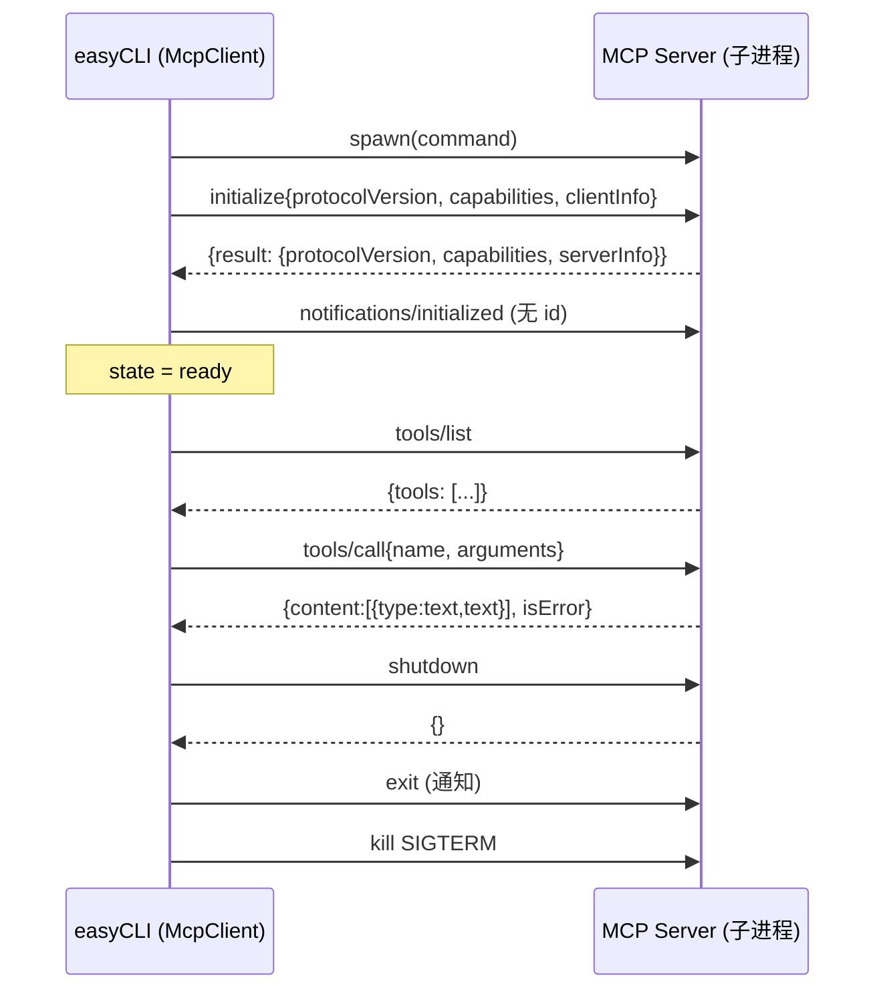
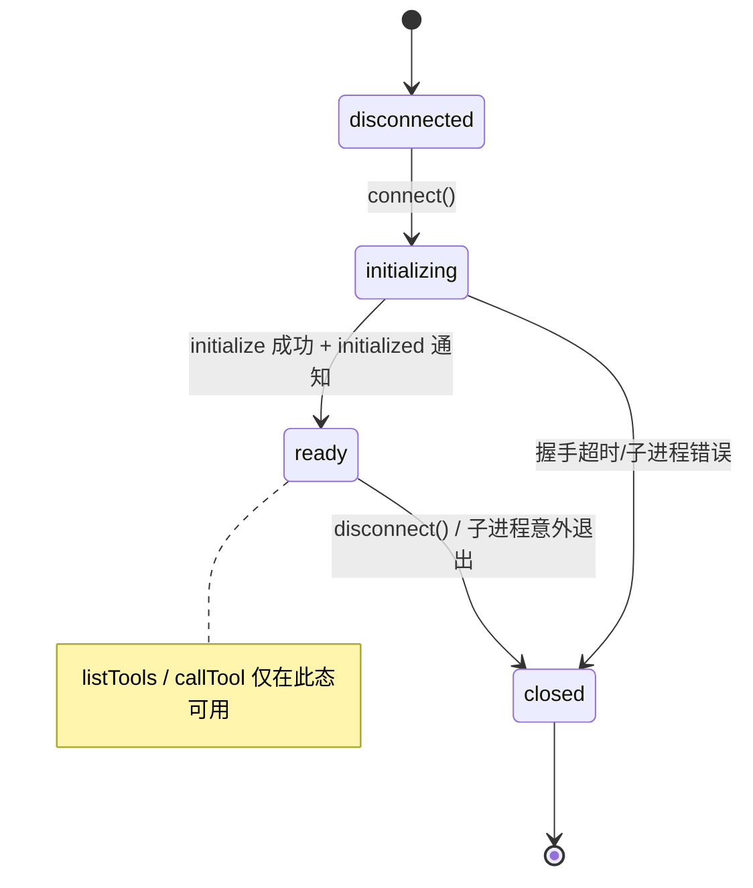
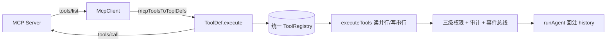

# 第 5 期学习文档：MCP 客户端（stdio + JSON-RPC 2.0，纯手写）

## 0. 本期在全局路线图中的位置

| 期 | 模块 | 状态 |
|---|---|---|
| 1 | 脚手架 + REPL + 流式对话 + ChatModel/OpenAI 适配器 | ✅ |
| 2 | ReAct 循环 + Tool Calling + 最小内置工具 | ✅ |
| 3 | 内置工具扩展 + 安全围栏 | ✅ |
| 4 | 上下文压缩 + 长期记忆（SQLite） | ✅ |
| **5** | **MCP 客户端（stdio，JSON-RPC 连接状态机）** | **✅ 本期** |
| 6 | RAG | 待做 |
| 7 | Skill 系统 | 待做 |
| 8 | Multi-Agent | 待做 |
| 9 | MCP Server + 多模型补全 | 待做 |
| 10 | Plan 模式 + 异步并行 | 待做 |
| 11 | Browser（CDP） | 待做 |

本期把「工具」的边界从进程内扩展到**另一个进程（MCP Server）**：Agent 的模型侧完全无感——MCP 工具被归一化成与普通内置工具完全相同的 `ToolDef`，复用同一套执行器、三级权限、审计与事件总线。**这也是为第 12 期写 MCP Server 打基础**：先把协议客户端吃透，再反过来理解 Server 该回什么。

---

## 1. 本节完成了什么（交付物）

| 文件 | 角色 | 关键内容 |
|---|---|---|
| `src/core/mcp/client.ts` | **核心新增** | 手写 `McpClient`：stdio 拉起子进程 + JSON-RPC 2.0 传输 + 连接状态机 + `connect/listTools/callTool/disconnect`；`mcpToolsToToolDefs` 适配器；`connectMcpServers` 批量编排 |
| `src/config/index.ts` | 改造 | 新增 `mcpServers` 配置（优先级：CLI `--mcp` > 环境变量 `AGENTCLI_MCP_SERVERS` > 空），`parseMcpServers` 容错解析 |
| `src/cli/main.ts` | 改造 | 合成根里 `connectMcpServers` 连接并注册工具；退出时（`runOnce`/REPL/SIGINT）回收 MCP 子进程 |
| `tests/fixtures/fake-mcp-server.mjs` | 测试桩 | 真实可用的 stdio MCP Server（initialize/tools/list/tools/call/shutdown/exit） |
| `tests/fixtures/silent-mcp-server.mjs` | 测试桩 | 永不应答，验证 `connect` 超时 |
| `tests/fixtures/lazy-mcp-server.mjs` | 测试桩 | 完成握手但吞掉 `tools/call`，验证断开时在途请求立即失败 |
| `tests/unit/mcp.test.ts` | 测试 | 13 个用例：握手/状态机/列表/调用/超时/归一化/垂直集成 |

**交付验证**：`pnpm typecheck` 通过；`pnpm test` 共 **72 个用例全绿**（含新增 13 个 MCP 用例）；**真机验证**用真实 API（`agnes-2.0-flash`）+ 真实拉起的 fake server，模型成功调用 `mcp_echo`，结果 `echo: 你好，MCP 世界` 经执行器→总线→回注全链路正确。

---

## 2. 核心概念速览（先看这个）

- **MCP（Model Context Protocol）**：Anthropic 提出的「模型与外部工具/数据源」开放协议，本质是**把 Tool Calling 的「声明 + 调用」标准化为 JSON-RPC 2.0**。Server 暴露 `tools/list`（能力声明）与 `tools/call`（执行）。
- **JSON-RPC 2.0**：一种无状态的远程调用协议。每个请求 `{jsonrpc,id,method,params}`，响应 `{jsonrpc,id,result|error}`，**用 `id` 配对**；通知（notification）无 `id`，不期待响应。
- **stdio 传输**：MCP 的事实标准传输——父进程 `spawn` 子进程，父写子 stdin、读子 stdout，**每条消息一行 JSON**（换行分隔）。比 HTTP 的 `Content-Length` 头更轻，且天然隔离进程。
- **protocolVersion 协商**：客户端在 `initialize` 里声明自己支持的版本（我们固定 `2024-11-05`），服务端回显其采用的版本；客户端以服务端回的值为准。
- **连接状态机**：`disconnected → initializing → ready → closed`。未 `ready` 前禁止 `listTools/callTool`，避免协议层级错乱。
- **工具归一化（Tool Unification）**：MCP 工具的 schema 转换成与内置工具一致的 `ToolDef`，使「本地函数」与「远端进程函数」在 Agent 眼里毫无区别。

---

## 3. 设计方案与原理

### 3.1 生命周期（握手顺序）

### 3.2 连接状态机

### 3.3 工具归一化（关键设计）

> MCP 工具的执行体 `execute` 只是薄封装：`(args) => client.callTool(name, args)`。它**复用**内置工具的全部下游（执行器并发模型、权限 `ask` 默认、审计事件），不另起一套路径——这是「统一契约」决策（CLAUDE.md §5）的直接收益。

---

## 4. 为什么这样设计（设计权衡）

| 决策点 | 选择 | 反方案 | 取舍理由 |
|---|---|---|---|
| 手写 vs 官方 SDK | **纯手写**（CLAUDE.md 硬约束） | `@modelcontextprotocol/sdk` | 项目目标是吃透协议原理，SDK 会把 JSON-RPC/状态机封装成黑盒；手写 250 行反而把「请求-响应配对、超时、状态机」讲透 |
| 传输方式 | **stdio** | HTTP/SSE | 第 12 期前只做客户端且 stdio 优先（决策 4）；stdio 进程隔离最好、零网络配置 |
| 消息分隔 | **换行分隔 JSON** | `Content-Length` 头 | stdio 场景下一行一条足够简单，且便于测试桩用 `console.log` 直接输出 |
| `isReadOnly` 缺省 | **false（保守）** | 默认 true | MCP Server 能力未知，按「写/危险」处理 → 默认走 `ask` 权限，安全优先；Server 用 `annotations.readOnlyHint` 声明只读可放开 |
| 单 Server 失败 | **容错跳过，不阻断主流程** | 任一失败即整体崩溃 | 多 Server 场景下一个挂了不应拖垮 CLI（`connectMcpServers` 逐个 try/catch） |
| 在途请求处理 | **断开时主动 failAll** | 等各自超时 | 避免子进程被杀后在途 `callTool` 悬空到 30s 超时 |

---

## 5. 与其它方案对比（优势）

| 维度 | 手写 McpClient（本期） | 官方 TypeScript SDK | 直接 child_process + 约定俗成 |
|---|---|---|---|
| 协议理解 | 深：自己实现握手/配对/状态机 | 浅：调用封装好的 `Client.connect()` | 无（易错、无状态机） |
| 依赖 | 0（仅 `node:child_process`） | 增加一个 npm 包 | 0 |
| 可控性 | 高：超时/重试/诊断可定制 | 中：受 SDK 设计约束 | 低 |
| 代码量 | ~250 行 | 0（但黑盒） | ~需自己堆但易漏边界 |
| 与本项目契合 | ✅ 符合「纯手写不引 SDK」硬约束 | ❌ 违反约束 | 部分 |

> 结论：对本「学习项目」而言，手写是**唯一符合题意**的解；对生产项目，官方 SDK 省心且更全（支持 Streamable HTTP、认证、进度通知等），但那是把原理「借出去」了。

---

## 6. 面试话术（30 秒版 + 详版）

**30 秒版**：
> 我在 easyCLI 里手写了一个 MCP 客户端，不依赖官方 SDK。核心是一个 JSON-RPC 2.0 的 stdio 传输层加一个连接状态机。客户端 `spawn` 子进程后先发 `initialize` 完成协议版本协商，再发 `notifications/initialized` 进入 ready；随后 `tools/list` 拉取远端工具、转成和本地工具一样的 `ToolDef`，于是 MCP 工具复用同一套执行器、权限和审计。我重点处理了三个边界：握手超时（静默服务端不能卡死主流程）、写 stdin 的 EPIPE、以及断开时在途请求要立即失败而非干等超时。

**详版**（追问时展开）：
> 为什么手写？因为项目约束是「纯手写吃透原理」。JSON-RPC 的关键是用自增 `id` 把响应配对到请求——我维护一个 `Map<id, {resolve,reject,timer}>`，每条 stdout 行解析后按 `id` 取 pending。状态机保证未 ready 前不能发业务请求。工具归一化是重点：**回归点不在协议，而在让远端工具伪装成本地工具**——`execute` 只是 `(args)=>client.callTool(name,args)` 的薄壳，从而继承并发模型（只读并行/写串行）和三级权限。安全上 MCP 工具默认按非只读处理、走 `ask` 权限，和内置写工具一致，不另开后门。

---

## 7. 常见面试题（附答题要点）

**Q1：MCP 和普通的「函数调用 / function calling」有什么区别？**
> 函数调用是模型厂商的私有格式（OpenAI/Anthropic 各自不同）；MCP 是把「工具声明 + 调用」抽象成**与模型无关的开放协议**，并且工具可以跑在**另一个进程甚至另一台机器**上。换句话说，MCP 把 Tool Calling 从「模型能力」升级成了「标准化 transport + 生命周期」。

**Q2：为什么 MCP 用 JSON-RPC 2.0 而不是 REST？**
> 因为 MCP 是**有状态的会话协议**（initialize 握手 + 能力协商 + 通知），不是无状态资源操作；JSON-RPC 的请求/响应/通知三元组天然贴合「调用一个方法并获得结果/错误」。再加上 stdio 传输，整体比 REST 的 URL 路由更轻、更适合进程间通信。

**Q3：`tools/call` 的 `isError` 和 JSON-RPC 的 `error` 有什么不同？**
> `isError:true` 是 **MCP 业务层**结果——工具成功运行了，但业务上报错（如「文件不存在」），仍走 `result` 通道；JSON-RPC `error` 是**协议层**失败（如方法不存在 `-32601`、参数非法 `-32602`）。我在客户端把前者映射成 `ToolResult{ok:false}`，把后者直接抛异常交给执行器兜底。

**Q4：如果 MCP Server 进程卡死不回响应，你的客户端会怎样？**
> 不会卡死主流程。每个请求都有 `setTimeout`：`initialize` 用 `connectTimeoutMs`（默认 15s），`tools/call` 用 `timeoutMs`（默认 30s）。超时即 reject 并清理 pending；`connect` 超时会杀掉子进程并把状态置 `closed`。

**Q5：你如何保证 MCP 工具不破坏已有的安全模型？**
> 归一化后，MCP 工具走的是**同一条** `executeTools` → 权限 `resolve` → 审计 `emit` 路径。路径围栏/命令黑名单对 MCP 工具不直接适用（它们在远端），但三级权限、HITL、事件总线一律生效；且 `isReadOnly` 缺省为 false，所以默认进入 `ask` 而非自动放行，避免「连上陌生 Server 就自动放权」。

---

## 8. 关键代码索引

| 能力 | 位置 |
|---|---|
| 状态机 + spawn + 握手 | `src/core/mcp/client.ts` → `McpClient.connect` |
| 请求-响应配对（id 匹配） | `src/core/mcp/client.ts` → `request` / `onStdout` |
| 超时与在途失败 | `src/core/mcp/client.ts` → `request`(timer) / `failAll` |
| 工具调用与结果归一 | `src/core/mcp/client.ts` → `callTool` |
| MCP→ToolDef 适配器 | `src/core/mcp/client.ts` → `mcpToolsToToolDefs` |
| 批量连接编排（容错） | `src/core/mcp/client.ts` → `connectMcpServers` |
| 配置加载 | `src/config/index.ts` → `parseMcpServers` / `loadConfig` |
| 合成根接入 | `src/cli/main.ts` → `action` 内 `connectMcpServers` + 退出回收 |
| 统一执行/权限/审计 | `src/core/tools/executor.ts`（MCP 工具复用，无改动） |

---

## 9. 踩坑与细节（来自真实实现）

1. **响应包了一层 `result`，取值要再解一层**（最关键的坑）
   最初 `request` 直接 `resolve(msg)`，调用方按 `init.protocolVersion` 取值得到 `undefined`——因为完整响应是 `{jsonrpc,id,result:{protocolVersion}}`。修正为 `resolve(msg.result)`，调用方拿到的是 `result` 本体。这同时解释了为什么 `listTools` 拿到的是 `resp.tools` 而非 `resp.result.tools`。

2. **静默服务端必须能超时失败**
   `connect()` 若只 `await request('initialize')` 而不设超时，遇到假死 Server 会永远 hang。用 `connectTimeoutMs` 的 `setTimeout` 在 pending 上 `reject` 并 `killChild`，测试中 400ms 超时验证 elapsed < 3s。

3. **EPIPE：进程已退出时写 stdin 会抛错**
   在 `killChild`/断开后若仍尝试 `notify('exit')`，目标进程可能已死，`stdin.write` 抛 `EPIPE`。把 `write` 包进 `try/catch` 忽略即可。

4. **断开时在途请求要 failAll**
   一开始 `disconnect` 只杀进程，在途 `callTool` 会悬空到各自 30s 超时。补上 `failAll(new Error('MCP 连接已关闭'))`，让在途请求立即失败（测试用 `lazy-mcp-server` 覆盖）。

5. **先挂 stdout 解析再发首包**
   `connect` 里若先 `request` 后 `on('data')`，首条 `initialize` 的响应可能在监听器挂上前到达而丢失。顺序改为：先 `stdout.on('data', ...)`，再发请求。

6. **`isReadOnly` 缺省 false 的双刃剑**
   好处是安全默认（默认 `ask`）；代价是 `runOnce` 无 HITL resolver 时 MCP 工具会被拒。真机验证时我用了 `defaultForAsk:'allow'` 的权限管理器来模拟「用户已预批准」——这也提示第 12 期做 MCP Server 时，对可信 Server 可以考虑更宽松的默认策略。

7. **ESLint 缺配置文件**（项目既有问题，非本期引入）：仓库没有 `eslint.config.js`，`pnpm lint` 直接报错。本期未新增 lint 配置（保持改动聚焦），但 `tsc --noEmit` 严格模式已覆盖类型正确性。

---

## 10. 自测题（检验是否真懂）

1. 如果 `initialize` 返回的 `protocolVersion` 是服务端自定义版本（非你声明的那个），客户端应以谁的为准？为什么？
2. 为什么 `notifications/initialized` 用「通知」(无 id) 而不是「请求」？如果误发成请求会怎样？
3. 画出 `Map<id, Pending>` 在一个 `tools/call` 从发起到收到响应期间的生命周期（含 timer）。
4. 假设同时连 3 个 MCP Server，第 2 个 `connect` 失败，`connectMcpServers` 会怎样？已连上的第 1 个和第 3 个呢？
5. 如何在不改 `executeTools` 的前提下，让 MCP 工具的只读工具也享受「并行执行」优化？（提示：看 `annotations.readOnlyHint`）

参考答案

1. 以**服务端回显的版本**为准（MCP 规范：服务端决定实际使用的协议版本）。客户端应验证它在自己支持的集合内，否则应拒绝握手。
2. 因为 `initialized` 是客户端对服务端的「握手完成」告知，不需要对方回执；若误发成请求，服务端可能回一个 `result`，客户端会创建一个永远等不到配对的 pending（除非也处理它），浪费一个 id 且语义错误。
3. 发请求：`nextId++` 得 id=3，`pending.set(3,{resolve,reject,timer})`，写 stdin；收到响应行：`pending.get(3)`，清除 `timer`，`pending.delete(3)`，`resolve(msg.result)`。
4. 第 2 个失败被 `try/catch` 吞掉并 `onWarn` 告警 + `disconnect` 清理；第 1 个、第 3 个照常连上并注册工具；最终返回 `[client1, client3]`。主流程不受影响。
5. 让 MCP Server 在 `tools/list` 的 `annotations.readOnlyHint:true` 声明只读；`mcpToolsToToolDefs` 会据此设 `isReadOnly:true`，执行器便把该工具归入「只读并行」分支。

---

## 11. 延伸与下一步

- **第 12 期 MCP Server**：本期是客户端，Server 端要回 `initialize`/`tools/list`/`tools/call`——正好把本期发的请求当成「Server 该回什么」的测试基准（我们的 `fake-mcp-server.mjs` 其实就是最小 Server 雏形）。
- **更多传输**：本期只做 stdio；HTTP+SSE（Streamable HTTP）是第 12 期的扩展方向，传输层可抽象成接口，stdio/HTTP 可插拔。
- **进度通知 / 取消**：真实 MCP 支持 `notifications/progress` 与 `cancelled` 通知；本期只消费请求-响应，服务端通知被忽略——可作为健壮性增强。
- **MCP 资源与 Prompt**：本期只接 `tools` 能力；MCP 还有 `resources`/`prompts` 能力，对应 RAG（第 6 期）与 Skill（第 7 期）的天然接入点。
- **安全增强**：对不可信 Server 可加「MCP 工具白名单」与 `annotations` 审计，进一步收紧默认 `ask` 策略。
