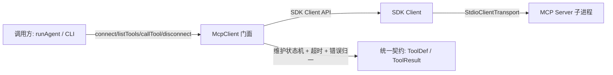
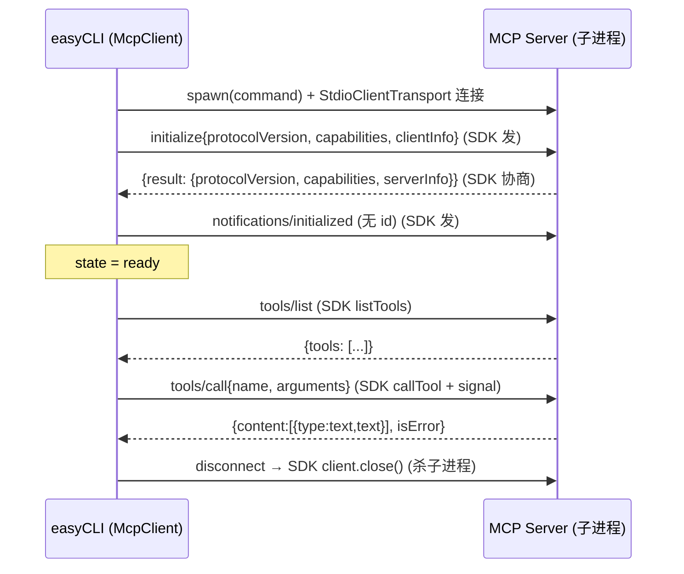
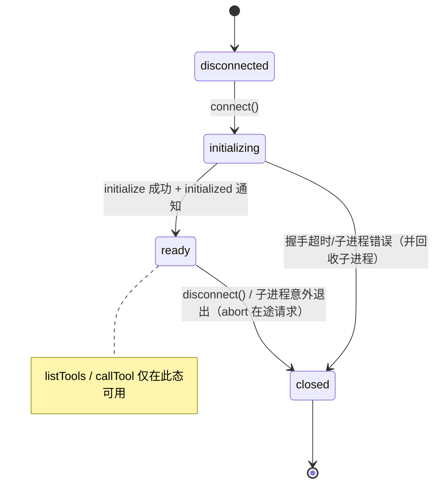

# 第 5 期学习文档：MCP 客户端（基于官方 `@modelcontextprotocol/sdk` 的 Client）

> 演进说明：本期最初是「纯手写 JSON-RPC 客户端」实现（见 git 历史与 `docs/mcp-sdk-migration-plan.md`）。
> 后续为获得生产级的协议健壮性（多版本协商、流式、错误模型）并消除自维护的协议层风险，
> 已将客户端**迁移到官方 SDK**：`McpClient` 改为 SDK `Client` 之上的**薄门面（facade）**，
> 对外契约（`connect/listTools/callTool/disconnect`、状态机、`ToolDef` 归一化、CLI/配置）**完全不变**。
> 本文档描述的是**当前 SDK 版**实现。

## 0. 本期在全局路线图中的位置

| 期 | 模块 | 状态 |
|---|---|---|
| 1 | 脚手架 + REPL + 流式对话 + ChatModel/OpenAI 适配器 | ✅ |
| 2 | ReAct 循环 + Tool Calling + 最小内置工具 | ✅ |
| 3 | 内置工具扩展 + 安全围栏 | ✅ |
| 4 | 上下文压缩 + 长期记忆（SQLite） | ✅ |
| **5** | **MCP 客户端（官方 SDK Client + stdio 传输门面）** | **✅ 本期** |
| 6 | RAG | 待做 |
| 7 | Skill 系统 | 待做 |
| 8 | Multi-Agent | 待做 |
| 9 | MCP Server + 多模型补全 | ✅（SDK 版） |
| 10 | Plan 模式 + 异步并行 | 待做 |
| 11 | Browser（CDP） | 待做 |

本期把「工具」的边界从进程内扩展到**另一个进程（MCP Server）**：Agent 的模型侧完全无感——MCP 工具被归一化成与普通内置工具完全相同的 `ToolDef`，复用同一套执行器、三级权限、审计与事件总线。**这也是为第 12 期写 MCP Server 打基础**：客户端先吃透「标准 MCP 客户端应该怎么连」，再理解 Server 该回什么。

---

## 1. 本节完成了什么（交付物）

| 文件 | 角色 | 关键内容 |
|---|---|---|
| `src/core/mcp/client.ts` | **核心（SDK 门面）** | `McpClient` 薄门面：内持 SDK `Client` + `StdioClientTransport`，暴露 `connect/listTools/callTool/disconnect` 与状态机 `disconnected→initializing→ready→closed`；`mcpToolsToToolDefs` 适配器；`connectMcpServers` 批量编排 |
| `src/config/index.ts` | 改造 | `mcpServers` 配置（`CLI --mcp` > 环境变量 `AGENTCLI_MCP_SERVERS` > 空），`parseMcpServers` 容错解析 |
| `src/cli/main.ts` | 改造 | 合成根里 `connectMcpServers` 连接并注册工具；退出时（`SIGINT`/`SIGTERM`）`disconnect` 回收 MCP 子进程 |
| `tests/fixtures/fake-mcp-server.mjs` | 测试桩 | **裸协议**（非 SDK）stdio MCP Server，作「迁移后 SDK 客户端仍能连任意标准服务器」的互操作证据 |
| `tests/fixtures/silent-mcp-server.mjs` | 测试桩 | 永不应答，验证 `connect` 超时 |
| `tests/fixtures/lazy-mcp-server.mjs` | 测试桩 | 完成握手但吞掉 `tools/call`，验证断开时在途请求立即失败 |
| `tests/unit/mcp.test.ts` | 测试 | 握手/状态机/列表/调用/超时/归一化/垂直集成 |

**交付验证**：`tsc --noEmit` 通过；`vitest` 全量绿（含 MCP 客户端用例）；**真机验证**用真实 API + 真实拉起的 fake server，模型成功调用 `mcp_echo`，结果 `echo: 你好，MCP 世界` 经执行器→总线→回注全链路正确。

---

## 2. 核心概念速览（先看这个）

- **MCP（Model Context Protocol）**：Anthropic 提出的「模型与外部工具/数据源」开放协议，本质是**把 Tool Calling 的「声明 + 调用」标准化为 JSON-RPC 2.0**。Server 暴露 `tools/list`（能力声明）与 `tools/call`（执行）。
- **官方 SDK 接管了协议细节**：JSON-RPC 配对（自增 `id` 关联请求/响应）、`initialize` 握手、协议版本协商、通知（notification）、错误码模型——全部由 `@modelcontextprotocol/sdk` 的 `Client` 负责。我们**不再手写**这些。
- **stdio 传输**：MCP 事实标准传输——父进程 `spawn` 子进程，父写子 stdin、读子 stdout，每条消息一行 JSON。SDK 的 `StdioClientTransport` 封装了这套字节收发。
- **protocolVersion 协商**：客户端在 `initialize` 声明自己支持的最高版本，服务端回其值，二者取 `min(client, server)` 作为实际版本——**由 SDK 自动完成**，替代写死的 `2024-11-05`，兼容性更好。
- **连接状态机**：`disconnected → initializing → ready → closed`。门面 `McpClient` 保留该状态机作为对外契约（未 `ready` 前禁止 `listTools/callTool`），并在 `connect` 失败时把状态置 `closed` 并回收子进程。
- **工具归一化（Tool Unification）**：SDK `ListToolsResult` 的 `tools` 转换成与内置工具一致的 `ToolDef`，使「本地函数」与「远端进程函数」在 Agent 眼里毫无区别。

---

## 3. 设计方案与原理

### 3.1 门面（facade）模式：为什么不在调用方直接用 SDK Client？

- **保留契约**：`runAgent`、CLI、测试都只认识 `McpClient` 的 `connect/listTools/callTool/disconnect` 与状态机。把它们换成「直接 new SDK Client」会改动每一处调用点。门面把这层变化隔离在 `client.ts` 内部。
- **补充 SDK 没有的语义**：SDK `Client` 本身**没有**显式状态机、没有「静默服务端超时」的兜底（连接挂起会一直等）、没有「把协议错误归一化成旧文案」的需求。门面补上这些，并复用既有测试。
- **最小化回归**：迁移后所有旧测试只需微调断言（错误文案从「JSON-RPC」变为「MCP 错误」），调用方零改动。

### 3.2 生命周期（握手顺序）

### 3.3 连接状态机

### 3.4 工具归一化（关键设计）

> MCP 工具的执行体 `execute` 只是薄封装：`(args) => client.callTool(name, args)`。它**复用**内置工具的全部下游（执行器并发模型、权限 `ask` 默认、审计事件），不另起一套路径——这是「统一契约」决策（CLAUDE.md §5）的直接收益。

---

## 4. 为什么这样设计（设计权衡）

| 决策点 | 选择 | 反方案 | 取舍理由 |
|---|---|---|---|
| 手写 vs 官方 SDK | **官方 SDK `Client`** | 继续维护手写 JSON-RPC 层 | SDK 自动处理多版本协商、错误码、`notifications/initialized` 等边界，生产更稳；手写层是「学习产物」，长期维护成本高且易错 |
| 直接暴露 SDK 还是包门面 | **薄门面 `McpClient`** | 调用方直接用 `new Client` | 保留状态机契约 + 超时兜底 + 错误归一，避免改动 `runAgent`/CLI/测试 |
| 传输方式 | **stdio**（`StdioClientTransport`） | HTTP/SSE | 第 12 期前只做客户端且 stdio 优先；进程隔离最好、零网络配置 |
| `isReadOnly` 缺省 | **false（保守）** | 默认 true | MCP Server 能力未知，按「写/危险」处理 → 默认走 `ask` 权限，安全优先；Server 用 `annotations.readOnlyHint` 声明只读可放开 |
| 单 Server 失败 | **容错跳过，不阻断主流程** | 任一失败即整体崩溃 | 多 Server 场景下一个挂了不应拖垮 CLI（`connectMcpServers` 逐个 try/catch） |
| 在途请求处理 | **断开时 `AbortController.abort()`** | 等各自超时 | 子进程被杀后在途 `callTool` 立即以 `AbortError` 失败，不悬空到 30s |

---

## 5. 为什么客户端基于官方 SDK（而非自维护协议层）

手写 JSON-RPC 客户端是「学习期」产物，能看清握手/配对/状态机；但把协议层长期交给社区维护更稳。本项目在 phase 5 完成客户端后，又做了 phase 12 的服务端（同样基于 SDK），并统一把两端迁到官方 SDK（见 `docs/mcp-sdk-migration-plan.md`）。保留的「业务价值」始终是：门面契约（`connect/listTools/callTool/disconnect` + 状态机）、超时兜底、错误归一化、工具归一化——协议配对/握手/错误码/版本协商全部由 SDK `Client` 内建处理。

---

## 6. 面试话术（30 秒版 + 详版）

**30 秒版**：
> 我在 easyCLI 里实现了一个 MCP 客户端，现在基于官方 `@modelcontextprotocol/sdk` 的 `Client`。我没有直接把 SDK Client 到处 new——而是包了一层 `McpClient` 门面，保留 `connect/listTools/callTool/disconnect` 和连接状态机，这样 Agent 和 CLI 调用方零改动。SDK 帮我搞定 JSON-RPC 配对、`initialize` 握手和协议版本协商；门面负责三件事：连接超时兜底（静默服务端不能卡死主流程）、`AbortController` 让断开时在途请求立即失败、`AbortError`/协议错误归一化成统一文案。MCP 工具经 `mcpToolsToToolDefs` 转成和本地一样的 `ToolDef`，复用同一套执行器、权限和审计。

**详版**（追问时展开）：
> 为什么包门面？因为 SDK Client 没有我们既有的「状态机契约」和「超时/错误归一」语义；如果让 `runAgent` 直接依赖 SDK Client，迁移会改动每一处调用点。门面把差异封在 `client.ts` 内，对外 API 不变，旧测试几乎不用动。
> 超时怎么做的？`connect` 用 `Promise.race([sdk.connect(transport), timeout])`，超时即 reject 并 `transport.close()` 回收子进程；`callTool` 用 `AbortController` 的 `signal` 透传给 SDK，再套一层 Promise 超时。
> 协议错误怎么归一的？SDK 抛的协议错误带数字 `code`（如 `-32601`），门面收口成旧文案 `MCP 错误 <code>: <msg>`；断开导致的 `AbortError` 收口成 `MCP 连接已关闭`——下游执行器/测试看到的是一致的错误形态。
> 工具归一化的回归点在哪？不在协议，而在让远端工具伪装成本地工具——`execute` 只是 `(args)=>client.callTool(name,args)` 的薄壳，继承并发模型与三级权限。

---

## 7. 常见面试题（附答题要点）

**Q1：MCP 和普通的「函数调用 / function calling」有什么区别？**
> 函数调用是模型厂商的私有格式（OpenAI/Anthropic 各自不同）；MCP 是把「工具声明 + 调用」抽象成**与模型无关的开放协议**，工具可以跑在**另一个进程甚至另一台机器**上。换句话说，MCP 把 Tool Calling 从「模型能力」升级成了「标准化 transport + 生命周期」。SDK 的 `Client`/`Server` 正是这套协议的官方实现。

**Q2：为什么 MCP 用 JSON-RPC 2.0 而不是 REST？**
> 因为 MCP 是**有状态的会话协议**（`initialize` 握手 + 能力协商 + 通知），不是无状态资源操作；JSON-RPC 的请求/响应/通知三元组天然贴合「调用一个方法并获得结果/错误」。这些配对与握手细节现在由 SDK 的 `Client` 内部处理，我们不再手动维护 `Map<id, pending>`。

**Q3：`tools/call` 的 `isError` 和 JSON-RPC 的 `error` 有什么不同？**
> `isError:true` 是 **MCP 业务层**结果——工具成功运行了，但业务上报错（如「文件不存在」），仍走 `result` 通道；JSON-RPC `error` 是**协议层**失败（如方法不存在 `-32601`、参数非法 `-32602`）。SDK 只在协议层失败时 reject `callTool`；业务失败通过 `result.isError` 返回。门面把后者映射成 `ToolResult{ok:false}`，把前者归一化为 `MCP 错误 <code>` 异常。

**Q4：如果 MCP Server 进程卡死不回响应，你的客户端会怎样？**
> 不会卡死主流程。`connect` 有 `connectTimeoutMs` 兜底（默认 15s，测试用 400ms 验证）；`callTool` 有 `timeoutMs`（默认 30s）+ `AbortController`。`disconnect` 会 `abort` 所有在途请求并 `client.close()` 回收子进程，在途调用立即以 `AbortError` 失败。

**Q5：你如何保证 MCP 工具不破坏已有的安全模型？**
> 归一化后，MCP 工具走的是**同一条** `executeTools` → 权限 `resolve` → 审计 `emit` 路径。三级权限、HITL、事件总线一律生效；且 `isReadOnly` 缺省为 false，所以默认进入 `ask` 而非自动放行，避免「连上陌生 Server 就自动放权」。

---

## 8. 关键代码索引

| 能力 | 位置 |
|---|---|
| 门面 + 状态机 + spawn 握手 | `src/core/mcp/client.ts` → `McpClient.connect` |
| SDK 传输装配 | `src/core/mcp/client.ts` → `new StdioClientTransport({command,args,env,cwd})` |
| 超时与在途失败 | `src/core/mcp/client.ts` → `withTimeout` / `connect` 的 `Promise.race` / `disconnect` 的 `abort` |
| 错误归一化 | `src/core/mcp/client.ts` → `normalizeError`（`code`→`MCP 错误 <code>`；断开/中断（-32001 或 AbortError）→`连接已关闭`，并剥掉 SDK 自带前缀避免重复） |
| 工具调用与结果归一 | `src/core/mcp/client.ts` → `callTool`（text 块拼 `output`、`isError`→`ok`） |
| MCP→ToolDef 适配器 | `src/core/mcp/client.ts` → `mcpToolsToToolDefs` |
| 批量连接编排（容错） | `src/core/mcp/client.ts` → `connectMcpServers` |
| 配置加载 | `src/config/index.ts` → `parseMcpServers` / `loadConfig` |
| 合成根接入 | `src/cli/main.ts` → `connectMcpServers` + 退出 `SIGINT`/`SIGTERM` 回收 |
| 统一执行/权限/审计 | `src/core/tools/executor.ts`（MCP 工具复用，无改动） |

---

## 9. 踩坑与细节（来自 SDK 迁移）

1. **协议版本不再是写死的 `2024-11-05`**
   手写版把 `protocolVersion` 写死；SDK 自动协商（`min(client, server)`）。`negotiatedProtocol` 由门面在 `connect` 前给 `transport` 动态挂一个 `setProtocolVersion` 拦截器捕获——因为 SDK 的 stdio/in-memory 传输把协商版本在 `initialize` 后即丢弃，无法从 `Client` 直接读到。测试断言其为一个协议版本字符串（fake 服务端回 `2024-11-05`，CLI 自带 SDK 服务端协商出 `LATEST_PROTOCOL_VERSION`），**不要硬编码**。

2. **静默服务端必须能超时失败**
   `connect()` 若只 `await sdk.connect(transport)` 而不设超时，遇到假死 Server 会永远 hang。用 `connectTimeoutMs` 的 `setTimeout` 在 `Promise.race` 里 `reject` 并 `transport.close()`（回收子进程），测试中 400ms 超时验证 elapsed < 3s。

3. **EPIPE 由 SDK 接管**
   手写版要自己 `try/catch` 忽略 `stdin.write` 的 EPIPE；SDK 的 `StdioClientTransport` 已处理传输关闭，门面只需在 `disconnect` 里 `client.close().catch(()=>undefined)` 容错。

4. **断开时在途请求要 `abort`**
   手写版用 `failAll(new Error('MCP 连接已关闭'))`；SDK 版改为：断开时遍历在途 `AbortController` 调 `abort()`，SDK 会让对应 `callTool` 以 `AbortError` 拒绝，门面归一化为 `MCP 连接已关闭`。测试用 `lazy-mcp-server` 覆盖。

5. **`isReadOnly` 缺省 false 的双刃剑**
   好处是安全默认（默认 `ask`）；代价是 `runOnce` 无 HITL resolver 时 MCP 工具会被拒。真机验证时用了 `defaultForAsk:'allow'` 的权限管理器模拟「用户已预批准」——这也提示第 12 期做 MCP Server 时，对可信 Server 可考虑更宽松的默认策略。

6. **npm arborist 崩溃（`Cannot read properties of null (reading 'matches')`）**
   在向一个已部分损坏的 `node_modules` 增量安装 SDK（其 `express` 依赖触发 dedupe 空指针）时，npm 10.9.7 会崩。可靠解法：**`rm -rf node_modules package-lock.json` 后全量重装**（从干净树构建，避免 partial-merge dedupe 的空 Link 节点）。见 `mcp-sdk-migration-plan.md` Step 0。

---

## 10. 自测题（检验是否真懂）

1. 为什么 `McpClient` 要做成「门面」而不是直接让 `runAgent` 用 SDK `Client`？门面补充了哪三件 SDK 没有的语义？
2. 如果服务端回的 `protocolVersion` 是客户端不认识的版本，SDK 会怎样？我们的 `negotiatedProtocol` 应读谁的值？
3. 画出 `connect` 的 `Promise.race` 结构：成功/超时两条路径各自做什么、状态机怎么变、子进程怎么回收？
4. 假设同时连 3 个 MCP Server，第 2 个 `connect` 失败，`connectMcpServers` 会怎样？已连上的第 1 个和第 3 个呢？
5. 如何在不改 `executeTools` 的前提下，让 MCP 工具的只读工具也享受「并行执行」优化？（提示：看 `annotations.readOnlyHint`）

参考答案

1. 门面隔离协议层变化，保持 `connect/listTools/callTool/disconnect` + 状态机契约不变，使 Agent/CLI/测试零改动。补充三件事：① 连接超时兜底（静默服务端不 hang）；② 在途请求 `AbortController.abort()`（断开即失败）；③ 协议/`AbortError` 归一化为统一错误文案。
2. SDK 会拒绝握手（协议版本不在其支持集合内）。`negotiatedProtocol` 由门面在 `connect` 时通过拦截 `transport.setProtocolVersion` 捕获协商值，不同服务端/SDK 版本可能不同，断言里不要写死具体版本。
3. 成功路径：`await sdk.connect()` 完成 → 读 `negotiatedProtocol` → `state='ready'`。超时路径：`setTimeout` 先 reject → `catch` 里 `state='closed'`、`transport.close()` 回收子进程、`connectPromise.catch()` 吞掉后续 reject → 把超时异常向上抛。
4. 第 2 个失败被 `try/catch` 吞掉并 `onWarn` 告警 + `disconnect` 清理；第 1 个、第 3 个照常连上并注册工具；最终返回 `[client1, client3]`。主流程不受影响。
5. 让 MCP Server 在 `tools/list` 的 `annotations.readOnlyHint:true` 声明只读；`mcpToolsToToolDefs` 据此设 `isReadOnly:true`，执行器便把该工具归入「只读并行」分支。

---

## 11. 延伸与下一步

- **第 12 期 MCP Server**：本期是客户端，Server 端要回 `initialize`/`tools/list`/`tools/call`——本期发的请求就是「Server 该回什么」的基准。服务端同样基于官方 SDK（低层 `Server` + `setRequestHandler`）。
- **更多传输**：客户端本期只做 stdio；HTTP（Streamable HTTP）由 SDK 的 `StreamableHTTPClientTransport` 支持，服务端侧已实现，需要时客户端可对称接入。
- **进度通知 / 取消**：真实 MCP 支持 `notifications/progress` 与 `cancelled`；可在门面层把 `onprogress` 透传给上层。
- **MCP 资源与 Prompt**：本期只接 `tools` 能力；MCP 还有 `resources`/`prompts` 能力，对应 RAG（第 6 期）与 Skill（第 7 期）的天然接入点。
- **安全增强**：对不可信 Server 可加「MCP 工具白名单」与 `annotations` 审计，进一步收紧默认 `ask` 策略。
