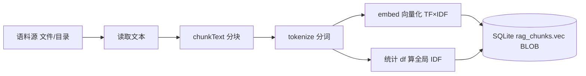
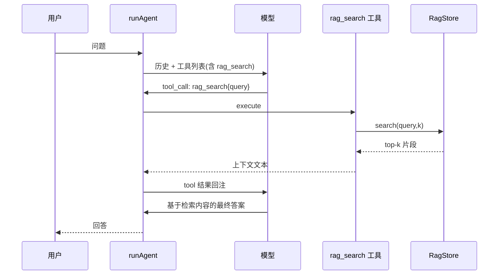

# 第 6 期学习文档：RAG（检索增强生成，纯手写）

## 0. 本期在全局路线图中的位置

| 期 | 模块 | 状态 |
|---|---|---|
| 1 | 脚手架 + REPL + 流式对话 + ChatModel/OpenAI 适配器 | ✅ |
| 2 | ReAct 循环 + Tool Calling + 最小内置工具 | ✅ |
| 3 | 内置工具扩展 + 安全围栏 | ✅ |
| 4 | 上下文压缩 + 长期记忆（SQLite） | ✅ |
| 5 | MCP 客户端（stdio + JSON-RPC） | ✅ |
| **6** | **RAG（检索增强生成）** | **✅ 本期** |
| 7 | Skill 系统 | 待做 |
| 8 | Multi-Agent | 待做 |
| 9 | MCP Server + 多模型补全 | 待做 |
| 10 | Plan 模式 + 异步并行 | 待做 |
| 11 | Browser（CDP） | 待做 |

本期把「**外部知识**」接入 Agent：模型本身不背知识，推理时按需从本地语料做语义检索并注入上下文。它和 Phase 4 的「长期记忆」是两种不同增强——记忆存「事实」、RAG 存「文档原文 + 向量」，检索方式从模糊匹配升级到**语义相似度**。

---

## 1. 本节完成了什么（交付物）

| 文件 | 角色 | 关键内容 |
|---|---|---|
| `src/core/rag/embed.ts` | **核心** | 纯手写分词（拉丁词 + 字符 unigram/bigram，兼顾中文）+ FNV-1a 哈希降维 + TF×IDF 加权 + L2 归一化 + 余弦相似度 |
| `src/core/rag/chunk.ts` | 核心 | 重叠分块，尽量在自然句边界切断 |
| `src/core/rag/store.ts` | 核心 | `RagStore`：复用 Phase 4 的 `node:sqlite`（向量存 BLOB），`reindex/search/status/addSource` |
| `src/core/rag/tools.ts` | 接入 | `getRagTools` 暴露 `rag_search` 工具（isReadOnly），接入统一 `ToolRegistry` |
| `src/config/index.ts` | 改造 | 新增 `ragPath`（CLI `--rag` / 环境变量 `AGENTCLI_RAG_PATH`，逗号分隔多源） |
| `src/cli/main.ts` | 改造 | 合成根：建 `RagStore`、建索引（空则 reindex）、注册 `rag_search` |
| `src/cli/repl.ts` | 改造 | `/rag` 子命令：`search` / `ingest` / `reindex` / `status`；系统提示引导模型使用检索 |
| `tests/unit/rag.test.ts` | 测试 | 12 个用例：分块/分词/嵌入确定性/相似度/RagStore 增查/rag_search 经执行器 |
| `docs/phase6.md` | 文档 | 本文件 |

**交付验证**：`pnpm typecheck` 通过；`pnpm test` 共 **82 个用例全绿**（新增 12 个 RAG 用例）；**真机验证**用真实 API（`agnes-2.0-flash`）+ 真实语料，模型成功调用 `rag_search` 并基于检索内容答出语料专有事实（项目代号「知识之桥」、维度 1024 等），证明增强生成闭环成立。

---

## 2. 核心概念速览（先看这个）

- **RAG（Retrieval-Augmented Generation）**：先**检索**相关外部知识，再把它**拼接进 prompt** 让模型**生成**答案。解决「模型知识截止 / 私域知识不可见」问题。
- **Chunking（分块）**：长文档切成片段，粒度越细检索越准；块间重叠避免语义被切坏。
- **Embedding（嵌入）**：把文本映射成稠密向量；语义相近的文本向量距离近。本期**手写**（不引模型/SDK）。
- **Hashing Trick（哈希技巧）**：把任意词项哈希到固定维度，词汇表无限大也不爆内存——Vowpal Wabbit 等生产系统的经典做法。
- **TF-IDF**：词频（TF）× 逆文档频率（IDF）。IDF 让「罕见但区分度高」的词权重更大。
- **Cosine Similarity（余弦相似度）**：衡量两向量方向一致性，归一化后等于点积，是检索排序的核心指标。
- **Vector Store / ANN**：存向量并高效检索。本期用 SQLite + 线性扫描（O(N·D)），生产用 HNSW/FAISS 等近似最近邻。
- **Augmented Generation 落地点**：以 `rag_search` 工具形式暴露给 Agent，模型「自己决定何时检索」。

---

## 3. 设计方案与原理

### 3.1 索引管线（离线，启动时一次）

### 3.2 检索（在线，每次 query）

### 3.3 rag_search 在 Agent 循环中的定位

---

## 4. 为什么这样设计（设计权衡）

| 决策点 | 选择 | 反方案 | 取舍理由 |
|---|---|---|---|
| 嵌入实现 | **手写 TF-IDF + 哈希** | 调 OpenAI `/embeddings` API | 项目硬约束「纯手写不引 SDK」；手写把分词/哈希/TF-IDF/余弦全讲透；零网络依赖、单测可确定性回归 |
| 中文处理 | **字符 unigram/bigram** | 仅按空格分词 | 中文无空格，必须字符级 n-gram 才能度量语义重叠 |
| 向量存储 | **SQLite BLOB**（复用 Phase 4） | 独立向量数据库 | 零新增依赖；与记忆库技术栈统一；学习项目数据量下足够 |
| 检索算法 | **线性扫描 + 余弦** | HNSW/ANN 索引 | 数据规模小，线性扫描直观且正确；ANN 是第 14 期+的升级项 |
| 索引时机 | **空则 reindex**（持久化） | 每次启动全量重建 | 避免每次启动重复建索引；`/rag reindex` 可强制刷新 |
| IDF 范围 | **全局（跨所有块）** | 逐文档 | 全局 IDF 更稳、更贴近标准 TF-IDF 定义 |

---

## 5. 与其它方案对比（优势）

| 维度 | 本期手写 RAG | 调 Embeddings API | LangChain/向量库 |
|---|---|---|---|
| 依赖 | 0（仅 node:sqlite 内置） | 需网络 + API Key + 厂商绑定 | 引入多个 npm 包 |
| 原理透明度 | 高：每一步可见 | 低：黑盒向量 | 中：封装在框架里 |
| 中文适配 | ✅ 字符 n-gram 显式处理 | 依赖模型能力 | 依赖所选 embedding |
| 可控性 | 高：哈希维/分块/IDF 全可调 | 低 | 中 |
| 语义质量 | 中（词袋级，无深层语义） | 高（神经网络语义） | 高 |
| 契合度 | ✅ 符合「纯手写吃透原理」 | ❌ 把原理交给外部 | ❌ 框架黑盒 |

> 结论：对学习项目，手写词袋嵌入**唯一符合「从零吃透」目标**，并清楚暴露 RAG 的全链路；代价是语义粒度不如神经网络 embedding——这正是第 11 期「可插拔 embeddings」的升级点（把 `embed()` 换成调 API 即可，检索/存储层不动）。

---

## 6. 面试话术（30 秒版 + 详版）

**30 秒版**：
> 我在 easyCLI 里手写了一整套 RAG，不依赖任何 embedding 模型或向量库。流程是：文档分块 → 分词（中文用字符 n-gram）→ TF-IDF 哈希成 1024 维向量 → 存进 SQLite 的 BLOB → 检索时把 query 同样向量化，和库里所有块算余弦取 top-k，拼成上下文注入 prompt。我重点处理了三个点：中文必须字符级分词否则相似度失效；向量用 BLOB 而非 JSON 省空间；检索走统一 `rag_search` 工具，让模型自己决定何时检索。

**详版**（追问时展开）：
> 为什么不用现成 embedding？因为项目约束是纯手写。词袋模型虽然语义不如神经网络，但能把 RAG 的「分块→嵌入→索引→检索→重排→注入」全链路讲清楚，而且零依赖、可确定性单测。我用了 hashing trick 把无限词表映射到固定维度——这是生产系统（VW）也用的技巧。检索层用线性扫描而非 ANN，因为数据量小、且 ANN 是近似算法、会引入额外复杂度；真正的瓶颈在「语义质量」而非「检索速度」，所以把升级点留给了可插拔 embedding。落地形态是工具而非自动注入，因为让模型**自主决策**何时检索，比无脑前置检索更贴近 Agent 范式。

---

## 7. 常见面试题（附答题要点）

**Q1：RAG 相比直接把文档塞进 prompt 有什么好处？**
> 文档可能远超上下文窗口；RAG 只取最相关的 top-k 片段注入，省 token、提精度、可跨超大语料。且知识更新只需重建索引，不必重训模型。

**Q2：为什么中文 RAG 不能只按空格分词？**
> 中文没有词间空格，按空格只能切出拉丁词，中文部分会变成一整段无法度量相似度。必须用字符级 n-gram（unigram/bigram）或中文分词器，让「机器学习」和「深度学习」在字符重叠上体现关联。

**Q3：TF-IDF 里 IDF 解决什么问题？**
> TF 只看词频，会高估「的/是」等高词频停用词。IDF 用 `log(N/df)` 惩罚「出现于几乎所有文档」的词、奖励「罕见但有区分度」的词，让向量更聚焦语义关键词。

**Q4：为什么检索用余弦相似度而不是欧氏距离？**
> 向量经过 L2 归一化后，余弦（方向）与欧氏（距离）单调相关，但余弦对「长度/模长」不敏感——长篇与短篇只要主题一致就应相似。归一化后余弦=点积，计算也更省。

**Q5：手写词袋嵌入的局限？生产怎么升级？**
> 局限：捕捉不到深层语义/同义关系（"电脑"和"计算机"字符无重叠就判不相似）。升级：① 把 `embed()` 换成神经网络 embedding API（检索/存储不动，可插拔）；② 加重排（rerank）模型对 top-k 精排；③ 混合检索（BM25 稀疏 + 稠密向量）；④ 海量数据用 HNSW/向量库做 ANN。

---

## 8. 关键代码索引

| 能力 | 位置 |
|---|---|
| 分词（中文 n-gram） | `src/core/rag/embed.ts` → `tokenize` |
| 嵌入 / 余弦 | `src/core/rag/embed.ts` → `embed` / `cosine` / `computeIdf` |
| 分块 | `src/core/rag/chunk.ts` → `chunkText` |
| 索引/检索/持久化 | `src/core/rag/store.ts` → `RagStore.reindex` / `search` / `status` |
| 向量 BLOB 序列化 | `src/core/rag/store.ts` → `vecToBuffer` / `bufferToVec` |
| 工具暴露 | `src/core/rag/tools.ts` → `getRagTools` |
| 配置与接线 | `src/config/index.ts` / `src/cli/main.ts` / `src/cli/repl.ts`（`/rag`） |

---

## 9. 踩坑与细节（来自真实实现）

1. **BLOB 转回 Float32Array 的细节**
   存：`Buffer.from(float32.buffer, byteOffset, byteLength)`。读：`new Uint8Array(buf)`（**会拷贝**成新 ArrayBuffer）→ 再 `new Float32Array(u.buffer, 0, len/4)`。拷贝后底层 ArrayBuffer 是新分配的、天然 8 字节对齐，Float32 视图合法——测试已验证向量往返无误。

2. **`noUncheckedIndexedAccess` 下向量赋值**
   `vec[dim] += w` 在严格模式下 `vec[dim]` 可能为 `undefined`，需 `vec[dim]! += ...`（dim 由 `hash % DIM` 保证在界内）。

3. **`walk` 生成器同步化**
   初版写成 `async function*` 却在 `for...of` 里同步遍历 → 类型报错。因底层用同步 `readdirSync`，改回 `function*` 同步生成器即可。

4. **`import type` 不能当值用**
   `tools.ts` 用到 `RagStore.toContext` 静态方法，初版写成 `import type` → 报「不能作值使用」。改为值导入（类是值也是类型）。

5. **IDF 必须在索引时算全局**
   若在每次 `search` 现算 IDF 会因只看到 query 而无意义；正确做法是 `reindex` 时统计全库 df 存进 `rag_idf` 表，query 嵌入时加载该表。

6. **分块边界防止死循环**
   找最近「自然边界」时限定 `lastBreak > size*0.4`，避免一直向前挪导致 `start` 不前进；再配合 `start = max(end-overlap, start+1)` 保证每轮前进。

7. **node:sqlite 仍需 `createRequire` 运行时加载**（同 Phase 4）
   直接 `import 'node:sqlite'` 会被打包/测试运行器误解析；沿用 `createRequire(import.meta.url).require('node:sqlite')` 模式。

---

## 10. 自测题（检验是否真懂）

1. 如果把 `EMBED_DIM` 从 1024 改成 512，已建好的 SQLite 索引还能直接用吗？为什么？
2. 两个完全不重叠词表的文档，余弦相似度是多少？如果它们都含高频停用词呢？
3. 为什么 `reindex` 用「先 clear 再全量插入」，而不是「增量 upsert」？增量方案会遇到什么麻烦？（提示：IDF 是全局统计）
4. `chunkText` 的 overlap 参数有什么用？设成 0 会有什么问题？
5. 若要让「电脑」和「计算机」被判定相似，本期方案做不到，第几期/怎么升级能解决？

参考答案

1. 不能。向量维度变了，旧 BLOB 长度（512×4 字节）与新代码期望（1024×4）不一致，`bufferToVec` 解析出的向量长度错误，余弦计算也会错位。必须 `reindex` 重建。
2. 词表无重叠 → 向量各维度无交集 → 点积为 0 → 余弦 0（完全不相关）。都含相同高频停用词 → 那些维度非零且有交集 → 余弦 > 0，但 IDF 会压低停用词权重，所以仍接近 0。这正说明纯词袋对「同义不同形」无能为力。
3. 增量 upsert 难在 IDF：新增文档会改变全库 df，已存向量的 IDF 权重全部过期，必须重算并重嵌所有块。所以「清空全量重建」在简单性与正确性上更优（代价是 O(N) 重建，学习场景可接受）。
4. overlap 让相邻块共享尾部/头部内容，避免「答案恰好跨在切分点」导致单个块都不完整、检索不到。设 0 则可能出现「前半句在块 i、后半句在块 i+1」，语义被切断。
5. 本期词袋做不到（字符无重叠）。升级：① 第 11 期把 `embed()` 换成神经网络 embedding API（同义词语义向量接近）；② 加同义词/分词词典；③ 混合 BM25 + 稠密向量。

---

## 11. 延伸与下一步

- **可插拔 embedding（第 11 期）**：把 `embed()` 抽象成接口，默认手写实现，可选接入 OpenAI-compatible `/embeddings` 端点；检索/存储层零改动。这是「手写原理」与「生产语义质量」的最佳折中。
- **重排（Rerank）**：对 top-k 候选用交叉编码器精排，提升精度（RAG 经典两阶段）。
- **混合检索**：稀疏（BM25/关键词）+ 稠密（向量）融合，兼顾召回与语义。
- **MCP resources 桥接（第 12 期）**：MCP 的 `resources` 能力天然适配 RAG 语料源，可作为 `rag_search` 的外部数据源。
- **检索即上下文压缩的协同**：Phase 4 压缩 + Phase 6 检索可组合——检索到的片段直接作为「高优先上下文」注入，减少无关历史。
