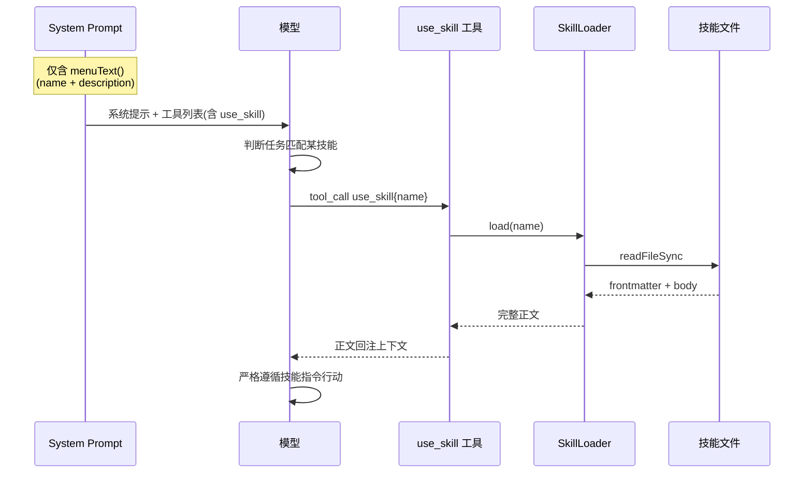

# 第 7 期学习文档：Skill 系统（三层加载 + 渐进式披露）

## 0. 本期在全局路线图中的位置

| 期 | 模块 | 状态 |
|---|---|---|
| 1 | 脚手架 + REPL + 流式对话 + ChatModel/OpenAI 适配器 | ✅ 完成 |
| 2 | ReAct 循环 + Tool Calling + 最小内置工具 | ✅ 完成 |
| 3 | 内置工具扩展 + 安全围栏 | ✅ 完成 |
| 4 | 上下文压缩 + 长期记忆（SQLite） | ✅ 完成 |
| 5 | MCP 客户端（stdio + JSON-RPC） | ✅ 完成 |
| 6 | RAG（检索增强生成，纯手写） | ✅ 完成 |
| **7** | **Skill 系统（三层加载 + 渐进式披露）** | **✅ 本期** |
| 8 | 模型配置持久化 | 待做 |
| 9 | 会话持久化（Session） | 待做 |
| 10 | REPL 体验打磨 | 待做 |
| 11 | 多模型适配补全（Anthropic/Ollama + fallback + 可插拔 embedding） | 待做 |
| 12 | MCP Server | 待做 |
| 13 | Token / 成本统计与可观测性 | 待做 |
| 14 | Plan 模式 + 异步并行 | 待做 |
| 15 | 记忆与检索自动注入 | 待做 |
| 16 | Multi-Agent | 待做 |
| 17 | Browser（CDP） | 待做 |

本期把「**可复用的能力/指令包**」引入 Agent。Skill 用一份 markdown 文件描述「何时用、怎么用」，三层来源加载、同名覆盖，且通过**渐进式披露**让常驻系统提示只挂「清单」、正文按需加载——既保住 prompt cache 命中率，又不撑爆上下文。这是对决策 12（§3 表）的直接落地。

---

## 1. 本节完成了什么（交付物）

| 文件 | 角色 | 关键内容 |
|---|---|---|
| `src/core/skill/types.ts` | **核心** | `SkillLayer`/`SkillSource`/`SkillMeta`/`Skill` 类型 + 手写 `parseFrontmatter`（`key:value` 与单行 `key:[a,b]` 数组，兼容 CRLF） |
| `src/core/skill/loader.ts` | **核心** | `SkillLoader`：三层扫描（`LAYER_ORDER`）、同名按层序覆盖、`load()` 按需取正文、`menuText()` 仅出 name+description、`isValidSkillFile` |
| `src/core/skill/tools.ts` | 接入 | `getSkillTools` 暴露 `use_skill` 工具（`isReadOnly=true` → 走执行器只读并行分支，默认放行） |
| `src/core/skill/index.ts` | 出口 | 桶文件统一 re-export |
| `src/cli/main.ts` | 改造 | 合成根：从 `AGENTCLI_SKILLS_BUILTIN`（内置）、`~/.config/agent-cli/skills`（用户）、`.agent/skills`（项目）三层构造 `SkillSource`，建 `SkillLoader` 并注册工具 |
| `src/cli/repl.ts` | 改造 | 系统提示追加 `skillLoader.menuText()`；新增 `/skills`（列已加载）、`/skill <name>`（看正文）；帮助文本同步 |
| `tests/unit/skill.test.ts` | 测试 | **12 个用例**：frontmatter 解析 / 三层覆盖 / 递归 walk / menuText 不泄漏正文 / `use_skill` 经执行器回注正文 / 未知技能友好报错 |
| `docs/phase7.md` | 文档 | 本文件 |

**交付验证**：`pnpm typecheck` 通过；`pnpm test` 共 **96 个用例全绿**（新增 12 个 Skill 用例）；**真机验证**用真实 API（`agnes-2.0-flash`）+ 项目 `.agent/skills/lucky-poem.md` 技能，模型成功「在菜单里发现技能 → 调用 `use_skill` → 正文（175 字符）被注入并严格遵循其格式输出」，证明渐进式披露闭环成立。

---

## 2. 核心概念速览（先看这个）

- **Skill（技能）**：一份 markdown 文件，用 YAML frontmatter 描述「叫什么、干什么、打什么标签」，**正文是给模型遵循的操作指令**。本质是把「prompt 工程的最佳实践」固化成可分发、可覆盖的包。
- **三层加载（Three-tier Loading）**：`builtin`（随 CLI 发布）/ `user`（跨项目个人 `~/.config/agent-cli/skills`）/ `project`（当前仓库 `.agent/skills`）。**同名覆盖、上层优先（project > user > builtin）**——让项目能定制/屏蔽内置技能。
- **渐进式披露（Progressive Disclosure）**：常驻系统提示只挂「技能清单 = name + description」（轻量稳定），**正文（body）只在模型真的调用 `use_skill` 时才加载进上下文**。避免一次性把所有技能正文塞满 prompt。
- **Prompt Cache 命中率**：系统提示越稳定、越低频变化，越容易被 API 侧缓存（命中后大幅降本降延迟）。菜单文本随「技能集合」稳定变化、不含多变正文，正是为此设计。
- **frontmatter**：markdown 文件头 `--- ... ---` 之间的 YAML 元数据块。本期**手写解析**而非引 yaml 库，契合「纯手写不引 SDK」，也把这种常见格式的原理讲透。
- **`use_skill` 工具**：模型在合适场景调用，传入技能 `name`，取回其完整指令正文，随后在本轮「遵循该指令」行动。正文经渐进披露只在被调用时才进入上下文。
- **覆盖语义（Override Semantics）**：同一 `name` 出现在多层时，按 `LAYER_ORDER` 顺序 `Map.set` 后者覆盖前者；解析用 `Map<name, meta>` 天然去重。

---

## 3. 设计方案与原理

### 3.1 三层加载 + 同名覆盖


`index()` 按 `['builtin','user','project']` 顺序遍历，每个同名 skill 用 `byName.set(name, meta)`；最后 `project` 写入，故同名以 project 为准。

### 3.2 渐进式披露（Progressive Disclosure）



**关键不变量**：系统提示里始终只有「清单」；正文永远只在被调用时才「临时」进入当前轮次上下文，不会污染常驻提示、不影响 cache 键。

### 3.3 `use_skill` 在 Agent 循环中的定位（与 RAG/MCP 同构）

```mermaid
flowchart LR
    Q[用户任务] --> R[runAgent]
    R --> D{模型决策}
    D -->|命中技能菜单| S[use_skill{name}]
    S --> B[SkillLoader.load 读正文]
    B --> C[正文回注 history]
    C --> A[模型遵循指令作答]
```

`use_skill` 与 Phase 5/6 的 MCP 工具、`rag_search` 走同一 `ToolRegistry`、同一执行器——这是「凡是增强都收敛为工具、让模型自主决策何时用」的统一范式。

---

## 4. 为什么这样设计（设计权衡）

| 决策点 | 选择 | 反方案 | 取舍理由 |
|---|---|---|---|
| 技能载体 | **markdown + 手写 frontmatter** | 引 `js-yaml` 等库 | 项目硬约束「纯手写不引 SDK」；frontmatter 原理朴素（`---` 间的 `key:value`），手写讲得清；零依赖 |
| 加载层级 | **三层 builtin/user/project** | 单一目录 | 兼顾「分发内置能力」「个人跨项目」与「仓库专属定制」；覆盖语义让项目可改/屏蔽内置 |
| 正文暴露时机 | **渐进式披露（菜单常驻、正文按需）** | 一次性把所有正文塞进系统提示 | 前者保 prompt cache 命中率、省 token、不撑爆上下文；后者技能多了会爆炸式膨胀 |
| 触发方式 | **`use_skill` 工具** | 自动匹配注入 | 工具形态让模型**自主决策**何时加载，与 RAG/MCP 一致；自动注入是期 15 的升级点 |
| 权限标记 | **`isReadOnly=true`** | 标记写/危险 | 加载技能是纯读取，天然走「只读并行 + 默认放行」，无需 HITL 打断 |
| 覆盖实现 | **`Map.set` 后写覆盖** | 数组去重后合并字段 | skill 场景「整包替换」比「字段合并」更直觉；同名即视为同一技能的更高优先级版本 |
| 路径健壮性 | **`existsSync` 守卫缺失目录** | 假设目录必存在 | 用户可能没配 skills 目录，缺目录应优雅跳过而非报错中断启动 |

---

## 5. 与其它方案对比（优势）

| 维度 | 本期 Skill 系统 | 把指令写死进 system prompt | 外部插件框架（如某 Agent 框架的 plugin） |
|---|---|---|---|
| 可分发性 | ✅ 单 markdown 文件可随仓库/配置分发 | ❌ 改代码才能改指令 | ✅ 但引入框架与约定 |
| 上下文占用 | ✅ 渐进披露，仅清单常驻 | ❌ 全部常驻，技能多则爆 | 取决于框架，常全量加载 |
| Prompt Cache | ✅ 系统提示稳定、命中率高 | ⚠ 改一处全失效 | ⚠ 框架常动态拼装 |
| 依赖 | ✅ 0（纯手写） | ✅ 0 | ❌ 引入 SDK/框架 |
| 覆盖/定制 | ✅ 三层、同名覆盖 | ❌ 硬编码 | ⚠ 框架自有机制 |
| 原理透明度 | ✅ 解析/加载全可见 | ✅（但无封装） | ❌ 黑盒框架 |

> 结论：对学习项目，手写「文件即技能 + 三层加载 + 按需披露」**唯一符合「从零吃透」目标**，并清楚暴露 Skill 的全链路（解析→索引→披露→触发→回注）；代价是缺少插件生态（依赖解析/发现是框架强项）——这正是期 15「自动注入」与未来插件化的升级点。

---

## 6. 面试话术（30 秒版 + 详版）

**30 秒版**：
> 我在 easyCLI 里实现了一套 Skill 系统，把「可复用的最佳实践/操作指令」固化成 markdown 文件。核心是两点：一是**三层加载**（内置/用户/项目，同名上层覆盖下层），让项目能定制内置能力；二是**渐进式披露**——系统提示里只挂技能「清单」（名字+描述），正文只在模型调用 `use_skill` 时才加载进上下文，这样常驻提示稳定、命中 prompt cache、不撑爆上下文。技能通过统一的 `use_skill` 工具触发，和 RAG、MCP 工具走同一执行器。

**详版**（追问时展开）：
> 为什么不直接把技能正文写进 system prompt？因为技能一旦多起来，全量常驻会爆掉上下文、还会让 prompt cache 频繁失效、成本飙升。渐进式披露把「稳定的元数据」与「多变的正文」解耦：清单几乎不变（只随技能集合增减），适合缓存；正文按需进入当前轮次。加载层用 builtin/user/project 三级，本质是一种**配置覆盖（override）**模式——项目级最高优先，能屏蔽或改写内置技能，和「配置文件的层叠覆盖」是同一思想。解析 frontmatter 我手写而非引 yaml 库，因为项目约束纯手写，而 `---` 间的 `key:value` 解析本身很简单，手写能把原理讲透。落地形态选工具而非自动注入，是让模型保持「自主决策何时用」的 Agent 范式一致性。

---

## 7. 常见面试题（附答题要点）

**Q1：什么是渐进式披露？为什么在 Skill 系统里重要？**
> 只把「轻量且稳定的元数据」常驻系统提示，把「重且多变的正文」延迟到真正需要时才加载。重要在三点：① 保 prompt cache 命中率（系统提示越稳定越易缓存、降本降延迟）；② 省 token，技能多了不会撑爆上下文；③ 正文只在被调用时进入当前轮次，不污染常驻提示。

**Q2：三层加载的覆盖语义怎么实现？为什么 project 优先？**
> 用 `Map<name, meta>`，按 `LAYER_ORDER=['builtin','user','project']` 顺序遍历、同名 `set` 后者覆盖前者，最后 project 写入即为准。project 优先是因为「当前仓库专属」最贴近本次任务语境，能定制/屏蔽内置能力——和「配置层叠：项目配置 > 用户配置 > 全局默认」同一思想。

**Q3：Skill 和 RAG、MCP 的关系？为什么都收敛成工具？**
> 三者都是「增强 Agent 上下文」的手段：RAG 注入文档语义、MCP 接入外部服务、Skill 注入操作指令。都收敛为统一 `ToolRegistry` 里的工具，是因为让模型**自主决策何时调用**比无脑前置注入更贴合 Agent 范式，且复用同一套执行器（只读并行/写串行）、权限、审计，结构单一、易维护。

**Q4：手写 frontmatter 解析有什么坑？**
> ① 区分标量与单行数组（`key:[a,b]`）；② 空值行（`key:` 无值）要跳过，否则污染元数据；③ 兼容 CRLF（`\r\n`）；④ 无 `---` 块时整段视为正文、fm 为空，不能报错；⑤ 取 `name` 时才决定是否算合法 skill——这正是 `isValidSkillFile` 的判断点。

**Q5：什么情况下 Skill 自动注入比按需加载更好？期 15 要做什么？**
> 当技能触发条件**高度规律、几乎每次都用**（如「每轮先回顾记忆」）时，按需调用反而增加一轮往返与失误率。期 15 的「记忆与检索自动注入」就是把 recall（期4）/RAG（期6）乃至高频技能在每轮自动注入上下文，无需模型主动调，提升「上下文智能化」——但高频自动注入要更谨慎地控制体积，避免反噬 cache 与 token。

---

## 8. 关键代码索引

| 能力 | 位置 |
|---|---|
| frontmatter 解析（标量/数组/CRLF/空值） | `src/core/skill/types.ts` → `parseFrontmatter` |
| 三层扫描 + 同名覆盖 | `src/core/skill/loader.ts` → `SkillLoader.index` |
| 按需加载正文 | `src/core/skill/loader.ts` → `SkillLoader.load` |
| 渐进披露菜单文本 | `src/core/skill/loader.ts` → `SkillLoader.menuText` |
| 递归 walk + 缺失目录守卫 | `src/core/skill/loader.ts` → `walk` / `index` 内 `existsSync` |
| 合法性校验 | `src/core/skill/loader.ts` → `isValidSkillFile` |
| 工具暴露 | `src/core/skill/tools.ts` → `getSkillTools`（`use_skill`） |
| 三层来源构造 + 注册 | `src/cli/main.ts`（合成根） |
| 系统提示追加 + `/skills` `/skill` | `src/cli/repl.ts` |
| 测试 | `tests/unit/skill.test.ts` |

---

## 9. 踩坑与细节（来自真实实现）

1. **`describe` 顶层求值时机 ≠ `beforeAll` 之后（真坑）**
   测试里把 `const sources = [{ layer:'builtin', dir: builtinDir }, ...]` 写在 `describe` 回调体里——而 vitest 在**收集阶段**就执行 `describe` 体，此时 `beforeAll` 还没跑，`builtinDir` 还是 `undefined`，于是每个 `src.dir` 都是 `undefined`，`index()` 全空、测试全挂。修复：把 `sources` 改成 `makeSources()` 函数，**在每个 `it` 内调用**（此时 `beforeAll` 已填充路径）。同理，任何依赖 `beforeAll` 产出值的对象，都不要在 `describe` 顶层构造。

2. **`menuText` 的「不泄漏」是设计纪律，不是巧合**
   `menuText()` 只拼 `name` + `description`，正文 `body` 绝不出门。真机验证时系统提示只有清单，模型仍能在合适的任务上调 `use_skill` 拿到正文——这正是渐进式披露成立的证据。若哪天手滑把 `body` 也拼进菜单，cache 命中率与上下文体积都会崩。

3. **`load()` 每次都 `index()` 重扫全目录**
   当前 `load(name)` 内部 `this.index().find(...)` 会重扫所有层目录。学习场景下技能数极小、可接受；若未来技能上百、且每个 `use_skill` 都重扫，应加一层 `name → path` 索引缓存（在 `index()` 时顺带构建）。

4. **frontmatter 解析对「值内含冒号」的边界**
   当前按第一个 `:` 切分 `key:value`。若值形如 `url: http://a:b` 会正确切到 `key=url`、值 `http://a:b`（因为我们只 `slice(idx+1)` 取第一个冒号之后全部）。但若 key 本身含冒号（罕见）会误判——Skill 场景 name/description/tags 不会，故未处理。

5. **`use_skill` 标记 `isReadOnly=true` 的连锁收益**
   因为加载技能是纯读取，执行器走「只读并行 + 默认放行」分支，无需 HITL 打断用户。若误标成写/危险，每次用技能都会弹出 `ask` 确认，体验崩坏——标记要和它的真实副作用一致。

6. **CRLF 与「无 frontmatter」都要兜住**
   从 Windows 或某些编辑器来的技能文件可能是 `\r\n`；无 `---` 块时整体当正文、fm 空、`name` 取不到 → 该文件被 `index` 静默跳过（`isValidSkillFile` 返回 false）。不抛错、不中断启动。

---

## 10. 自测题（检验是否真懂）

1. 如果项目层 `project/skill.md` 和用户层 `user/skill.md` 同名，但项目层文件**没有** `name` 字段（frontmatter 残缺），最终 `index()` 里这个 name 会以哪层为准？为什么？
2. 渐进式披露下，prompt cache 的「键」主要由哪部分决定？若把技能正文也写进系统提示，会怎样？
3. `menuText()` 只列 name+description，但模型仍能正确使用技能——中间靠哪一步把正文「补」进上下文？
4. 三层加载里 `builtin` 用环境变量 `AGENTCLI_SKILLS_BUILTIN` 传入多个目录，多个 builtin 目录出现同名 skill 时，覆盖顺序由什么决定？
5. 若想让「每次对话开头自动注入某技能正文（不等模型调用）」，最小改动在哪？会和期 4 的上下文压缩产生什么张力？

<details>
<summary>参考答案</summary>

1. 用户层（user）为准。`index()` 按 `['builtin','user','project']` 顺序遍历、同名 `set` 覆盖。builtin 先写、project 再写——但 project 文件的 frontmatter 缺 `name`，`parseFrontmatter` 后 `name=''`，被 `if (!name) continue` 跳过，不 `set`，于是 Map 里仍是 user 层那份。这正说明「覆盖」只在「双方都合法」时发生。
2. 主要由「系统提示内容」决定，而系统提示中技能部分是稳定的 `menuText()`（仅 name+description，随技能集合缓慢变化）。若把正文全写进系统提示，正文多变 → 系统提示每次都不同 → cache 键频繁失效 → 命中率骤降、成本上升。渐进式披露就是为守住这个稳定键。
3. 靠 `use_skill` 工具：模型在合适任务调用它 → `SkillLoader.load(name)` 读文件取 `body` → 作为工具结果回注 `history`，下一轮模型就「看得到」正文并遵循。菜单只负责「让模型知道有这个技能、何时该调」。
4. 由 `index()` 遍历 `LAYER_ORDER` 的**顺序**决定。多个 builtin 目录都在 `layer==='builtin'` 分支内被顺序处理，先处理的 `set` 后被同层下一个目录覆盖；跨层仍遵守 builtin<user<project 总体序。要让某目录优先，应把它放在 sources 数组更后（同层内后者覆盖前者）。
5. 最小改动：在 `runOnce`/`startRepl` 构造系统提示时，把某技能的 `body` 直接拼进 `SYSTEM_PROMPT`（或新增「自动注入清单」）。张力：自动注入会增大常驻上下文、冲击 prompt cache 命中率，且可能与期 4 的压缩策略冲突（压缩可能裁剪掉你「自动注入」的内容，需将其标记为不可裁剪）。这正是期 15 要系统解决的问题——高频且确定要用的才自动注入，且要纳入压缩白名单。

</details>

---

## 11. 延伸与下一步

- **期 15 记忆与检索自动注入**：把 recall（期4）/RAG（期6）/高频技能在每轮自动注入，无需模型主动调；需配合「压缩白名单」避免被裁剪。
- **技能间依赖/组合**：让一个技能 `use_skill` 另一个技能，或技能声明 `requires`，形成能力图谱（参考 Claude Code 的 skill 编排）。
- **技能发现增强**：除精确 name 匹配外，用 embedding 对 description 做语义检索，让用户「说不清名字也能被推荐到对的技能」（与期 6 检索天然结合）。
- **技能安全**：技能正文是「给模型的指令」，理论上可被恶意 skill 诱导越权——未来应在加载时做权限/来源校验（内置签名、用户确认第三方技能），与期 3 安全围栏协同。
- **内置技能随包分发**：把 `AGENTCLI_SKILLS_BUILTIN` 从环境变量改为「CLI 自带 skills 目录」，开箱即用一批官方最佳实践技能。
