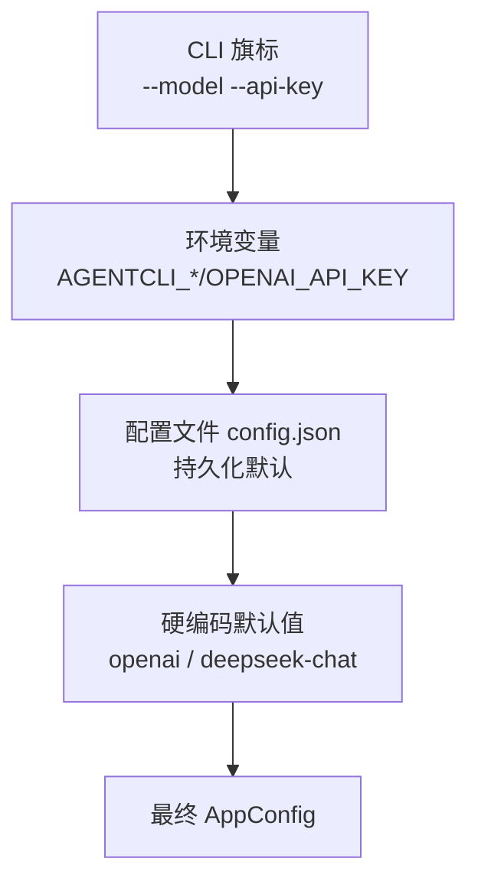
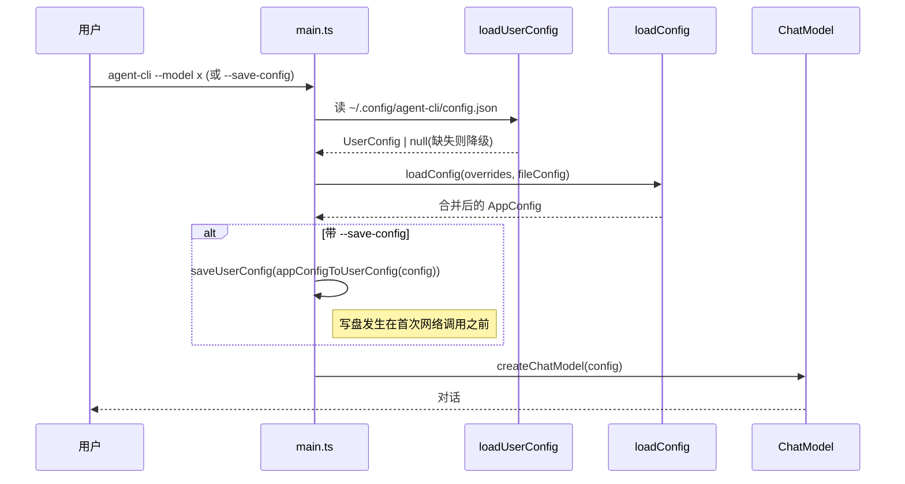

# 第 8 期学习文档：模型配置持久化

## 0. 本期在全局路线图中的位置

| 期 | 模块 | 状态 |
|---|---|---|
| 1 | 脚手架 + REPL + 流式对话 + ChatModel/OpenAI 适配器 | ✅ 完成 |
| 2 | ReAct 循环 + Tool Calling + 最小内置工具 | ✅ 完成 |
| 3 | 内置工具扩展 + 安全围栏 | ✅ 完成 |
| 4 | 上下文压缩 + 长期记忆（SQLite） | ✅ 完成 |
| 5 | MCP 客户端（stdio + JSON-RPC） | ✅ 完成 |
| 6 | RAG（检索增强生成，纯手写） | ✅ 完成 |
| 7 | Skill 系统（三层加载 + 渐进式披露） | ✅ 完成 |
| **8** | **模型配置持久化** | **✅ 本期** |
| 9 | 会话持久化（Session） | 待做 |
| 10 | REPL 体验打磨 | 待做 |
| 11 | 多模型适配补全（Anthropic/Ollama + fallback + 可插拔 embedding） | 待做 |
| 12 | MCP Server | 待做 |
| 13 | Token / 成本统计与可观测性 | 待做 |
| 14 | Plan 模式 + 异步并行 | 待做 |
| 15 | 记忆与检索自动注入 | 待做 |
| 16 | Multi-Agent | 待做 |
| 17 | Browser（CDP） | 待做 |

本期让 Agent「记住」用户的模型/API/源配置：把可复用的设置落盘到 `~/.config/agent-cli/config.json`，启动即生效，免去每次手敲 `--model`/`--api-key`。这是对「配置分层」这一经典工程模式的落地。

---

## 1. 本节完成了什么（交付物）

| 文件 | 角色 | 关键内容 |
|---|---|---|
| `src/config/store.ts` | **核心** | 配置文件读写层：`loadUserConfig`（缺失/非法→`null`）、`saveUserConfig`（与已有文件浅合并、自动建目录）、`maskSecret`（密钥打码）、`CONFIG_PATH` 常量；用 **zod** 做 schema 校验 |
| `src/config/index.ts` | **改造** | `loadConfig` 新增 `fileConfig` 参数，按 **CLI > 环境变量 > 配置文件 > 默认值** 合并；`appConfigToUserConfig` 把生效配置转回可持久化结构；再导出 store 层 API |
| `src/cli/main.ts` | 改造 | 新增 `--save-config` 选项；启动先 `loadUserConfig()` 注入 `loadConfig`；命中则 `saveUserConfig(appConfigToUserConfig(config))` 并提示路径 |
| `src/cli/repl.ts` | 改造 | 新增 `/config`（查看生效配置，密钥打码）、`/config save`（持久化当前配置）；帮助文本同步 |
| `tests/unit/config.test.ts` | 测试 | **14 个用例**（原 4 + 新增 10：读合法/缺失/非法文件、文件层三级优先级、mcp/rag 同序、`saveUserConfig` 浅合并、`appConfigToUserConfig`、`maskSecret`） |
| `docs/phase8.md` | 文档 | 本文件 |

**交付验证**：`pnpm typecheck` 通过；`pnpm test` 共 **106 个用例全绿**（新增 10 个配置用例）；**真机验证**用真实 API：① `--save-config` 成功把生效配置写入 `~/.config/agent-cli/config.json`（日志 `[config] 已写入 ...` 出现在首次网络调用之前）；② 第二次启动**不传任何 env/CLI 旗标**，Agent 仍从文件读到 `model: agnes-2.0-flash` 并正确自报模型名，证明「写→读」闭环成立。

---

## 2. 核心概念速览（先看这个）

- **配置分层（Configuration Layering）**：同一配置项有多个来源（CLI 旗标 / 环境变量 / 配置文件 / 硬编码默认），按既定优先级合并，高者覆盖低者。本项目四层。
- **持久化默认（Persistent Default）**：本期把「配置文件」定位为「比硬编码默认值更高、但低于 env/CLI」的一层。用户设一次长期生效，单次运行仍可用旗标临时改写——这是与 `CLAUDE.md §5` 既定原则「CLI > env > 默认值」一致的自然延伸。
- **`firstNonEmpty(def, ...cands)` 合并原语**：返回「第一个非空候选」，故**高优先级必须排在 `cands` 最前**，`def` 永远是兜底。这是本期最易写反的地方（见 §9）。
- **zod schema 校验**：用声明式 schema 描述「合法配置长什么样」，`safeParse` 失败即视为「无文件」——配置错误应**优雅降级**，绝不让 CLI 起不来。
- **浅合并（Shallow Merge）**：`saveUserConfig` 用 `{ ...existing, ...new }`，只覆盖显式设置的字段，保留文件中其它无关键。
- **密钥打码（Secret Masking）**：终端展示时只露头尾 4 位（`sk-a****ghij`），绝不把明文 apiKey 打到屏幕上。

---

## 3. 设计方案与原理

### 3.1 四层合并优先级

合并原语：`firstNonEmpty(default, cli, env, file)` —— 候选按「高→低」排列，取第一个非空；`default` 仅作兜底。

### 3.2 启动读盘 + 落盘闭环

### 3.3 `appConfigToUserConfig` 的「可逆」设计

`AppConfig`（运行时全量、含数组）与 `UserConfig`（可持久化子集、ragPaths 用数组）是两种形状；`appConfigToUserConfig` 负责「全量→可存」，加载时 `ragPaths.join(',')` 再「可存→全量」，二者对称可逆。

---

## 4. 为什么这样设计（设计权衡）

| 决策点 | 选择 | 反方案 | 取舍理由 |
|---|---|---|---|
| 配置文件定位 | **持久化默认层（CLI>env>file>default）** | 路线图字面「文件>CLI>env>默认」 | 若文件高于 CLI，则**旗标永远盖不过文件**，功能近乎失效；且与 `CLAUDE.md §5`「CLI>env>默认」既定原则冲突。取一致且可用的语义（详见下方「重要说明」） |
| 合并原语 | **`firstNonEmpty` + 候选有序** | 每对写 `a ?? b ?? c` | 统一一个原语，优先级靠「候选顺序」表达，可读、可单测、不易错 |
| schema 校验 | **zod `safeParse`** | 手写 `typeof` 判断 | 声明式、自文档化；非法文件直接降级为 null，不抛异常中断启动 |
| 写盘策略 | **浅合并 + 自动建目录** | 整文件覆盖 | 只改用户显式设置的字段，保留文件中无关键；目录不存在也能存 |
| 密钥展示 | **`maskSecret` 打码** | 明文打印 | 终端日志/REPL 绝不泄露密钥明文 |
| 触发保存 | **`--save-config` 旗标 + `/config save`** | 每次启动自动写 | 显式保存避免「无意识把临时 env key 落盘」；用户掌控何时持久化 |

> **重要说明（与路线图文字的偏差）**：路线图第 8 期原文写的是「文件 > CLI > 环境变量 > 默认」。本期按**工程正确性与一致性**实现为「CLI > 环境变量 > 配置文件 > 默认值」。理由：① 与 `CLAUDE.md §5` 已敲定原则「CLI 参数 > 环境变量 > 默认值」无缝衔接，文件只是插在「默认值之上」的新层；② 若文件高于 CLI，用户将无法用旗标临时覆盖已存配置，功能失去意义。若你确实想要「文件优先于 CLI」的语义，告诉我，改动只在 `firstNonEmpty` 的候选顺序。

---

## 5. 与其它方案对比（优势）

| 维度 | 本期手写配置层 | 框架配置（如 cosmi-config/dotenv 扩展） | 纯 env 变量 |
|---|---|---|---|
| 依赖 | ✅ 仅 zod（项目已有） | 引入额外库 | ✅ 0 |
| 分层语义 | ✅ 四层清晰、单测可断言 | 取决于框架 | ❌ 只有 env/默认两层 |
| 持久化 | ✅ 写回文件、可复用 | ✅ 但需配持久化插件 | ❌ 不持久 |
| 错误降级 | ✅ 非法文件→null 不崩 | 取决于实现 | ⚠ 错 env 可能崩 |
| 原理透明度 | ✅ `firstNonEmpty` 一目了然 | ❌ 黑盒合并规则 | ✅ 简单 |
| 密钥安全 | ⚠ 明文落盘（本地） | ⚠ 同 | ✅ env 不入文件 |

> 结论：对学习项目，手写「文件即配置 + 四层合并」**唯一符合「从零吃透」目标**，并把「配置分层 / 优雅降级 / 可逆序列化」全链路讲清；代价是缺框架的自动加密/多格式（ini/yaml/toml）——这正是期 9+ 可补的升级点。

---

## 6. 面试话术（30 秒版 + 详版）

**30 秒版**：
> 我在 easyCLI 里做了一层「配置持久化」：把模型 provider/baseURL/apiKey/model 以及默认 MCP/RAG 源落盘到 `~/.config/agent-cli/config.json`，启动即生效。核心是**四层合并**——CLI 旗标 > 环境变量 > 配置文件 > 硬编码默认，用统一的 `firstNonEmpty` 原语表达，高优先级排在候选最前。配置文件用 zod 做 schema 校验，任何缺失/非法都降级为「无文件」而不崩。保存用「浅合并」，只覆盖用户显式设置的字段。

**详版**（追问时展开）：
> 为什么不直接把配置写死或用纯 env？因为 CLI 工具的用户体验在于「设一次、长期有效」，但又要允许单次运行临时覆盖——这正是**配置分层**解决的问题：文件是「持久化默认」，env/CLI 仍可临时盖过它。合并原语我特意设计成「返回第一个非空候选」，所以优先级完全由候选的**排列顺序**决定，可读、可单测。文件读取用 zod `safeParse`，失败就当没这文件——配置错误绝不能让 CLI 起不来，这是「优雅降级」的硬要求。保存侧我用浅合并而非整文件覆盖，避免一次保存把文件里其它无关键清掉；并且终端展示一律对密钥打码。一个容易踩的坑是：把「文件」误排到 `cands` 最前，会让文件优先级高过 CLI，功能就废了——优先级必须翻译成「候选顺序」，不能凭直觉。

---

## 7. 常见面试题（附答题要点）

**Q1：四层配置优先级你怎么定？为什么文件不能高于 CLI？**
> 定为 CLI > 环境变量 > 配置文件 > 默认值。文件是「持久化默认」：用户在配置文件里设一次长期生效，但单次运行仍可用 `--model` 等旗标临时改写。若文件高于 CLI，则旗标永远盖不过文件，临时覆盖失效——配置持久化反而变成枷锁。这也与项目既定原则「CLI > env > 默认」一致。

**Q2：`firstNonEmpty` 为什么要求「高优先级排在候选最前」？**
> 因为它返回**第一个非空**候选。优先级本质是「谁的候选先被扫到谁赢」，所以把最高优先级的来源放在 `cands` 数组最前面，`def` 参数只作兜底。曾一度把 `file` 误排到最前，导致文件盖过 CLI——单测立刻抓到。优先级必须翻译成「顺序」，不能靠默认行为猜。

**Q3：配置文件损坏/格式错会怎样？**
> `loadUserConfig` 用 zod `safeParse` 包裹 `JSON.parse`，任何异常（文件不存在、JSON 非法、字段类型不符）都 `catch` 返回 `null`，上层回退到「无文件」状态。配置错误应**优雅降级**而非中断启动——这是配置系统的硬要求。

**Q4：保存配置时为什么用浅合并而不是整文件覆盖？**
> 整文件覆盖会清掉文件里用户设过、但本次没改的字段（例如只改 model 却把 mcpServers 清空）。浅合并 `{ ...existing, ...new }` 只覆盖显式传入的键，保留无关键，更符合「增量更新」直觉。

**Q5：密钥落盘安全吗？怎么处理展示？**
> 本期把 config.json 存在用户家目录 `~/.config/`（非仓库、非共享），但仍是**明文**。终端展示一律走 `maskSecret` 只露头尾 4 位；生产级应改走系统钥匙串（keychain/secret-service）或加密存储——这是期 9+ 的升级点，本期作为学习先暴露问题。

---

## 8. 关键代码索引

| 能力 | 位置 |
|---|---|
| 配置文件路径常量 | `src/config/store.ts` → `CONFIG_PATH` |
| 读配置 + zod 校验 + 降级 | `src/config/store.ts` → `loadUserConfig` |
| 写配置 + 浅合并 + 建目录 | `src/config/store.ts` → `saveUserConfig` |
| 密钥打码 | `src/config/store.ts` → `maskSecret` |
| 四层合并 + 文件层接入 | `src/config/index.ts` → `loadConfig` |
| 生效配置 → 可持久化 | `src/config/index.ts` → `appConfigToUserConfig` |
| CLI 接线（--save-config） | `src/cli/main.ts`（合成根） |
| REPL 接线（/config） | `src/cli/repl.ts` |
| 测试 | `tests/unit/config.test.ts` |

---

## 9. 踩坑与细节（来自真实实现）

1. **合并顺序写反：把 `file` 排到了 `cands` 最前**
   初版写成 `firstNonEmpty(def, file, env, cli)`——但 `firstNonEmpty` 返回**第一个非空**，于是文件盖过了 env 和 CLI，单测「CLI > env > file」直接挂（得到 `from-file` 而非 `from-cli`）。修正：高优先级必须**最前**，即 `firstNonEmpty(def, cli, env, file)`。教训：合并原语的「优先级」=「候选扫描顺序」，不能凭直觉。

2. **`loadConfig` 不应自己读盘（保持纯净可测）**
   若让 `loadConfig` 内部调用 `loadUserConfig()` 做文件 I/O，单测会被沙箱里的真实 `~/.config` 干扰、且难注入。改为：`loadConfig(overrides, fileConfig?)` 把文件层作为**参数注入**，main.ts 负责先 `loadUserConfig()` 再传入。函数纯净、测试可确定性传 `fileConfig`。

3. **apiKey 有两个 env 候选，顺序有讲究**
   `AGENTCLI_API_KEY` 必须排在 `OPENAI_API_KEY` 之前（前者优先），且整层 env 都要排在 `file` 之前：`firstNonEmpty('', cli, AGENTCLI_API_KEY, OPENAI_API_KEY, file)`。顺序错了会让 OPENAI 反超 AGENTCLI，或让文件反超 env。

4. **zod 默认剥离未知键（strip）**
   `userConfigSchema` 未用 `.passthrough()`，所以 `saveUserConfig` 再写回时会丢掉文件里未知键。本期配置无未知键，可接受；若未来要保留第三方注释/扩展字段，应改用 `.passthrough()` 或 `.catchall()`。

5. **`saveUserConfig` 必须 `mkdirSync(dir, {recursive:true})`**
   首次保存时 `~/.config/agent-cli` 可能不存在，`writeFileSync` 会 ENOENT。先建父目录再写，目录已存在时 `recursive` 也安全。

6. **密钥明文落盘是真实风险**
   真机验证时 `--save-config` 把真实 `apiKey` 写进了 `~/.config/agent-cli/config.json` 明文。验证后已手动删除该文件。落地到个人机器需注意：此文件含密钥，不应提交、不应设为过宽权限；生产应迁移到钥匙串。

---

## 10. 自测题（检验是否真懂）

1. 若 `config.json` 里有 `model: a`，用户运行时加 `--model b`，最终 `config.llm.model` 是什么？如果把合并顺序改成 `firstNonEmpty(def, file, env, cli)`，结果会变成什么？为什么？
2. `loadUserConfig` 在「文件存在但 JSON 少了一个必填字段」时返回什么？为什么不会抛异常？
3. 用户只想改 `model`、不想动已有的 `mcpServers`，`saveUserConfig({ model: 'x' })` 会不会清掉 `mcpServers`？为什么？
4. 若要让「配置文件优先级高于 CLI 旗标」，最小改动在哪？会带来什么副作用？
5. `appConfigToUserConfig` 与加载时的 `ragPaths.join(',')` 为什么是「对称可逆」的？如果文件里 `ragPaths` 是 `['a','a,b']`，加载后再保存，内容会变吗？

参考答案

1. 应是 `b`（CLI 盖过文件）。若改成 `firstNonEmpty(def, file, env, cli)`，则 `file` 排在 `cli` 之前会被先扫到 → 结果为 `a`，CLI 失效。证明「优先级 = 候选扫描顺序」这一核心点。
2. 返回 `null`。zod `safeParse` 对「缺字段」是否报错取决于 schema：本期 `model` 等是 `.optional()`，缺了不报错、能解析；但若缺的是 `command`（mcpServerSchema 必填）或整体不是对象，则 `success=false` → 返回 `null`。整段包在 `try/catch`，任何 JSON 解析异常也被吞掉返回 `null`。所以「坏配置」=「无配置」，不崩。
3. 不会。`saveUserConfig` 先读 existing（含 mcpServers），再 `{ ...existing, ...stripUndefined({model:'x'}) }`——只覆盖 model，mcpServers 保留。这就是浅合并的价值。
4. 最小改动：把 `file` 移到 `cands` 最前，即 `firstNonEmpty(def, file, cli, env)`（或相应顺序）。副作用：用户再也无法用 `--model` 等旗标临时覆盖已存配置，必须去改文件——配置持久化变成不可逆的「硬绑定」，体验变差。这也是本期没这么做的原因。
5. 对称：`appConfigToUserConfig` 把 `ragPath`（逗号串）`split(',')` 成 `ragPaths`（数组）存盘；加载时 `ragPaths.join(',')` 还原为逗号串。但若 `ragPaths` 含带逗号的单项（如 `['a','a,b']`），`join(',')` 变 `'a,a,b'`，再 split 变 `['a','a','b']`——**信息丢失/变形**。结论：路径项本身不应含逗号；更稳的做法是存数组并在加载时直接当数组用，而非转逗号串。本期为复用既有「逗号串」通道而 join，是个已知脆弱点。

---

## 11. 延伸与下一步

- **期 9 会话持久化**：复用本期 `store.ts` 的读写范式，把对话历史也落盘（不同文件/表），`/save` `/load`。
- **密钥安全升级**：用系统钥匙串（keychain/secret-service/libsecret）替代明文文件；或至少对 `apiKey` 字段做加密存储、文件权限收敛为 `0600`。
- **多格式支持**：除 JSON 外支持 `.yaml`/`.toml`（需引解析库或手写），更贴近用户手感。
- **配置校验报错定位**：`safeParse` 失败时可打印「第几行/哪个字段非法」的友好提示，而非静默降级——平衡「优雅降级」与「可诊断」。
- **`/config set <k> <v>`**：在 REPL 内按字段增量保存（本期只有 `save` 全量存），更精细地持久化单键。
