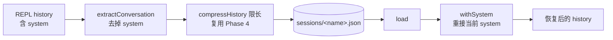
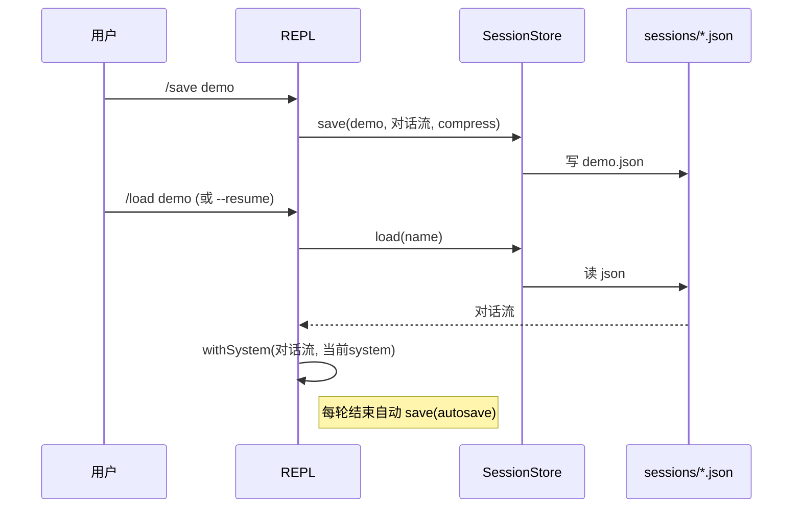
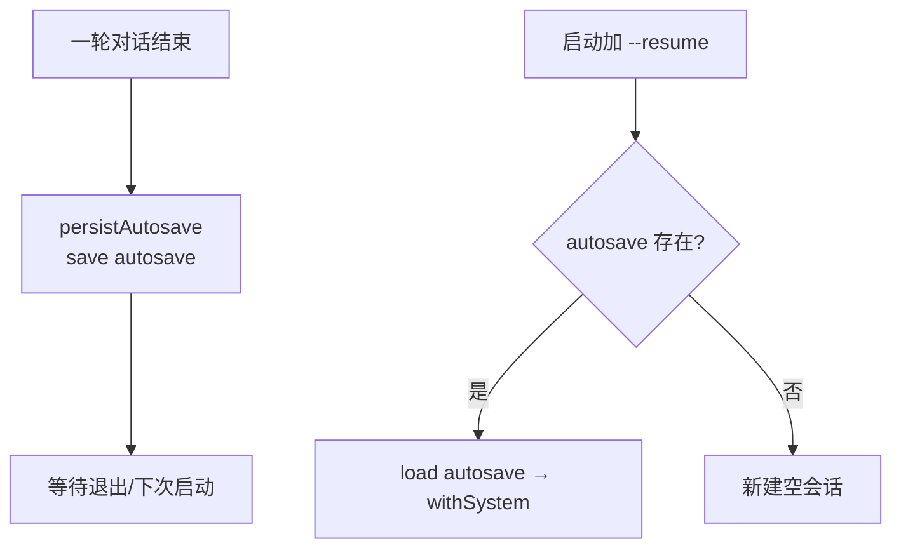

# 第 9 期学习文档：会话持久化（Session）

## 0. 本期在全局路线图中的位置

| 期 | 模块 | 状态 |
|---|---|---|
| 1 | 脚手架 + REPL + 流式对话 + ChatModel/OpenAI 适配器 | ✅ 完成 |
| 2 | ReAct 循环 + Tool Calling + 最小内置工具 | ✅ 完成 |
| 3 | 内置工具扩展 + 安全围栏 | ✅ 完成 |
| 4 | 上下文压缩 + 长期记忆（SQLite） | ✅ 完成 |
| 5 | MCP 客户端（stdio + JSON-RPC） | ✅ 完成 |
| 6 | RAG（检索增强生成，纯手写） | ✅ 完成 |
| 7 | Skill 系统（三层加载 + 渐进式披露） | ✅ 完成 |
| 8 | 模型配置持久化 | ✅ 完成 |
| **9** | **会话持久化（Session）** | **✅ 本期** |
| 10 | REPL 体验打磨 | 待做 |
| 11 | 多模型适配补全（Anthropic/Ollama + fallback + 可插拔 embedding） | 待做 |
| 12 | MCP Server | 待做 |
| 13 | Token / 成本统计与可观测性 | 待做 |
| 14 | Plan 模式 + 异步并行 | 待做 |
| 15 | 记忆与检索自动注入 | 待做 |
| 16 | Multi-Agent | 待做 |
| 17 | Browser（CDP） | 待做 |

本期让 Agent「记住聊到哪了」：把对话历史落盘成命名会话，支持 `/save` `/load` `/sessions` `/session` `/rm`，并用 `--resume` + 每轮自动保存实现跨会话恢复。对话流在保存时复用 Phase 4 的 `compressHistory` 限长。

---

## 1. 本节完成了什么（交付物）

| 文件 | 角色 | 关键内容 |
|---|---|---|
| `src/core/session/store.ts` | **核心** | `SessionStore`：`save/load/list/exists/remove`（文件位于 `~/.config/agent-cli/sessions/<name>.json`）；`extractConversation`（去 system）、`withSystem`（重接 system）；文件名安全化；保存时复用 `compressHistory` 限长 |
| `src/cli/repl.ts` | 改造 | 新增 `/save [名称]` `/load [名称]` `/sessions` `/session <名称>` `/rm <名称>`；`startRepl` 增 `resume` 参数，启动时恢复 `autosave`；每轮结束自动写 `autosave`；输入队列修正（见 §9） |
| `src/cli/main.ts` | 改造 | 新增 `--resume` 旗标并透传 |
| `tests/unit/session.test.ts` | 测试 | **11 个用例**：抽取/重接、存读删、列表倒序、文件名安全化、压缩限长、缺失返回 null |
| `docs/phase9.md` | 文档 | 本文件 |

**交付验证**：`pnpm typecheck` 通过；`pnpm test` 共 **116 个用例全绿**（新增 11 个会话用例）；**真机验证**用管道喂 REPL（slash 命令不触发模型调用，零 API 消耗）：① 单进程内 `/save demo` → `/sessions` 列出 → `/session demo` 预览，全链路通；② 新进程 `/sessions` 仍能看到 `demo`（**跨进程持久化**成立）；③ `/load demo` 正确载入；④ 预置 `autosave` 会话后 `--resume` 打印「已从自动保存的会话恢复（2 条消息）」并列出该会话（**跨会话恢复**成立）。

---

## 2. 核心概念速览（先看这个）

- **会话（Session）**：一段对话历史（不含 system 提示）的命名快照，落盘为 JSON 文件。
- **对话流 vs 完整 history**：`history` 含 `system` 提示（index 0）；保存到磁盘的应是「纯对话流」（去掉 system），加载时再把**当前** system 提示接回——这样 skills 菜单等随版本变化的部分永远是新的。
- **跨会话恢复（Resume）**：用预留名 `autosave` 的会话，每轮结束自动覆盖写入；`--resume` 启动时读取它，实现「关掉终端下次接着聊」。
- **压缩复用（Compression Reuse）**：保存时调 Phase 4 的 `compressHistory` 限长，避免长会话把会话文件/恢复上下文撑爆——呼应路线图「复用压缩 + 记忆存储模式」。
- **文件名安全化（Sanitization）**：会话名里的 `/ ?` 等字符替换成 `_`，既防止路径穿越，又保证「按原名存取」一致。
- **输入队列（Input Queue）**：模型生成期间到达的输入不丢弃，排队等本轮结束再顺序处理（本期顺带修正的旧 bug）。

---

## 3. 设计方案与原理

### 3.1 存储布局与生命周期

### 3.2 四类交互与恢复闭环

### 3.3 每轮自动保存（autosave）驱动恢复

---

## 4. 为什么这样设计（设计权衡）

| 决策点 | 选择 | 反方案 | 取舍理由 |
|---|---|---|---|
| 存储形态 | **每会话一个 JSON 文件** | 单 SQLite 库 / 全量追加日志 | 文件直观、易调试、易 `/rm`；学习项目数据量下足够；与配置/RAG 的「文件即状态」风格统一 |
| 存什么 | **纯对话流（去 system）** | 连 system 一起存 | 重加载时用「当前」system 提示，避免加载到过期/缺 skills 的提示 |
| 限长 | **保存时复用 compressHistory** | 全量无脑存 | 长会话不撑爆文件与恢复上下文；与 Phase 4 压缩一脉相承 |
| 恢复机制 | **autosave + --resume** | 启动时自动加载最近会话 | 显式 `--resume` 不强制，避免「一启动就塞入旧上下文」的意外；同时保留无缝恢复能力 |
| 命名 | **显式名 + default + 预留 autosave** | 仅自动时间戳命名 | 用户可控、可读；`default` 给懒人；`autosave` 预留给恢复，互不污染 |
| 文件名 | **安全化替换非法字符** | 直接用原名做路径 | 防路径穿越/注入，且存取对称 |
| 输入处理 | **队列化而非丢弃** | `if(busy) return` 丢弃 | 管道/多行粘贴不丢命令，REPL 更稳健（见 §9 踩坑） |

---

## 5. 与其它方案对比（优势）

| 维度 | 本期手写会话 | 框架方案（如某 Agent 的 transcript 服务） | 纯内存（不持久） |
|---|---|---|---|
| 依赖 | ✅ 0（仅 node:fs） | 引入服务/数据库 | ✅ 0 |
| 可移植 | ✅ 纯文本 JSON，可拷走 | 绑定框架存储 | ❌ 重启即丢 |
| 可控性 | ✅ `/save` `/load` 显式掌控 | 常自动、难干预 | ❌ 无 |
| 恢复 | ✅ `--resume` 无缝 | ✅ 通常有 | ❌ 无 |
| 限长 | ✅ 复用压缩 | 取决于框架 | ❌ 无界 |
| 原理透明 | ✅ 存读即 JSON | ❌ 黑盒 | ✅ |

> 结论：对学习项目，手写「文件即会话 + 显式 save/load + autosave 恢复」**唯一符合「从零吃透」目标**，并把「序列化/压缩/恢复/文件名安全」全链路讲清；代价是缺「多会话标签/搜索/云同步」——期 10+ 可补。

---

## 6. 面试话术（30 秒版 + 详版）

**30 秒版**：
> 我在 easyCLI 里做了一层会话持久化：把对话历史存成命名 JSON 文件，支持 `/save` `/load` `/sessions` 浏览。关键两点——一是保存时**抽掉 system 提示**、加载时把**当前** system 提示重接回去，保证 skills 菜单等始终是新的；二是保存时**复用 Phase 4 的压缩器限长**，长会话不会撑爆文件。恢复用预留的 `autosave` 会话 + `--resume`：每轮结束自动覆盖写入，启动时读取即「接着聊」。

**详版**（追问时展开）：
> 为什么存的时候要去掉 system？因为 system 提示会随版本（比如新加了技能）变化，如果把它原样存进会话、下次原样加载，就会用一份过期的提示，甚至缺了新技能的菜单。所以存的是「纯对话流」，加载时用加载那一刻的 system 提示接回去——这是「快照与运行时解耦」的思想。限长为什么要复用压缩器？因为会话可能很长，直接全量存既费磁盘又会在恢复时把上百轮旧 tool 结果塞回上下文；复用 `compressHistory`（默认不调摘要器、不联网）把它压到预算内。恢复为什么用 autosave 而不是直接加载最近会话？因为自动加载可能让用户「一启动就被旧上下文淹没」，用显式 `--resume` 把控制权交还用户，同时保留无缝恢复的可能。顺带还修了一个 REPL 老 bug：模型生成期间管道进来的命令原本被 `if(busy) return` 直接丢弃，改成输入队列后管道/多行粘贴都不丢命令了。

---

## 7. 常见面试题（附答题要点）

**Q1：为什么保存时要去掉 system 提示、加载时再接回？**
> system 提示会随版本演进（加技能、改指令）。若原样存+原样加载，恢复出的会话会带着一份过期提示，可能缺失新能力。存「纯对话流」、加载时接「当前」system，保证恢复后的会话始终运行在最新系统提示之上。

**Q2：会话文件会不会无限膨胀？怎么处理？**
> 保存时复用 `compressHistory` 限长（与 Phase 4 同一套）：超预算就裁剪/去重/折叠中间轮，默认不调摘要器、不联网。这样落盘会话与恢复上下文都有界。

**Q3：`--resume` 和自动加载最近会话，你选哪个？为什么？**
> 选显式 `--resume`。自动加载虽方便，但会让用户「一启动就被旧上下文淹没」、且难以预测；显式旗标把控制权交给用户，同时保留无缝恢复能力（靠每轮自动写 `autosave` 支撑）。

**Q4：会话名里有 `/` 或特殊字符怎么办？**
> 文件名做安全化：非 `a-zA-Z0-9_-` 的字符替换为 `_`，既防路径穿越/注入，又保证「按原名存取」两端用同一规则、对称可还原。

**Q5：本期顺手修的「输入丢弃」bug 是什么？**
> 旧 REPL 在模型生成（`busy=true`）期间用 `if (busy) return` 直接丢弃后续行。管道或粘贴多行时，后面的命令会丢失。改为「输入队列」：busy 期间把输入 push 进 `pending`，本轮结束顺序排空——管道/多行粘贴不再丢命令。

---

## 8. 关键代码索引

| 能力 | 位置 |
|---|---|
| 会话读写删/列表/文件名安全化 | `src/core/session/store.ts` → `SessionStore` |
| 去 system / 重接 system | `src/core/session/store.ts` → `extractConversation` / `withSystem` |
| 保存时压缩限长 | `src/core/session/store.ts` → `save`（调 `compressHistory`） |
| REPL 命令 | `src/cli/repl.ts` → `handleSlash` 的 save/load/sessions/session/rm |
| 启动恢复 + 每轮自动保存 | `src/cli/repl.ts` → `startRepl` 内 resume 分支 + `persistAutosave` |
| 输入队列修正 | `src/cli/repl.ts` → `rl.on('line')` 的 `pending` 队列 |
| CLI 旗标 | `src/cli/main.ts` → `--resume` |
| 测试 | `tests/unit/session.test.ts` |

---

## 9. 踩坑与细节（来自真实实现）

1. **REPL 输入丢弃 bug（本期顺手修）**
   旧 `rl.on('line')` 用 `if (busy) return`——模型生成期间到达的输入被直接丢弃。管道喂多行命令时，只有第一条被执行。改为：busy 时把输入 push 进 `pending` 队列，本轮结束顺序 `while (pending.length) processInput(shift())` 排空。验证：单进程管道 `/save`→`/sessions`→`/session`→`/exit` 现在全部生效。

2. **`history` 是 `const` 数组但能「重载」**
   `/load` 与 `--resume` 用 `history.length = 0; history.push(...)` 原地替换内容——`const` 只禁止**重新赋值变量**，不禁止**改动数组元素**，所以无需把 `history` 改成 `let`。但若将来要整体替换引用，才需 `let`。

3. **压缩是「有损快照」，恢复即接受折叠**
   `compressHistory` 无摘要器时把中间 tool 结果折成占位 `[已折叠工具结果: 原 N 字符]`。这意味着 `--resume` 恢复出的旧轮次细节已被折叠——这是「限长」的代价，也是有意为之（恢复的是「可继续对话的上下文」，不是「完整考古」）。若需完整回溯，应另存一份未压缩的归档（期 10+ 可加 `/save --full`）。

4. **压缩后「轮数不变、token 变少」**
   单测里不能断言「压缩后消息条数减少」来证明确实压缩了——`compressHistory` 以「整轮」为原子单位折叠，轮数不变、只是中间内容变短。正确断言是 `estimateHistoryTokens(loaded) <= budget`（限长生效）。本期测试即如此断言。

5. **`noUncheckedIndexedAccess` 下的 history[0]?**
   `history[0]?.content` 用可选链取 system 内容；`withSystem` 接收 `string`，加载时若 system 缺失则回退空串接回——不会因旧文件缺 system 而崩。

6. **跨进程共享会话目录的测试污染**
   `SessionStore` 用例用同一临时 `dir` 时，前序用例写入的会话会污染后序「精确断言列表内容」的用例。解法：列表断言用**独立子目录**（本测试即如此）。

7. **autosave 与显式命名互不污染**
   `autosave` 是预留名，显式 `/save`（无参→`default`、有参→`<name>`）不会覆盖它；`--resume` 只读 `autosave`。二者隔离，用户既能显式管理命名会话，又能无缝恢复。

---

## 10. 自测题（检验是否真懂）

1. 若保存时连 system 提示一起存了，三个月后加了新技能再 `--resume`，会发生什么？为什么本期设计能避免？
2. 一个 50 轮的会话，每轮含一条 600 字符的 tool 结果。保存时 `compressHistory` 的 `keepRecentTurns=4`、`budget=2000`，无摘要器。恢复后消息**条数**会变少吗？**token 数**会变少吗？为什么？
3. 用户管道执行 `/save a\n/save b\n/sessions\n/exit`，在「输入队列」修正前会怎样？修正后呢？
4. 为什么 `--resume` 用预留名 `autosave` 而不是「加载修改时间最新的那个文件」？
5. 若想支持「恢复时连 system 提示里的旧技能菜单也一并还原」，本期设计要改哪一处？会有什么副作用？

参考答案

1. 会加载到一份**三个月前、没有新技能菜单**的 system 提示，模型看不到、也不会调新技能。本期存「纯对话流」、加载时接「当前」system，所以恢复后永远运行在最新提示上，规避此问题。
2. **条数不变**（压缩以整轮为原子单位，50 轮仍是 50 条消息）；**token 数变少**（中间 46 轮的工具结果被折叠成占位短串，只有最近 4 轮保留原文）。证明「限长」靠的是内容折叠而非删轮。
3. 修正前：`if(busy) return` 丢弃——首行 `/save a` 执行后，后续行在 busy 期间到达被丢，`/save b` 与 `/sessions` 不执行，最终只存了 a、且看不到列表。修正后：进入 `pending` 队列，首轮结束后顺序排空，三个命令都执行。
4. 「取最新文件」无法区分「用户主动保存的命名会话」与「自动恢复的 autosave」，且「最新」可能是刚 `/save` 的一个无关会话，误恢复会扰乱当前上下文。预留 `autosave` 名让「恢复目标」与「用户会话」职责清晰隔离。
5. 要改 `extractConversation`/`withSystem`：存时**保留** system、加载时**原样接回**旧 system（而不是当前）。副作用：恢复的会话会缺失「当前版本新加的技能/指令」，且 system 可能与其他运行时状态不一致——正是本期刻意避免的。所以除非做「归档/回放」场景，否则不应这样改。

---

## 11. 延伸与下一步

- **期 10 REPL 体验打磨**：把本期「输入队列」正式纳入；再加跨会话命令历史文件、多行粘贴、基础补全、更顺滑渲染。
- **归档/回放**：`/save --full` 存未压缩完整版，供事后审计/回放（与限长快照互补）。
- **会话搜索/标签**：对多会话按关键词/标签检索（呼应期 13 可观测性）。
- **云同步/加密**：把会话文件纳入钥匙串或加密存储（密钥安全升级，同 Phase 8 议题）。
- **自动摘要归档**：对 autosave 用期 4 摘要器（若提供）生成「会话摘要」，恢复时先给模型一份浓缩上下文，进一步省 token。
